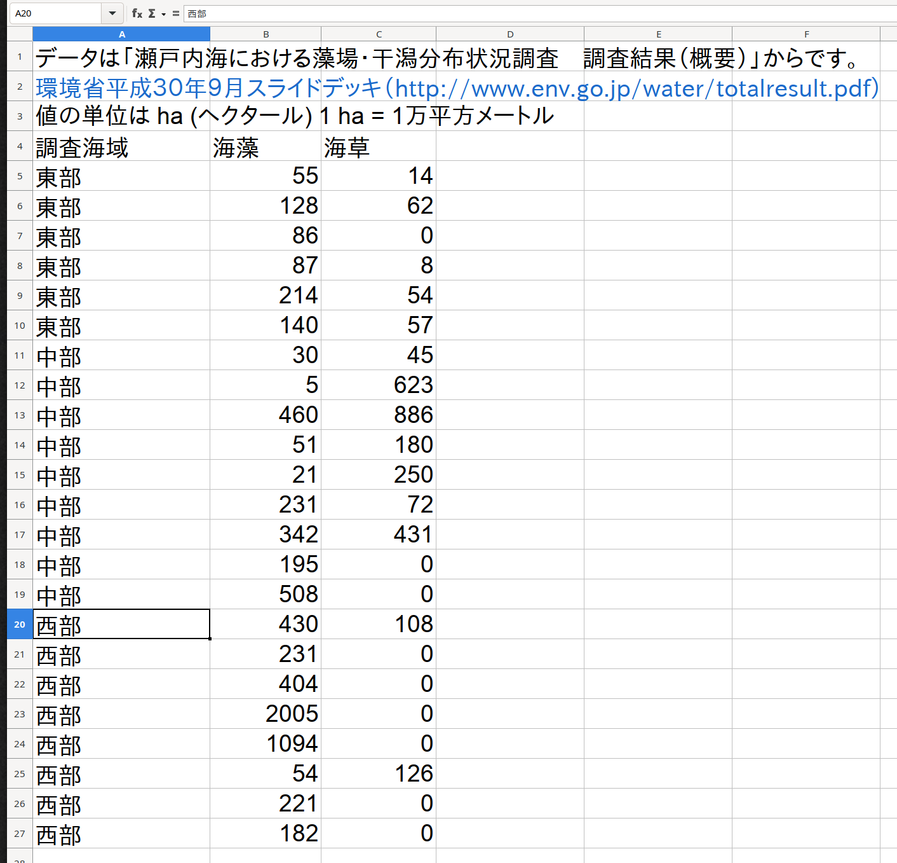
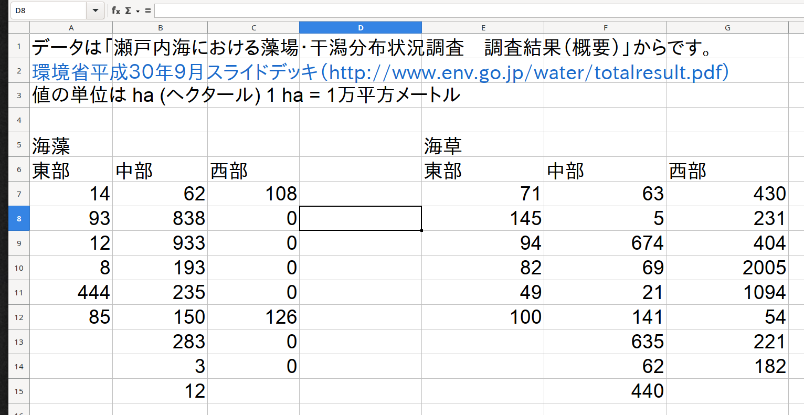
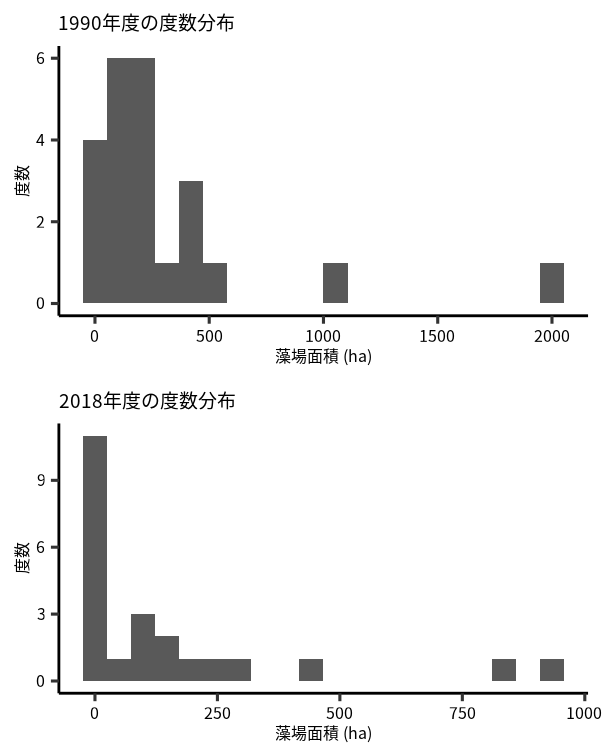

# データの読み込み {#data-input}

## 必要なパッケージ

::: {.rmdnote}


```r
library(tidyverse)
library(readxl)
```

:::


## データの確認

データは環境省の「瀬戸内海における藻場・干潟分布状況調査（概要）」からまとめました。
もとのファイルは[環境省平成３０年９月スライドデッキ](http://www.env.go.jp/water/totalresult.pdf) からダウンロードできます。
XLSXファイルは `readxl` パッケージの `read_xlsx()` 関数で読み込みます。
では、XLSXファイルに存在するシートの確認をしましょう^[t検定、一元配置分散分析、二元配置分散分析のチャプターに使うデータはここで処理しています。]。


```r
rootdatafolder = rprojroot::find_rstudio_root_file("Data/")
filename = '瀬戸内海藻場データ.xlsx'
path = str_c(rootdatafolder, filename)
excel_sheets(path) # シート名を確認する
#> [1] "FY1990" "FY2018"
```

`excel_sheets()` を実行したら、ファイルから 2つのシート名が返ってきました。
読み込む前に、それぞれのシートの構造を確認しましょう (Fig. \@ref(fig:seto1) and \@ref(fig:seto2))。
確認はスプレッドシートソフト（MS Office、 Google Sheets、 Open Office、 Apple Numbers、 など）で行います。

<div class="figure">

<p class="caption">(\#fig:seto1)瀬戸内海藻場データ.xlsx の FY1990 シートに入力されているデータは縦長の形式です。</p>
</div>

FY1990 のデータの構造は縦長なので、読み込みは比較的に楽です。
**それぞれの変数は一つの列**^[基本的には一行に 1 サンプル、一列に 1 変数にしましょう。]に入力されているから、読み込みが簡単です。

<div class="figure">

<p class="caption">(\#fig:seto2)瀬戸内海藻場データ.xlsx の FY2018 シートに入力されているデータは横長の形式です。</p>
</div>

FY2018 のデータの構造は横長です。
データは海藻と海草にわけられ、それぞれの変数じゃなくて、それぞれの場所の値を列に入力されています。
この用なデータの読み込みは手間がかかります^[一行に複数サンプルがあるので、そのまま R の関数にわたせない。]。

## データを読み込む

では、**FY1990 シート**のデータを読み込みます。
ここでシートから読み込むセルの範囲を指定します。


```r
RNG = "A4:C27"   # セルの範囲
SHEET = "FY1990" # シート名
d19 = read_xlsx(path, sheet = SHEET, range = RNG)
```

データは `tibble` として読み込まれました。
データに大きな問題がなければ、各列の型・タイプ (type)^[他に: \<lgl\> logical、 論理値；\<int\> integer、 整数；\<dttm\> datetime、日時 などもあります。] は自動的に設定されます。

* `調査海域` の列は `<chr>` : character, 文字列
* `海藻` の列は `<dbl>`: double, ダブル・数値・実数
* `海草` の列は `<dbl>`: double, ダブル・数値・実数

変数名が日本語の場合、コードが書きづらくなったり、バグの原因になります。
最初から英語表記にするのが合理的ですが、R環境内で名前を変換することは難しくないです。
とりあえず `d19` の内容をみましょう。


```r
d19 # FY1990 データの内容
#> # A tibble: 23 × 3
#>    調査海域  海藻  海草
#>    <chr>    <dbl> <dbl>
#>  1 東部        55    14
#>  2 東部       128    62
#>  3 東部        86     0
#>  4 東部        87     8
#>  5 東部       214    54
#>  6 東部       140    57
#>  7 中部        30    45
#>  8 中部         5   623
#>  9 中部       460   886
#> 10 中部        51   180
#> # … with 13 more rows
```

**FY2018 シート**の読み込みは、海藻と海草ごとにする必要があります。
読み込んだ後に、データを縦長に変換し、2 つの tibble を縦に結合します。


```r
RNG = "A6:C15"   # 海藻データのセル範囲
SHEET = "FY2018" # シート名
seaweed = read_xlsx(path, sheet = SHEET, range = RNG)
RNG = "E6:G15"   # 海草データのセル範囲
seagrass = read_xlsx(path, sheet = SHEET, range = RNG)
```

最初のセル範囲を読み込んで ファイルのコンテンツを `seaweed` に書き込んだら、`RNG` を次のセル範囲に書き換えます。
データは同じシートにあるので、`SHEET` を変更したり、新たに定義する必要はありません。

`seaweed` の内容は次のとおりです。


```r
seaweed
#> # A tibble: 9 × 3
#>    東部  中部  西部
#>   <dbl> <dbl> <dbl>
#> 1    14    62   108
#> 2    93   838     0
#> 3    12   933     0
#> 4     8   193     0
#> 5   444   235     0
#> 6    85   150   126
#> 7    NA   283     0
#> 8    NA     3     0
#> 9    NA    12    NA
```

`seagrass` の内容は次のとおりです。


```r
seagrass
#> # A tibble: 9 × 3
#>    東部  中部  西部
#>   <dbl> <dbl> <dbl>
#> 1    71    63   430
#> 2   145     5   231
#> 3    94   674   404
#> 4    82    69  2005
#> 5    49    21  1094
#> 6   100   141    54
#> 7    NA   635   221
#> 8    NA    62   182
#> 9    NA   440    NA
```

`NA` は Not Available の諸略です。
Rの場合、存在しないデータ (欠損値) は `NA` になります。

## データの処理

つぎは、FY2018シートの構造をFY1990シートと同じようにします。
横長のデータを縦長に変換するには、`pivot_longer()` を使います。
これは MS Excel の ピボットテーブル (pivot table) の機能とにています。


```r
# %>% と |> はパイプ演算子とよびます。
# |> はR 4.1.0 から追加された、ネーティブのパイプ演算子です。
# RStudio の設定を変えなければ、CTRL+SHIFT+M をしたら、%>% が入力されるとおもいます。
# ネーティブパイプを使いたいなら、Tools -> Global Options -> Code に
#   いって、Use native pipe operator のボックスにチェックを入れてください。
# seaweed = seaweed %>% pivot_longer(cols = everything())
seaweed = seaweed |> pivot_longer(cols = everything())
```

ここでの重要なポイントは、必ずピボットしたい列を指定することです。
このとき、すべての列をピボットしたいので、`pivot_longer()` には `cols = everything()` をわたします。
ピボットされた `seaweed` は次のとおりです。
` |> print(n = Inf)` をすると、`tibble` 内容をすべて表示できます^[ちなみに R バージョン 4.1.0 (2021-05-18) からは `|>` が追加されました。これは R のネーティブパイプ演算子です。使い方は tidyverse の `%>%` とほとんど同じです。]。


```r
seaweed |> print(n = Inf)
#> # A tibble: 27 × 2
#>    name  value
#>    <chr> <dbl>
#>  1 東部     14
#>  2 中部     62
#>  3 西部    108
#>  4 東部     93
#>  5 中部    838
#>  6 西部      0
#>  7 東部     12
#>  8 中部    933
#>  9 西部      0
#> 10 東部      8
#> 11 中部    193
#> 12 西部      0
#> 13 東部    444
#> 14 中部    235
#> 15 西部      0
#> 16 東部     85
#> 17 中部    150
#> 18 西部    126
#> 19 東部     NA
#> 20 中部    283
#> 21 西部      0
#> 22 東部     NA
#> 23 中部      3
#> 24 西部      0
#> 25 東部     NA
#> 26 中部     12
#> 27 西部     NA
```

`seagrass` も同じように処理しました。


```r
seagrass = seagrass |> pivot_longer(cols = everything())
```

では、次は `seaweed` と `seagrass` を縦に結合することです。
複数の `tibble` を縦に結合するための関数は `bind_rows()` です。


```r
d20 = bind_rows(seaweed = seaweed, seagrass = seagrass, .id = "type")
```

`seaweed` に `seaweed`、`seagrass` に `seagrass` を渡します。
さらに、`seaweed` と `seagrass` を `type` 変数に書き込みます。


```r
d20　# FY2018 データ
#> # A tibble: 54 × 3
#>    type    name  value
#>    <chr>   <chr> <dbl>
#>  1 seaweed 東部     14
#>  2 seaweed 中部     62
#>  3 seaweed 西部    108
#>  4 seaweed 東部     93
#>  5 seaweed 中部    838
#>  6 seaweed 西部      0
#>  7 seaweed 東部     12
#>  8 seaweed 中部    933
#>  9 seaweed 西部      0
#> 10 seaweed 東部      8
#> # … with 44 more rows
```

実は、次のように `bind_rows()` を実行できますが、データの構造は不都合になります。
どちらも 2つの `tibble` を縦に結合してくれますが、結果は全く違います。
コードと結果の違いをよく確認して、その違いを理解しましょう。


```r
bind_rows(seaweed, seagrass)
#> # A tibble: 54 × 2
#>    name  value
#>    <chr> <dbl>
#>  1 東部     14
#>  2 中部     62
#>  3 西部    108
#>  4 東部     93
#>  5 中部    838
#>  6 西部      0
#>  7 東部     12
#>  8 中部    933
#>  9 西部      0
#> 10 東部      8
#> # … with 44 more rows
```

では、`d20` の `type` ごとの `value` 変数を横にならべたら、`d19` と全く同じ構造になります。


```r
d20 = d20 |> pivot_wider(id_cols = name,
                   names_from = type,
                   values_from = value)
#> Warning: Values from `value` are not uniquely identified; output will contain list-cols.
#> * Use `values_fn = list` to suppress this warning.
#> * Use `values_fn = {summary_fun}` to summarise duplicates.
#> * Use the following dplyr code to identify duplicates.
#>   {data} %>%
#>     dplyr::group_by(name, type) %>%
#>     dplyr::summarise(n = dplyr::n(), .groups = "drop") %>%
#>     dplyr::filter(n > 1L)
```

このように処理したら、`Warning message` がでます。
`Warning` (ウォーニング) は `Error` (エラー) ほどの問題ではないので、コードは実行されています。
`Error` の場合はコードは実行されません。
この `Warning` で `values are not uniquely identified` と返ってきました。
つまり、各サンプルの値は、区別することができないと意味します。
このデータの場合は、区別しなくても問題ないので、このまま解析を続きます。
それにしても、`seaweed` と `seagrass` の変数 type は `<list>` です。
それぞれの変数の要素に `<dbl [9]>` と記述されています。
各要素に 9つの値が入力されていると意味します。
研究室では、`seaweed` と `seagrass` 変数は nested (ネスト) または、「たたまれている」といいます。
では、この２つの変数を unnest (アンネスト) します。


```r
d20 = d20 |> unnest(c(seaweed, seagrass))
d20
#> # A tibble: 27 × 3
#>    name  seaweed seagrass
#>    <chr>   <dbl>    <dbl>
#>  1 東部       14       71
#>  2 東部       93      145
#>  3 東部       12       94
#>  4 東部        8       82
#>  5 東部      444       49
#>  6 東部       85      100
#>  7 東部       NA       NA
#>  8 東部       NA       NA
#>  9 東部       NA       NA
#> 10 中部       62       63
#> # … with 17 more rows
```

さらに、`name` を `site` (調査海域) に変更します。


```r
d20 = d20 |> rename(site = name)
d20
#> # A tibble: 27 × 3
#>    site  seaweed seagrass
#>    <chr>   <dbl>    <dbl>
#>  1 東部       14       71
#>  2 東部       93      145
#>  3 東部       12       94
#>  4 東部        8       82
#>  5 東部      444       49
#>  6 東部       85      100
#>  7 東部       NA       NA
#>  8 東部       NA       NA
#>  9 東部       NA       NA
#> 10 中部       62       63
#> # … with 17 more rows
```

最後に、`d20` の `NA` データを外します。


```r
d20 = d20 |> drop_na() # NAを外す
d20
#> # A tibble: 23 × 3
#>    site  seaweed seagrass
#>    <chr>   <dbl>    <dbl>
#>  1 東部       14       71
#>  2 東部       93      145
#>  3 東部       12       94
#>  4 東部        8       82
#>  5 東部      444       49
#>  6 東部       85      100
#>  7 中部       62       63
#>  8 中部      838        5
#>  9 中部      933      674
#> 10 中部      193       69
#> # … with 13 more rows
```


これで、`d20` と `d19` はほぼ同じ構造です。
次のコードブロックで、`d19` の変数名を`rename()` を用いて英語に変えます。
日本語の変数名は使いづらくて、バグの原因になることが多いので名前を変更します。

解析をするまえに、`site` を要因 (因子) として設定します。
`levels = c('東部', '中部', '西部')` は因子の順序を指定するためです。
指定しなかった場合、アルファベット順やあいうえお順になります。


```r
d19 = d19 |> 
  rename(site = 調査海域, seaweed = 海藻, seagrass = 海草) |> 
  mutate(site = factor(site, levels = c('東部', '中部', '西部')))
d20 = d20 |> 
  mutate(site = factor(site, levels = c('東部', '中部', '西部')))
```

これで解析に使えるデータが完成しました。
コードを一つのコードブロックにまとめました。
最初から上手にデータを保存していたら、処理が楽になるのがわかるとおもいます。


```r
rootdatafolder = rprojroot::find_rstudio_root_file("Data/")
filename = '瀬戸内海藻場データ.xlsx'
path = str_c(rootdatafolder, filename)

# fy1990 の処理
RNG = "A4:C27"   # セルの範囲
SHEET = "FY1990" # シート名
d19 = read_xlsx(path, sheet = SHEET, range = RNG)
d19 = d19 |> 
  rename(site = 調査海域, seaweed = 海藻, seagrass = 海草) |> 
  mutate(site = factor(site, levels = c('東部', '中部', '西部')))

# fy2018の処理
RNG = "A6:C15"   # 海藻データのセル範囲
SHEET = "FY2018" # シート名
seaweed = read_xlsx(filename, sheet = SHEET, range = RNG)
RNG = "E6:G15"   # 海草データのセル範囲

seagrass = read_xlsx(filename, sheet = SHEET, range = RNG)
seaweed = seaweed |> pivot_longer(cols = everything())
seagrass = seagrass |> pivot_longer(cols = everything())

d20 = bind_rows(seaweed = seaweed, seagrass = seagrass, .id = "type")
d20 = d20 |> pivot_wider(id_cols = name,
                   names_from = type,
                   values_from = value)
d20 = d20 |> unnest(c(seaweed, seagrass)) |> rename(site = name) |> drop_na()
d20 = d20 |> 
  mutate(site = factor(site, levels = c('東部', '中部', '西部')))
```

## データの可視化

検定をする前には、必ずデータの作図や集計をしましょう。
観測値の単位はヘクタール^[1 ha = 10,000 m^2^] です。


```r
# geom_point()：散布図
# labs()：軸ラベルや図タイトルの記述

ggplot(d19) + 
  geom_point(aes(x = site, y = seaweed, color = site)) +
  labs(x = '調査海域',
       y = '藻場面積 (ha)',
       color = '海域',
       title = '1990年度海藻藻場面積')

ggplot(d20) + 
  geom_point(aes(x = site, y = seaweed, color = site)) +
  labs(x = '調査海域',
       y = '藻場面積 (ha)',
       color = '海域',
       title = '2018年度海藻藻場面積') 
```

```
#> Warning in grid.Call(C_stringMetric,
#> as.graphicsAnnot(x$label)): font family 'notosans' not found
#> in PostScript font database

#> Warning in grid.Call(C_stringMetric,
#> as.graphicsAnnot(x$label)): font family 'notosans' not found
#> in PostScript font database

#> Warning in grid.Call(C_stringMetric,
#> as.graphicsAnnot(x$label)): font family 'notosans' not found
#> in PostScript font database

#> Warning in grid.Call(C_stringMetric,
#> as.graphicsAnnot(x$label)): font family 'notosans' not found
#> in PostScript font database

#> Warning in grid.Call(C_stringMetric,
#> as.graphicsAnnot(x$label)): font family 'notosans' not found
#> in PostScript font database

#> Warning in grid.Call(C_stringMetric,
#> as.graphicsAnnot(x$label)): font family 'notosans' not found
#> in PostScript font database

#> Warning in grid.Call(C_stringMetric,
#> as.graphicsAnnot(x$label)): font family 'notosans' not found
#> in PostScript font database

#> Warning in grid.Call(C_stringMetric,
#> as.graphicsAnnot(x$label)): font family 'notosans' not found
#> in PostScript font database

#> Warning in grid.Call(C_stringMetric,
#> as.graphicsAnnot(x$label)): font family 'notosans' not found
#> in PostScript font database

#> Warning in grid.Call(C_stringMetric,
#> as.graphicsAnnot(x$label)): font family 'notosans' not found
#> in PostScript font database

#> Warning in grid.Call(C_stringMetric,
#> as.graphicsAnnot(x$label)): font family 'notosans' not found
#> in PostScript font database

#> Warning in grid.Call(C_stringMetric,
#> as.graphicsAnnot(x$label)): font family 'notosans' not found
#> in PostScript font database

#> Warning in grid.Call(C_stringMetric,
#> as.graphicsAnnot(x$label)): font family 'notosans' not found
#> in PostScript font database

#> Warning in grid.Call(C_stringMetric,
#> as.graphicsAnnot(x$label)): font family 'notosans' not found
#> in PostScript font database

#> Warning in grid.Call(C_stringMetric,
#> as.graphicsAnnot(x$label)): font family 'notosans' not found
#> in PostScript font database

#> Warning in grid.Call(C_stringMetric,
#> as.graphicsAnnot(x$label)): font family 'notosans' not found
#> in PostScript font database

#> Warning in grid.Call(C_stringMetric,
#> as.graphicsAnnot(x$label)): font family 'notosans' not found
#> in PostScript font database

#> Warning in grid.Call(C_stringMetric,
#> as.graphicsAnnot(x$label)): font family 'notosans' not found
#> in PostScript font database

#> Warning in grid.Call(C_stringMetric,
#> as.graphicsAnnot(x$label)): font family 'notosans' not found
#> in PostScript font database

#> Warning in grid.Call(C_stringMetric,
#> as.graphicsAnnot(x$label)): font family 'notosans' not found
#> in PostScript font database

#> Warning in grid.Call(C_stringMetric,
#> as.graphicsAnnot(x$label)): font family 'notosans' not found
#> in PostScript font database

#> Warning in grid.Call(C_stringMetric,
#> as.graphicsAnnot(x$label)): font family 'notosans' not found
#> in PostScript font database

#> Warning in grid.Call(C_stringMetric,
#> as.graphicsAnnot(x$label)): font family 'notosans' not found
#> in PostScript font database

#> Warning in grid.Call(C_stringMetric,
#> as.graphicsAnnot(x$label)): font family 'notosans' not found
#> in PostScript font database

#> Warning in grid.Call(C_stringMetric,
#> as.graphicsAnnot(x$label)): font family 'notosans' not found
#> in PostScript font database

#> Warning in grid.Call(C_stringMetric,
#> as.graphicsAnnot(x$label)): font family 'notosans' not found
#> in PostScript font database

#> Warning in grid.Call(C_stringMetric,
#> as.graphicsAnnot(x$label)): font family 'notosans' not found
#> in PostScript font database

#> Warning in grid.Call(C_stringMetric,
#> as.graphicsAnnot(x$label)): font family 'notosans' not found
#> in PostScript font database
```

<div class="figure">

<p class="caption">(\#fig:p1)調査海域に対する海藻藻場面積</p>
</div>

藻場面積は1990年度と2018年度に大きな違いが見えています (Fig. \@ref(fig:p1))。
まず、1990年度の藻場面積は東部が低く、西部が高かった。
ところが、2018年度ではほとんどの海域における藻場面積は減少した。
とくに、西部の藻場面積は縮小した。
観測値のばらつきは海域によってことなり、1990年度では西部のばらつきが大きかったが、2018年度では中部のほうが大きかった。

では、観測値を度数分布・ヒストグラム^[histogram]としてみてみましょう。


```r
ggplot(d19) +
  geom_histogram(aes(x = seaweed), bins = 20) +
  labs(x = '藻場面積 (ha)',
       y = '度数', 
       title = '1990年度海藻藻場面積の度数分布')

ggplot(d20) + 
  geom_histogram(aes(x = seaweed), bins = 20)+
  labs(x = '藻場面積 (ha)',
       y = '度数',
       title = '2018年度海藻藻場面積の度数分布')
```
<div class="figure">

<p class="caption">(\#fig:p2)海藻藻場面積の度数分布</p>
</div>

## データの集計

海藻藻場面積の平均値、標準偏差 (se)、分散 (var)、サンプル数 (n)、標準誤差 (se) を求めます。


```r
# FY1990 の処理
d19 |>  
  group_by(site) |> 
  summarise(across(c(seaweed),
                   list(mean = mean, sd = sd, 
                        var = var, n = length))) |> 
  mutate(seaweed_se = seaweed_sd / sqrt(seaweed_n))
#> # A tibble: 3 × 6
#>   site  seaweed_mean seaweed_sd seaweed_var seaweed_n
#>   <fct>        <dbl>      <dbl>       <dbl>     <int>
#> 1 東部          118.       56.1       3151.         6
#> 2 中部          205.      195.       38072.         9
#> 3 西部          578.      658.      433431.         8
#> # … with 1 more variable: seaweed_se <dbl>
```


```r
# FY2018 の処理
d20 |> 
  group_by(site) |> 
  summarise(across(c(seaweed),
                   list(mean = mean, sd = sd, 
                        var = var, n = length))) |> 
  mutate(seaweed_se = seaweed_sd / sqrt(seaweed_n))
#> # A tibble: 3 × 6
#>   site  seaweed_mean seaweed_sd seaweed_var seaweed_n
#>   <fct>        <dbl>      <dbl>       <dbl>     <int>
#> 1 東部         109.       168.       28338.         6
#> 2 中部         301        346.      119548          9
#> 3 西部          29.2       54.4       2956.         8
#> # … with 1 more variable: seaweed_se <dbl>
```

図 (Fig. \@ref(fig:p1) and \@ref(fig:p2))と集計表を確認すると、正規性と等分散性に問題がありそうですね。
