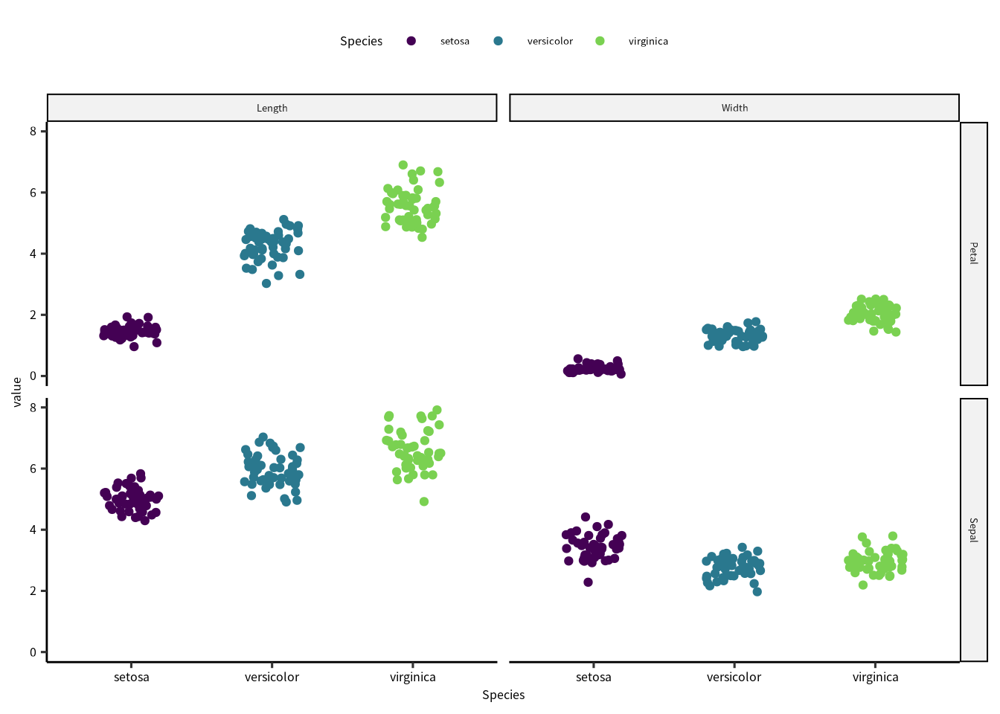

# t 検定 {#t-test}

## 必要なパッケージ


```r
library(tidyverse)
library(readxl)
library(broom)
```

## データの準備

Rの `iris`^[iris: アヤメ] データで解析を紹介します。
`iris` は `data.frame` として定義されているので、`as_tibble()` を使って `tibble` のクラスを追加します。


```r
iris = iris |> as_tibble()
iris
#> # A tibble: 150 × 5
#>    Sepal.Length Sepal.Width Petal.Length Petal.Width Species
#>           <dbl>       <dbl>        <dbl>       <dbl> <fct>  
#>  1          5.1         3.5          1.4         0.2 setosa 
#>  2          4.9         3            1.4         0.2 setosa 
#>  3          4.7         3.2          1.3         0.2 setosa 
#>  4          4.6         3.1          1.5         0.2 setosa 
#>  5          5           3.6          1.4         0.2 setosa 
#>  6          5.4         3.9          1.7         0.4 setosa 
#>  7          4.6         3.4          1.4         0.3 setosa 
#>  8          5           3.4          1.5         0.2 setosa 
#>  9          4.4         2.9          1.4         0.2 setosa 
#> 10          4.9         3.1          1.5         0.1 setosa 
#> # … with 140 more rows
```

`iris`には4つの数値データと1つの文字列データが入っています。

このデータを可視化してから、解析します。


```r
iris |> pivot_longer(cols = matches("Sepal|Petal")) |> 
  separate(name, c("part", "measurement")) |> 
  ggplot() + 
  geom_point(aes(x = Species, y = value, color = Species),
             position = position_jitter(0.2)) +
  scale_color_viridis_d(end = 0.8) +
  facet_grid(rows = vars(part),
             cols = vars(measurement))
```




## Petal と Sepal の長さの比較

種を無視して、アヤメの Petal （花びら）と Sepal (萼片)の長さを比較しています。

花びらと萼片の平均値、標準偏差、標準誤差を先にもとめます。
専用の標準誤差の関数はないので、ここで定義します。


```r
se = function(x) {
  sd(x) / sqrt(length(x))
}
```


```r
irisout = iris |> 
  summarise(across(matches("Length"), list(mean = mean, sd = sd, se = se)))
irisout
#> # A tibble: 1 × 6
#>   Sepal.Length_mean Sepal.Length_sd Sepal.Length_se
#>               <dbl>           <dbl>           <dbl>
#> 1              5.84           0.828          0.0676
#> # … with 3 more variables: Petal.Length_mean <dbl>,
#> #   Petal.Length_sd <dbl>, Petal.Length_se <dbl>
```


* H~0~: 花びらと萼片の長さに違いがない
* H~A~: 花びらと萼片の長さに違いがある


```r
t.test(iris$Petal.Length, iris$Sepal.Length)
#> 
#> 	Welch Two Sample t-test
#> 
#> data:  iris$Petal.Length and iris$Sepal.Length
#> t = -13.098, df = 211.54, p-value < 2.2e-16
#> alternative hypothesis: true difference in means is not equal to 0
#> 95 percent confidence interval:
#>  -2.399166 -1.771500
#> sample estimates:
#> mean of x mean of y 
#>  3.758000  5.843333
```

t検定は `t.test()` で実施します。
関数の出力には、使用したデータ、t値、 自由度、 P値、平均値の差の95%信頼区間、それぞれの平均値の推定量が返ってきました。
結論から説明すると、P < 0.0001 なので、有意水準が 0.05 のとき、帰無仮説は棄却できます。

`t.test()` の結果をオブジェクトに書き込んだら、t値 (t value)、p値 (p value)、自由度 (degrees of freedom) を抽出できます。


```r
dset_test = t.test(iris$Petal.Length, iris$Sepal.Length)
dset_test$statistic  # t value
#>         t 
#> -13.09835
dset_test$parameter  # degrees of freedom 
#>       df 
#> 211.5427
dset_test$p.value 　 # p value
#> [1] 4.262173e-29
```

英語論文に記述する場合は、次の通りです。

> The mean petal length of the samples was 3.76 ± 0.14, whereas the mean sepal length was 5.84 ± 0.07.
A Welch'S t-test revealed that there was statistical significance in the differences between the two sites (t~(211.54)~ = -13.098; P < 0.0001) at a significance level of $\alpha=$ 0.05.

大事なポイントは、この 3 つの情報を報告することです。

* t~(211.54)~: 検定に使用した自由度（サンプル数の目安）
* -13.098: t検定の統計量
* P = 0.0000: 結果のP値

## Petal と Sepal の幅の比較

先程の説明は横長のでデータ解析でしたが、`tidy` データ（縦長）の場合、もっと簡易に検定のコードをくめます。
まず、データを縦長に変換します。


```r
iris_long = iris |> pivot_longer(cols = matches("Sepal|Petal")) |> 
  separate(name, c("part", "measurement"))
iris_long
#> # A tibble: 600 × 4
#>    Species part  measurement value
#>    <fct>   <chr> <chr>       <dbl>
#>  1 setosa  Sepal Length        5.1
#>  2 setosa  Sepal Width         3.5
#>  3 setosa  Petal Length        1.4
#>  4 setosa  Petal Width         0.2
#>  5 setosa  Sepal Length        4.9
#>  6 setosa  Sepal Width         3  
#>  7 setosa  Petal Length        1.4
#>  8 setosa  Petal Width         0.2
#>  9 setosa  Sepal Length        4.7
#> 10 setosa  Sepal Width         3.2
#> # … with 590 more rows
```

記述統計ととり方も変わります。
グループ化してから平均値、標準偏差、標準誤差を求めます。


```r
irisout = iris_long |> 
  group_by(part, measurement) |> 
  summarise(across(value, list(mean = mean, sd = sd, se = se)))
irisout
#> # A tibble: 4 × 5
#> # Groups:   part [2]
#>   part  measurement value_mean value_sd value_se
#>   <chr> <chr>            <dbl>    <dbl>    <dbl>
#> 1 Petal Length            3.76    1.77    0.144 
#> 2 Petal Width             1.20    0.762   0.0622
#> 3 Sepal Length            5.84    0.828   0.0676
#> 4 Sepal Width             3.06    0.436   0.0356
```

* H~0~: 花びらと萼片の幅に違いがない
* H~A~: 花びらと萼片の幅に違いがある

長さと幅のデータが混ざっているので、幅のデータのフィルターを掛けてから解析します。


```r
iris_width = iris_long |> filter(str_detect(measurement, "Width"))
iris_width
#> # A tibble: 300 × 4
#>    Species part  measurement value
#>    <fct>   <chr> <chr>       <dbl>
#>  1 setosa  Sepal Width         3.5
#>  2 setosa  Petal Width         0.2
#>  3 setosa  Sepal Width         3  
#>  4 setosa  Petal Width         0.2
#>  5 setosa  Sepal Width         3.2
#>  6 setosa  Petal Width         0.2
#>  7 setosa  Sepal Width         3.1
#>  8 setosa  Petal Width         0.2
#>  9 setosa  Sepal Width         3.6
#> 10 setosa  Petal Width         0.2
#> # … with 290 more rows
```


```r
t.test(value ~ part, data = iris_width)
#> 
#> 	Welch Two Sample t-test
#> 
#> data:  value by part
#> t = -25.916, df = 237.03, p-value < 2.2e-16
#> alternative hypothesis: true difference in means between group Petal and group Sepal is not equal to 0
#> 95 percent confidence interval:
#>  -1.999237 -1.716763
#> sample estimates:
#> mean in group Petal mean in group Sepal 
#>            1.199333            3.057333
```

幅の解析をしても、P < 0.0001 なので、帰無仮説を棄却できます。


## `map()` 関数を用いて解析する

上に紹介した解析は長さと幅に分けてから実施したが、`tidyverse` の機能を上手につかば最低限のコードでできます。

`map()`関数の詳細は専用の章に説明しています (\@ref(map-function))。


```r
iris_long = iris |> pivot_longer(cols = matches("Sepal|Petal")) |> 
  separate(name, c("part", "measurement"))
```

`group_nest()` を使って、データのグループ化とネスティングをします。


```r
iris_long = iris_long |> group_nest(measurement)
iris_long
#> # A tibble: 2 × 2
#>   measurement               data
#>   <chr>       <list<tibble[,3]>>
#> 1 Length               [300 × 3]
#> 2 Width                [300 × 3]
```

これで、`iris_long` の `tibble` は2つの 300 x 3 `tibble`に分離しました。
解析は `map()` を通して実施します。


```r
runttest = function(df) {
  t.test(value ~ part, data = df)
}

iris_long = iris_long |> mutate(tout = map(data, runttest))
iris_long
#> # A tibble: 2 × 3
#>   measurement               data tout   
#>   <chr>       <list<tibble[,3]>> <list> 
#> 1 Length               [300 × 3] <htest>
#> 2 Width                [300 × 3] <htest>
```

結果は `tout` に入っています。


```r
library(broom)

iris_long |> mutate(tout = map(tout, tidy)) |> unnest(tout)
#> # A tibble: 2 × 12
#>   measurement              data estimate estimate1 estimate2
#>   <chr>       <list<tibble[,3]>    <dbl>     <dbl>     <dbl>
#> 1 Length              [300 × 3]    -2.09      3.76      5.84
#> 2 Width               [300 × 3]    -1.86      1.20      3.06
#> # … with 7 more variables: statistic <dbl>, p.value <dbl>,
#> #   parameter <dbl>, conf.low <dbl>, conf.high <dbl>,
#> #   method <chr>, alternative <chr>
```


## 種ごとの比較

検証する帰無仮説は

* H~0~: 種間の花びらの長さに違いがないまたは、萼片の幅に違いがない
* H~A~: 種間の花びらの長さに違いがあるまたは、萼片の幅に違いがある


```r
iris_long = iris |> pivot_longer(cols = matches("Sepal|Petal")) |> 
  separate(name, c("part", "measurement"))

runmultttest = function(df) {
  #t12: setosa - versicolor
  #t13: setosa - virginica
  #t23: versicolor - virginica
   
  t12 = t.test(value ~ part, data = filter(df, str_detect(Species, "set|ver"))) |> tidy()
  t13 = t.test(value ~ part, data = filter(df, str_detect(Species, "set|vir"))) |> tidy()
  t23 = t.test(value ~ part, data = filter(df, str_detect(Species, "ver|vir"))) |> tidy()
  bind_rows("setosa vs. versicolor" = t12, 
            "setosa vs. virginica" = t13, 
            "versicolor vs. virginica" = t23, .id = "comparison")
}

iris_long |> group_nest(measurement) |> 
  mutate(tout = map(data, runmultttest)) |> 
  unnest(tout) 
#> # A tibble: 6 × 13
#>   measurement             data comparison estimate estimate1
#>   <chr>       <list<tibble[,3> <chr>         <dbl>     <dbl>
#> 1 Length             [300 × 3] setosa vs…    -2.61     2.86 
#> 2 Length             [300 × 3] setosa vs…    -2.29     3.51 
#> 3 Length             [300 × 3] versicolo…    -1.36     4.91 
#> 4 Width              [300 × 3] setosa vs…    -2.31     0.786
#> 5 Width              [300 × 3] setosa vs…    -2.07     1.14 
#> 6 Width              [300 × 3] versicolo…    -1.20     1.68 
#> # … with 8 more variables: estimate2 <dbl>,
#> #   statistic <dbl>, p.value <dbl>, parameter <dbl>,
#> #   conf.low <dbl>, conf.high <dbl>, method <chr>,
#> #   alternative <chr>
```

すべての t 検定に対して、P < 0.0001 でした。
よって、帰無仮説を棄却できます。
ところが、このように複数の組み合わせで検定をすることで、第1種の誤りを起こすことがあります。

第1種の誤差とは、帰無仮説が事実であるのに、棄却する誤りです。
第1種の誤りを起こす確率は有意水準と同じです（$\alpha$）。
つまり、$\alpha = $ 0.05 にした場合、第1種の誤りを起こす確率は 0.5 です。

第1種の誤りは検定の回数によって上昇します。

$$
\text{Type-I error rate} = 1 - (1-\alpha)^n
$$

アヤメの解析の場合、種間の比較は 3 回実施したので、第1種の誤りは、

$$
1 - (1-0.05)^3 = 0.142625
$$
です。

有意水準を厳しくすることで誤りの確率を抑えることができます。
例えば、全体の第1種の誤りを 0.05 に抑えたい場合、ここの検定の有意水準を小さくします。

$$
1 - (1 + 0.05)^{1/3} = 0.01695243
$$
つまり、ここの検定の有意水準を 0.016 にすれば、第1種の誤りは 0.047 に抑えられます。
それにしても、このような **多重比較** は専用の解析手法があります。
複数群の平均値が統計学的に違うかを検証したい場合は分散分析のような線形解析を実施します。
最初から複数群のペアごとの違いを検証したいなら、多重比較の検定法を使用します。


