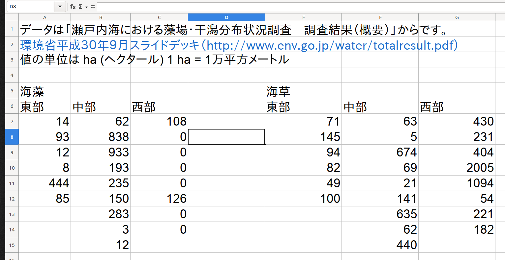

# データの読み込み {#data-input}

## 必要なパッケージ

::: {.rmdnote}


```r
library(tidyverse)
library(readxl)
```

:::

## データの確認

データは環境省の「瀬戸内海における藻場・干潟分布状況調査（概要）」からまとめました。
もとのファイルは[環境省平成３０年９月スライドデッキ](http://www.env.go.jp/water/totalresult.pdf) からダウンロードできます。
XLSXファイルは `readxl` パッケージの `read_xlsx()` 関数で読み込みます。
では、XLSXファイルに存在するシートの確認をしましょう^[t検定、一元配置分散分析、二元配置分散分析のチャプターに使うデータはここで処理しています。]。


```r
rootdatafolder = rprojroot::find_rstudio_root_file("Data/")
filename = '瀬戸内海藻場データ.xlsx'
path = str_c(rootdatafolder, filename)
excel_sheets(path) # シート名を確認する
#> [1] "FY1990" "FY2018"
```

`excel_sheets()` を実行したら、ファイルから 2つのシート名が返ってきました。
読み込む前に、それぞれのシートの構造を確認しましょう (Fig. \@ref(fig:seto1) and \@ref(fig:seto2))。
確認はスプレッドシートソフト（MS Office、 Google Sheets、 Open Office、 Apple Numbers、 など）で行います。

<div class="figure" style="text-align: center">

<p class="caption">(\#fig:seto1)瀬戸内海藻場データ.xlsx の FY1990 シートに入力されているデータは縦長の形式です。</p>
</div>

FY1990 のデータの構造は縦長なので、読み込みは比較的に楽です。
**それぞれの変数は一つの列**^[基本的には一行に 1 サンプル、一列に 1 変数にしましょう。]に入力されているから、読み込みが簡単です。

<div class="figure" style="text-align: center">

<p class="caption">(\#fig:seto2)瀬戸内海藻場データ.xlsx の FY2018 シートに入力されているデータは横長の形式です。</p>
</div>

FY2018 のデータの構造は横長です。
データは海藻と海草にわけられ、それぞれの変数じゃなくて、それぞれの場所の値を列に入力されています。
この用なデータの読み込みは手間がかかります^[一行に複数サンプルがあるので、そのまま R の関数にわたせない。]。

## データを読み込む

では、**FY1990 シート**のデータを読み込みます。
ここでシートから読み込むセルの範囲を指定します。


```r
RNG = "A4:C27"   # セルの範囲
SHEET = "FY1990" # シート名
d19 = read_xlsx(path, sheet = SHEET, range = RNG)
```

データは `tibble` として読み込まれました。
データに大きな問題がなければ、各列の型・タイプ (type)^[他に: \<lgl\> logical、 論理値；\<int\> integer、 整数；\<dttm\> datetime、日時 などもあります。] は自動的に設定されます。

* `調査海域` の列は `<chr>` : character, 文字列
* `海藻` の列は `<dbl>`: double, ダブル・数値・実数
* `海草` の列は `<dbl>`: double, ダブル・数値・実数

変数名が日本語の場合、コードが書きづらくなったり、バグの原因になります。
最初から英語表記にするのが合理的ですが、R環境内で名前を変換することは難しくないです。
とりあえず `d19` の内容をみましょう。


```r
d19 # FY1990 データの内容
#> # A tibble: 23 × 3
#>    調査海域  海藻  海草
#>    <chr>    <dbl> <dbl>
#>  1 東部        55    14
#>  2 東部       128    62
#>  3 東部        86     0
#>  4 東部        87     8
#>  5 東部       214    54
#>  6 東部       140    57
#>  7 中部        30    45
#>  8 中部         5   623
#>  9 中部       460   886
#> 10 中部        51   180
#> # … with 13 more rows
```

**FY2018 シート**の読み込みは、海藻と海草ごとにする必要があります。
読み込んだ後に、データを縦長に変換し、2 つの tibble を縦に結合します。


```r
RNG = "A6:C15"   # 海藻データのセル範囲
SHEET = "FY2018" # シート名
seaweed = read_xlsx(path, sheet = SHEET, range = RNG)
RNG = "E6:G15"   # 海草データのセル範囲
seagrass = read_xlsx(path, sheet = SHEET, range = RNG)
```

最初のセル範囲を読み込んで ファイルのコンテンツを `seaweed` に書き込んだら、`RNG` を次のセル範囲に書き換えます。
データは同じシートにあるので、`SHEET` を変更したり、新たに定義する必要はありません。

`seaweed` の内容は次のとおりです。


```r
seaweed
#> # A tibble: 9 × 3
#>    東部  中部  西部
#>   <dbl> <dbl> <dbl>
#> 1    14    62   108
#> 2    93   838     0
#> 3    12   933     0
#> 4     8   193     0
#> 5   444   235     0
#> 6    85   150   126
#> 7    NA   283     0
#> 8    NA     3     0
#> 9    NA    12    NA
```

`seagrass` の内容は次のとおりです。


```r
seagrass
#> # A tibble: 9 × 3
#>    東部  中部  西部
#>   <dbl> <dbl> <dbl>
#> 1    71    63   430
#> 2   145     5   231
#> 3    94   674   404
#> 4    82    69  2005
#> 5    49    21  1094
#> 6   100   141    54
#> 7    NA   635   221
#> 8    NA    62   182
#> 9    NA   440    NA
```

`NA` は Not Available の諸略です。
Rの場合、存在しないデータ (欠損値) は `NA` になります。
