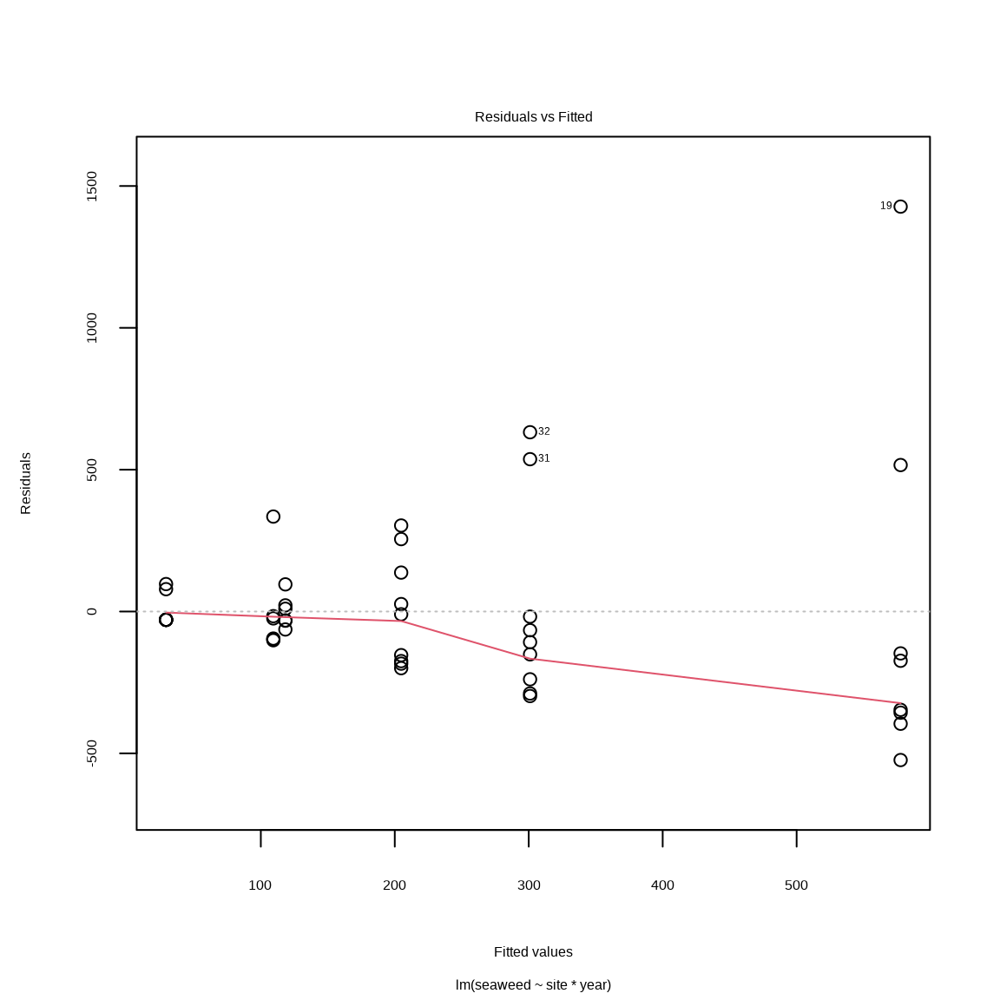
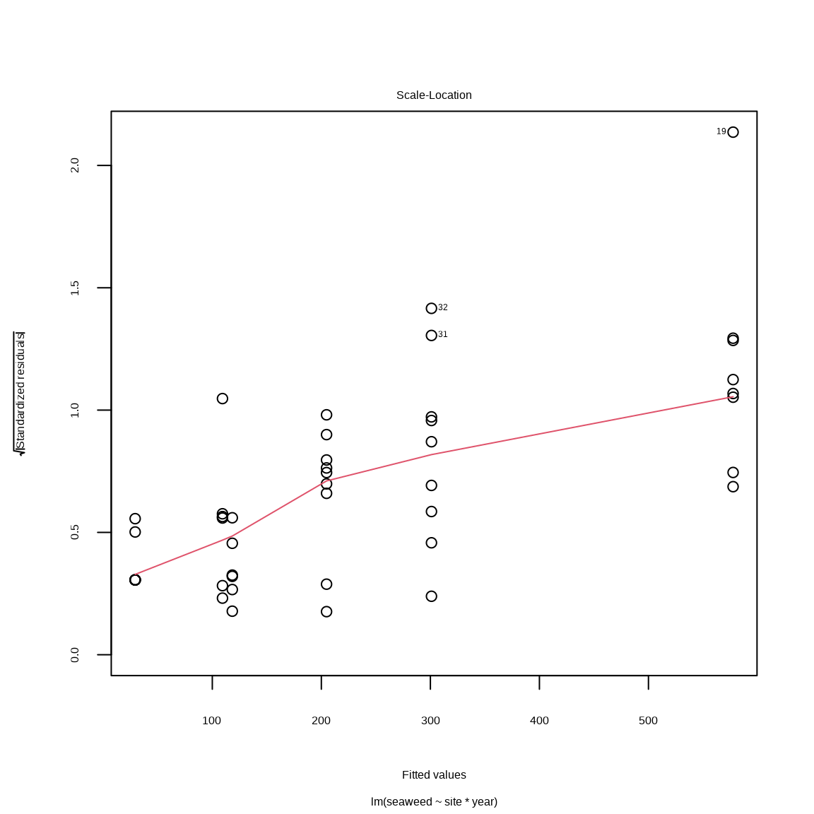

# 分散分析 {#anova}


## 必要なパッケージ


```r
library(tidyverse)
library(readxl)
library(car)
library(emmeans)
```

## データの読み込み


```r
rootdatafolder = rprojroot::find_rstudio_root_file("Data/")
filename = '瀬戸内海藻場データ.xlsx'
path = str_c(rootdatafolder, filename)

# fy1990 の処理
RNG = "A4:C27"   # セルの範囲
SHEET = "FY1990" # シート名
d19 = read_xlsx(path, sheet = SHEET, range = RNG)
d19 = d19 |> 
  rename(site = 調査海域, seaweed = 海藻, seagrass = 海草) |> 
  mutate(site = factor(site, levels = c('東部', '中部', '西部')))

# fy2018の処理
RNG = "A6:C15"   # 海藻データのセル範囲
SHEET = "FY2018" # シート名
seaweed = read_xlsx(path, sheet = SHEET, range = RNG)
RNG = "E6:G15"   # 海草データのセル範囲

seagrass = read_xlsx(path, sheet = SHEET, range = RNG)
seaweed = seaweed |> pivot_longer(cols = everything())
seagrass = seagrass |> pivot_longer(cols = everything())

d20 = bind_rows(seaweed = seaweed, seagrass = seagrass, .id = "type")
d20 = d20 |> pivot_wider(id_cols = name,
                   names_from = type, values_from = value, 
                   values_fn = "list")
d20 = d20 |> unnest(c(seaweed, seagrass)) |> rename(site = name) |> drop_na()
d20 = d20 |> 
  mutate(site = factor(site, levels = c('東部', '中部', '西部')))
```


## 一元配置分散分析

では、一元配置分散分析を実施します。
まず、分散分析の平方和を正しく求めるためには、`contr.sum` を設定することです。
その処理のあと、`lm()` 関数でモデルを当てはめます。
`lm()` 関数に渡すモデルは、 `〜` の右辺に説明変数、左辺に観測値を指定しましょう。


```r
contrasts(d19$site) = contr.sum
contrasts(d20$site) = contr.sum
m19 = lm(seaweed ~ site, data = d19)
m20 = lm(seaweed ~ site, data = d20)
```

FY1990 海藻藻場面積の一元配置分散分析の結果は次のとおりです。

```r
a19 = anova(m19)
a20 = anova(m20)
```


```r
anova(m19) # FY1990 の処理
#> Analysis of Variance Table
#> 
#> Response: seaweed
#>           Df  Sum Sq Mean Sq F value  Pr(>F)  
#> site       2  892963  446482  2.6621 0.09439 .
#> Residuals 20 3354343  167717                  
#> ---
#> Signif. codes:  
#> 0 '***' 0.001 '**' 0.01 '*' 0.05 '.' 0.1 ' ' 1
```

FY2019 海藻藻場面積の一元配置分散分析の結果は次のとおりです。


```r
anova(m20) # FY2018 の処理
#> Analysis of Variance Table
#> 
#> Response: seaweed
#>           Df  Sum Sq Mean Sq F value  Pr(>F)  
#> site       2  330811  165405  2.9569 0.07499 .
#> Residuals 20 1118771   55939                  
#> ---
#> Signif. codes:  
#> 0 '***' 0.001 '**' 0.01 '*' 0.05 '.' 0.1 ' ' 1
```

FY1990 のP値は P = 0.0944、
FY2018 のP値は P = 0.0750 でした。
どちらも有意水準 (α = 0.05) より大きいので、帰無仮説（海域間の藻場面積は同じ）を棄却できません。

等分散性と正規性の検定を無視したように、今回だけ分散分析の結果を無視して、多重比較をしてみます。

## 多重比較

調査海域の全ペアの比較をしるので、Tukey HSDを用います。


```r
e19 = emmeans(m19, specs = pairwise ~ site, adjust = "tukey")
e20 = emmeans(m20, specs = pairwise ~ site, adjust = "tukey")
```


FY2019 の場合、全ペアを比較したら、有意な結果はありません。


```r
e19 # FY1990 の処理
#> $emmeans
#>  site emmean  SE df lower.CL upper.CL
#>  東部    118 167 20     -230      467
#>  中部    205 137 20      -80      490
#>  西部    578 145 20      276      880
#> 
#> Confidence level used: 0.95 
#> 
#> $contrasts
#>     contrast estimate  SE df t.ratio p.value
#>  東部 - 中部    -86.4 216 20  -0.400  0.9158
#>  東部 - 西部   -459.3 221 20  -2.077  0.1202
#>  中部 - 西部   -372.8 199 20  -1.874  0.1723
#> 
#> P value adjustment: tukey method for comparing a family of 3 estimates
```

FY2020 も同じですね。


```r
e20 # FY2018 の処理
#> $emmeans
#>  site emmean   SE df lower.CL upper.CL
#>  東部  109.3 96.6 20    -92.1      311
#>  中部  301.0 78.8 20    136.5      465
#>  西部   29.2 83.6 20   -145.2      204
#> 
#> Confidence level used: 0.95 
#> 
#> $contrasts
#>     contrast estimate  SE df t.ratio p.value
#>  東部 - 中部   -191.7 125 20  -1.538  0.2953
#>  東部 - 西部     80.1 128 20   0.627  0.8072
#>  中部 - 西部    271.8 115 20   2.365  0.0696
#> 
#> P value adjustment: tukey method for comparing a family of 3 estimates
```

この用な結果は予想していました。そもそも分散分析から有意な結果がでなかったので、多重比較しても有意な結果はでません。

ちなみに Dunnet Method をつかって、西部と東部を中部と比較したら次の結果になります。


```r
e19d = emmeans(m19, specs = trt.vs.ctrl ~ site, ref = 2)
e20d = emmeans(m20, specs = trt.vs.ctrl ~ site, ref = 2)
```


```r
e19d # FY1990 の処理
#> $emmeans
#>  site emmean  SE df lower.CL upper.CL
#>  東部    118 167 20     -230      467
#>  中部    205 137 20      -80      490
#>  西部    578 145 20      276      880
#> 
#> Confidence level used: 0.95 
#> 
#> $contrasts
#>     contrast estimate  SE df t.ratio p.value
#>  東部 - 中部    -86.4 216 20  -0.400  0.8781
#>  西部 - 中部    372.8 199 20   1.874  0.1373
#> 
#> P value adjustment: dunnettx method for 2 tests
```


```r
e20d # FY2018 の処理
#> $emmeans
#>  site emmean   SE df lower.CL upper.CL
#>  東部  109.3 96.6 20    -92.1      311
#>  中部  301.0 78.8 20    136.5      465
#>  西部   29.2 83.6 20   -145.2      204
#> 
#> Confidence level used: 0.95 
#> 
#> $contrasts
#>     contrast estimate  SE df t.ratio p.value
#>  東部 - 中部     -192 125 20  -1.538  0.2441
#>  西部 - 中部     -272 115 20  -2.365  0.0531
#> 
#> P value adjustment: dunnettx method for 2 tests
```

Dunnet Method の場合でも有意な結果はありません。


## 二元配置分散分析

## 正規性と等分散性の確認


```r
dall = bind_rows(fy1990 = d19,
                 fy2018 = d20, 
                 .id = "year")
dall = dall |> mutate(year = factor(year))
```


分散分析を行う前に、Levene Test と Shapiro-Wilk Normality Test でデータの等分散性^[assumption of homogeneity of variance] と正規性^[assumption normality] を確認します。
ルビーン検定とシャピロウィルク検定については、t 検定の資料を参考にしてください。
ここで紹介する解析は `海藻` に対してです。


**ルビーン検定**

`FY1990`と`FY2018` データの等分散性検定結果は P = 0.0996 でしたので、
帰無仮説は棄却できません。
つまり、等分散性であると判断できます。


```r
leveneTest(seaweed ~ site*year, data = dall) 
#> Levene's Test for Homogeneity of Variance (center = median)
#>       Df F value Pr(>F)  
#> group  5  1.9994 0.0996 .
#>       40                 
#> ---
#> Signif. codes:  
#> 0 '***' 0.001 '**' 0.01 '*' 0.05 '.' 0.1 ' ' 1
```

**シャピロウィルク検定**


`FY1990`と`FY2018` データの等分散性について、P < 0.0001 だったので、
帰無仮説を棄却できます。
データの母集団は正規分布に従わないかもしれないです。


```r
shapiro.test(x = dall$seaweed) # FY1990 の処理
#> 
#> 	Shapiro-Wilk normality test
#> 
#> data:  dall$seaweed
#> W = 0.63263, p-value = 1.731e-09
```


## 二元配置分散分析

では、二元配置分散分析を実施します。
まず、分散分析の平方和を正しく求めるためには、`contr.sum` を設定することです。
その処理のあと、`lm()` 関数でモデルを当てはめます。
`lm()` 関数に渡すモデルは、 `〜` の右辺に説明変数、左辺に観測値を指定しましょう。


```r
contrasts(dall$site) = contr.sum
contrasts(dall$year) = contr.sum
mall = lm(seaweed ~ site*year, data = dall)
```

FY1990 海藻藻場面積の一元配置分散分析の結果は次のとおりです。


```r
Anova(mall, type =3)
#> Anova Table (Type III tests)
#> 
#> Response: seaweed
#>              Sum Sq Df F value    Pr(>F)    
#> (Intercept) 2230084  1 19.9421 6.382e-05 ***
#> site         256846  2  1.1484   0.32738    
#> year         263994  1  2.3607   0.13230    
#> site:year    966928  2  4.3233   0.01996 *  
#> Residuals   4473114 40                      
#> ---
#> Signif. codes:  
#> 0 '***' 0.001 '**' 0.01 '*' 0.05 '.' 0.1 ' ' 1
```


`site` 効果のP値は P = 0.3274、
`year` 効果のP値は P = 0.1323、
相互作用のP値は    P = 0.0200 でした。
相互作用のP値は有意水準 (α = 0.05) より大きいので、相互作用の帰無仮説は棄却できますが、主効果の帰無仮説は棄却できません。

## 多重比較

調査海域の全ペアの比較をしるので、Tukey HSDを用います。


```r
eall = emmeans(mall, specs = pairwise ~ site:year, adjust = "tukey")
```


FY2019 の場合、全ペアを比較したら、有意な結果はありません。


```r
eall 
#> $emmeans
#>  site year   emmean  SE df lower.CL upper.CL
#>  東部 fy1990  118.3 137 40   -157.6      394
#>  中部 fy1990  204.8 111 40    -20.5      430
#>  西部 fy1990  577.6 118 40    338.7      817
#>  東部 fy2018  109.3 137 40   -166.6      385
#>  中部 fy2018  301.0 111 40     75.7      526
#>  西部 fy2018   29.2 118 40   -209.7      268
#> 
#> Confidence level used: 0.95 
#> 
#> $contrasts
#>      contrast              estimate  SE df t.ratio p.value
#>  東部 fy1990 - 中部 fy1990    -86.4 176 40  -0.490  0.9962
#>  東部 fy1990 - 西部 fy1990   -459.3 181 40  -2.543  0.1360
#>  東部 fy1990 - 東部 fy2018      9.0 193 40   0.047  1.0000
#>  東部 fy1990 - 中部 fy2018   -182.7 176 40  -1.036  0.9027
#>  東部 fy1990 - 西部 fy2018     89.1 181 40   0.493  0.9961
#>  中部 fy1990 - 西部 fy1990   -372.8 162 40  -2.295  0.2201
#>  中部 fy1990 - 東部 fy2018     95.4 176 40   0.542  0.9940
#>  中部 fy1990 - 中部 fy2018    -96.2 158 40  -0.610  0.9897
#>  中部 fy1990 - 西部 fy2018    175.5 162 40   1.080  0.8863
#>  西部 fy1990 - 東部 fy2018    468.3 181 40   2.593  0.1226
#>  西部 fy1990 - 中部 fy2018    276.6 162 40   1.702  0.5383
#>  西部 fy1990 - 西部 fy2018    548.4 167 40   3.280  0.0245
#>  東部 fy2018 - 中部 fy2018   -191.7 176 40  -1.087  0.8835
#>  東部 fy2018 - 西部 fy2018     80.1 181 40   0.443  0.9977
#>  中部 fy2018 - 西部 fy2018    271.8 162 40   1.672  0.5573
#> 
#> P value adjustment: tukey method for comparing a family of 6 estimates
```


```r
emmeans(mall, specs = pairwise ~ site|year, adjust = "tukey")
#> $emmeans
#> year = fy1990:
#>  site emmean  SE df lower.CL upper.CL
#>  東部  118.3 137 40   -157.6      394
#>  中部  204.8 111 40    -20.5      430
#>  西部  577.6 118 40    338.7      817
#> 
#> year = fy2018:
#>  site emmean  SE df lower.CL upper.CL
#>  東部  109.3 137 40   -166.6      385
#>  中部  301.0 111 40     75.7      526
#>  西部   29.2 118 40   -209.7      268
#> 
#> Confidence level used: 0.95 
#> 
#> $contrasts
#> year = fy1990:
#>     contrast estimate  SE df t.ratio p.value
#>  東部 - 中部    -86.4 176 40  -0.490  0.8762
#>  東部 - 西部   -459.3 181 40  -2.543  0.0389
#>  中部 - 西部   -372.8 162 40  -2.295  0.0681
#> 
#> year = fy2018:
#>     contrast estimate  SE df t.ratio p.value
#>  東部 - 中部   -191.7 176 40  -1.087  0.5273
#>  東部 - 西部     80.1 181 40   0.443  0.8976
#>  中部 - 西部    271.8 162 40   1.672  0.2282
#> 
#> P value adjustment: tukey method for comparing a family of 3 estimates
emmeans(mall, specs = pairwise ~ year|site, adjust = "tukey")
#> $emmeans
#> site = 東部:
#>  year   emmean  SE df lower.CL upper.CL
#>  fy1990  118.3 137 40   -157.6      394
#>  fy2018  109.3 137 40   -166.6      385
#> 
#> site = 中部:
#>  year   emmean  SE df lower.CL upper.CL
#>  fy1990  204.8 111 40    -20.5      430
#>  fy2018  301.0 111 40     75.7      526
#> 
#> site = 西部:
#>  year   emmean  SE df lower.CL upper.CL
#>  fy1990  577.6 118 40    338.7      817
#>  fy2018   29.2 118 40   -209.7      268
#> 
#> Confidence level used: 0.95 
#> 
#> $contrasts
#> site = 東部:
#>  contrast        estimate  SE df t.ratio p.value
#>  fy1990 - fy2018      9.0 193 40   0.047  0.9631
#> 
#> site = 中部:
#>  contrast        estimate  SE df t.ratio p.value
#>  fy1990 - fy2018    -96.2 158 40  -0.610  0.5451
#> 
#> site = 西部:
#>  contrast        estimate  SE df t.ratio p.value
#>  fy1990 - fy2018    548.4 167 40   3.280  0.0022
```

## 等分散性と正規性の事後確認

`plot()` に渡している `mall` は前章に当てはめた二元配置分散分析のモデルです。

## 等分散性の確認に使うプロット


```r
plot(mall, which = 1)
```

<div class="figure" style="text-align: center">

<p class="caption">(\#fig:rfplot)残渣 vs. 期待値</p>
</div>

Fig. \@ref(fig:rfplot) は残渣^[residual] 
と期待値^[fitted values] の関係を理解するてめに使います。
等分散性に問題がない場合、残渣は y = 0 の周りを均一に、変動なくばらつきます。
ところが Fig. \@ref(fig:rfplot) の場合、期待値が高いとき、残渣のばらつきが大きい。


```r
plot(mall, which = 3)
```

<div class="figure" style="text-align: center">

<p class="caption">(\#fig:slplot)スケール・位置プロット</p>
</div>

Fig. \@ref(fig:slplot) はスケール・ロケーションプロットといいます。
スケール^[scale] は確率密度分布のばらつきのパラメータです。
位置（ロケーション）^[location] は確率分布の中心のパラメータです。
たとえば、正規分布のスケールパラメータは分散、位置パラメータは平均値です。
Fig. \@ref(fig:slplot) の横軸は位置、縦長はスケールパラメータで標準化した残渣の平方根です。
示されている標準化残渣のばらつきが均一で、期待値^[fitted values] と無関係であれば、ばらつきは均一であると考えられます。
Fig. \@ref(fig:slplot) の場合、標準化残渣は期待値と正の関係があるので、ばらつきは均一であると考えられません。


## 正規性の確認に使うプロット


```r
plot(mall, which = 2)
```

<div class="figure" style="text-align: center">

<p class="caption">(\#fig:qqplot)QQプロット</p>
</div>


## 飛び値・異常値の確認プロット


```r
plot(mall, which = 5)
```

<div class="figure" style="text-align: center">

<p class="caption">(\#fig:cookplot)クックの距離とてこ比</p>
</div>

