# 一般化線形モデル {#glm}

## 必要なパッケージ


```r
library(tidyverse)
library(car)
library(patchwork)
```


## 線形モデルとは？ 

* 線形モデルの **線型 (linear)** は直線 (straight line) と全く関係ないです。
* 線型モデルの線型は **線型結合 (linear combination)** を意味しています。

$$
y = b_1 x_1 + b_2 x_2 + b_3 x_3 + \cdots + b_n x_n
$$
$b_i$ は係数，$x_i$ はベクトル（変数, 説明変数）です。$y$ が $x_i$ の線型結合です。

## 線型モデルは直線じゃなくてもいい


**線形モデル**

* $\mu = \beta_0 + \beta_1 x_1$
* $\mu = \beta_0 + \beta_1 x_1 + \beta_2 x_2^2$
* $\mu = \beta_0 + \beta_1\exp(x_1)$


**非線形モデル**

* $\mu = \frac{\beta_1 x_1}{\beta_2 + x_1}$
* $\mu = \beta_1 \left(1-\exp(\beta_2 x_1)\right) + \beta_3$
* $\mu = \beta_0 + \beta_1\exp(\beta_2 x_1)$


線形モデルは直線じゃなくてもいい。
ただし，変数 ($x_i$) は線型結合であることが重要なポイントです。
では、検討しているモデルは線形モデルかどうかを確認したいなら、パラメータに対してモデルの偏微分方程式を求めてください。

たとえば、モデルパラメータ $(\beta_i)$ に対して，$\mu$を微分します。

$$
\mu = \beta_0 + \beta_1 x_1 + \beta_2 x_2^2
$$

パラメータの数ほど微分方程式があります。

$$
\frac{\partial \mu}{\partial \beta_0}  = 1 \qquad
\frac{\partial \mu}{\partial \beta_1}  = x_1 \qquad
\frac{\partial \mu}{\partial \beta_2}  = x_2 
$$

$\beta_i$ はどの微分方程式に残らないので，このモデルは線形モデルでしょう。

次のモデルは非線形モデルです。

$$
\mu = \frac{\beta_1 x_1}{\beta_2 + x_1}
$$

モデルパラメータは $\beta_1$, $\beta_2$ ですね。
ではパラメータに対する偏微分方程式は次の通りです。

$$
\begin{aligned}
\frac{\partial \mu}{\partial \beta_1}  &= \frac{x_1}{\beta_2 x_1} \\
\frac{\partial \mu}{\partial \beta_2}  &= -\frac{x_1}{(\beta_2 x_2)^2} 
\end{aligned}
$$

パラメータはお互いの方程式に残るので，このモデルは線形モデルではないですね。

## 線形モデルの仮定

線形モデルを用いるときに守るべき仮定は分散分析と同じです。

* 残差が正規分布に従うこと。
* 残差またはデータはお互いに独立し，同一分布から発生していること。

モデルに対する注意する点

* 説明変数もお互いに関係性（相関関係）が低いこと（関係ないほうがいい）。
    * 関係性が高いとき，モデルパラメータの推定量の精度 (precision) と正確度 (accuracy) が落ちます。
    * この現象は多重共線性 (multicollinearity) とよびます。
* 説明変数はお互いに関係がなければ，**直交性 (orthogonal)** のあるモデルとなり，変数の推定量はお互いとの相関性がないです。

野外データは上の条件を満たすことは珍しいが、すべての条件を満たさなくても解析はできます。
ただし、結果の解釈と考察には気をつけましょう。

## 一般線形モデルの例 (General Linear Model)

解析例にはアヤメのデータをつかっています。
ちなみに、一般線形モデルは一般化線形モデル (Generalized Linear Model, GLM) の特例です。


```r
iris = iris %>% as_tibble()
iris %>% print(n = 3)
#> # A tibble: 150 × 5
#>   Sepal.Length Sepal.Width Petal.Length Petal.Width Species
#>          <dbl>       <dbl>        <dbl>       <dbl> <fct>  
#> 1          5.1         3.5          1.4         0.2 setosa 
#> 2          4.9         3            1.4         0.2 setosa 
#> 3          4.7         3.2          1.3         0.2 setosa 
#> # … with 147 more rows
```

検討する線型モデルは次の通りです。

$$
E(\text{Petal Length}) = b_0 + b_1\text{Petal Width} + b_2\text{Sepal Length} + b_3\text{Sepal Width}
$$

$E(\text{Petal Length})$ は花びらの長さの**期待値 (expected value)** といいます。


線形モデルなので，`lm()` 関数で解析できます。
さらに、分散分析表も存在します。


```r
m1 = lm(Petal.Length ~ Petal.Width + Sepal.Length + Sepal.Width, data = iris)
```

分散分析表は `summary.aov()` でだします。


```r
m1 %>% summary.aov() %>% print(signif.stars = F)
#>               Df Sum Sq Mean Sq F value Pr(>F)
#> Petal.Width    1  430.5   430.5 4231.49 <2e-16
#> Sepal.Length   1    9.9     9.9   97.74 <2e-16
#> Sepal.Width    1    9.0     9.0   88.95 <2e-16
#> Residuals    146   14.9     0.1
```

モデルに入れた全ての説明変数のP値は $< 0.0001$ ですね。

では、線形モデルの係数表を出してみましょう。


```r
m1 %>% summary() %>% print(signif.stars = F)
#> 
#> Call:
#> lm(formula = Petal.Length ~ Petal.Width + Sepal.Length + Sepal.Width, 
#>     data = iris)
#> 
#> Residuals:
#>      Min       1Q   Median       3Q      Max 
#> -0.99333 -0.17656 -0.01004  0.18558  1.06909 
#> 
#> Coefficients:
#>              Estimate Std. Error t value Pr(>|t|)
#> (Intercept)  -0.26271    0.29741  -0.883    0.379
#> Petal.Width   1.44679    0.06761  21.399   <2e-16
#> Sepal.Length  0.72914    0.05832  12.502   <2e-16
#> Sepal.Width  -0.64601    0.06850  -9.431   <2e-16
#> 
#> Residual standard error: 0.319 on 146 degrees of freedom
#> Multiple R-squared:  0.968,	Adjusted R-squared:  0.9674 
#> F-statistic:  1473 on 3 and 146 DF,  p-value: < 2.2e-16
```

`Petal.Length` に対して，`Petal.Width` と `Sepal.Length` は正の効果があり，`Sepal.Width` とは負の効果がありました。
つまり， `Petal.Width` と `Sepal.Length` が上昇すると， `Petal.Length` も上昇します。

分散分析表の場合は、それぞれの変数に対するF値がでたが、係数表の場合は t値 がでました。
当然それぞれの値も異なった。

何が違うのか？

まず、分散分析の平方和って、さまざま求め方がるあることに気づきましょう。

* Type-I Sum-of-squares
  * SS(A), SS(B|A), SS(AB|B, A)
* Type-II Sum-of-squares
  * SS(A|B), SS(B|A)
* Type-III Sum-of-squares
  * SS(A|B), SS(B|A), SS(AB|B,A)

他にもありますが、この 3 つが一般的にです。

**Type-I** の場合、結果は変数の順序に依存します。
**Type-II** の場合、順序に依存しないが、相互作用はない。
**Type-III** の場合、順序に依存しないが、相互作用の影響も計算されます。

**Type-I** はRのデフォルトなので、**Type-II** または **Type-II** を使いたいなら、
`car` パッケージの `Anova()` 関数が必要です。

といくおとで、説明変数の順序をかえるた、次のように異なる結果が返ってきます。

```r
m1a  = lm(Petal.Length ~ Petal.Width + Sepal.Length + Sepal.Width, data = iris)
m1b = lm(Petal.Length ~ Petal.Width + Sepal.Width + Sepal.Length, data = iris)
m1c = lm(Petal.Length ~ Sepal.Width + Petal.Width + Sepal.Length, data = iris)
m1a |> summary.aov()
#>               Df Sum Sq Mean Sq F value Pr(>F)    
#> Petal.Width    1  430.5   430.5 4231.49 <2e-16 ***
#> Sepal.Length   1    9.9     9.9   97.74 <2e-16 ***
#> Sepal.Width    1    9.0     9.0   88.95 <2e-16 ***
#> Residuals    146   14.9     0.1                   
#> ---
#> Signif. codes:  
#> 0 '***' 0.001 '**' 0.01 '*' 0.05 '.' 0.1 ' ' 1
m1b |> summary.aov()
#>               Df Sum Sq Mean Sq F value   Pr(>F)    
#> Petal.Width    1  430.5   430.5 4231.49  < 2e-16 ***
#> Sepal.Width    1    3.1     3.1   30.37 1.57e-07 ***
#> Sepal.Length   1   15.9    15.9  156.31  < 2e-16 ***
#> Residuals    146   14.9     0.1                     
#> ---
#> Signif. codes:  
#> 0 '***' 0.001 '**' 0.01 '*' 0.05 '.' 0.1 ' ' 1
m1c |> summary.aov()
#>               Df Sum Sq Mean Sq F value Pr(>F)    
#> Sepal.Width    1   85.2    85.2   837.8 <2e-16 ***
#> Petal.Width    1  348.3   348.3  3424.1 <2e-16 ***
#> Sepal.Length   1   15.9    15.9   156.3 <2e-16 ***
#> Residuals    146   14.9     0.1                   
#> ---
#> Signif. codes:  
#> 0 '***' 0.001 '**' 0.01 '*' 0.05 '.' 0.1 ' ' 1
```

このとき、`car` パッケージの `Anova()` 関数を使って平方和の求め方を指定します。
相互作用なしのモデルなので、Type-II を指定しました。
相互作用も調べたいなら、`type="III"` を渡してください。

```r
m1a |> Anova(type = "II")
#> Anova Table (Type II tests)
#> 
#> Response: Petal.Length
#>              Sum Sq  Df F value    Pr(>F)    
#> Petal.Width  46.584   1 457.905 < 2.2e-16 ***
#> Sepal.Length 15.902   1 156.312 < 2.2e-16 ***
#> Sepal.Width   9.049   1  88.947 < 2.2e-16 ***
#> Residuals    14.853 146                      
#> ---
#> Signif. codes:  
#> 0 '***' 0.001 '**' 0.01 '*' 0.05 '.' 0.1 ' ' 1
m1b |> Anova(type = "II")
#> Anova Table (Type II tests)
#> 
#> Response: Petal.Length
#>              Sum Sq  Df F value    Pr(>F)    
#> Petal.Width  46.584   1 457.905 < 2.2e-16 ***
#> Sepal.Width   9.049   1  88.947 < 2.2e-16 ***
#> Sepal.Length 15.902   1 156.312 < 2.2e-16 ***
#> Residuals    14.853 146                      
#> ---
#> Signif. codes:  
#> 0 '***' 0.001 '**' 0.01 '*' 0.05 '.' 0.1 ' ' 1
m1c |> Anova(type = "II")
#> Anova Table (Type II tests)
#> 
#> Response: Petal.Length
#>              Sum Sq  Df F value    Pr(>F)    
#> Sepal.Width   9.049   1  88.947 < 2.2e-16 ***
#> Petal.Width  46.584   1 457.905 < 2.2e-16 ***
#> Sepal.Length 15.902   1 156.312 < 2.2e-16 ***
#> Residuals    14.853 146                      
#> ---
#> Signif. codes:  
#> 0 '***' 0.001 '**' 0.01 '*' 0.05 '.' 0.1 ' ' 1
```

係数表は t値の結果は Wald's test と呼びます。


```r
m1 |> summary()
#> 
#> Call:
#> lm(formula = Petal.Length ~ Petal.Width + Sepal.Length + Sepal.Width, 
#>     data = iris)
#> 
#> Residuals:
#>      Min       1Q   Median       3Q      Max 
#> -0.99333 -0.17656 -0.01004  0.18558  1.06909 
#> 
#> Coefficients:
#>              Estimate Std. Error t value Pr(>|t|)    
#> (Intercept)  -0.26271    0.29741  -0.883    0.379    
#> Petal.Width   1.44679    0.06761  21.399   <2e-16 ***
#> Sepal.Length  0.72914    0.05832  12.502   <2e-16 ***
#> Sepal.Width  -0.64601    0.06850  -9.431   <2e-16 ***
#> ---
#> Signif. codes:  
#> 0 '***' 0.001 '**' 0.01 '*' 0.05 '.' 0.1 ' ' 1
#> 
#> Residual standard error: 0.319 on 146 degrees of freedom
#> Multiple R-squared:  0.968,	Adjusted R-squared:  0.9674 
#> F-statistic:  1473 on 3 and 146 DF,  p-value: < 2.2e-16
```

このとき、$\beta = 0$ の帰無仮説を検証しています。
つまり、係数の値は 0 か 0 じゃないかですね。

Wald's test と F-test のこちらもモデルの解析に使えます。
ところが、一般的には、モデル選択に F-test を使いますが、
係数が 0 か 0 じゃないかの検証には Wald's test を使います。
ちなみに、このモデルの場合、$(t_\nu)^2 = F_{(1,\nu)}$ なので、
係数表のt値の2乗は Type-II 分散分析のF値と同じです。


## モデル診断

モデルを当てはめたあと、最も重要な解析はモデル残渣の確認です。
モデル残渣に異常があると、モデルとデータの相性が悪いです。
モデルとデータが合わない場合、求めた係数を信用できません。

一般線形モデルのとき、標準化残渣 (standardized residuals) をもとめて、モデルの良さを目で確認します。
つまり、標準化残渣を様々形の図を作ります。

まず、残渣を持てめて、図に使うデータを準備します。


```r
firis = fortify(m1) |> as_tibble()
firis
#> # A tibble: 150 × 10
#>    Petal.Length Petal.Width Sepal.Length Sepal.Width   .hat
#>           <dbl>       <dbl>        <dbl>       <dbl>  <dbl>
#>  1          1.4         0.2          5.1         3.5 0.0205
#>  2          1.4         0.2          4.9         3   0.0212
#>  3          1.3         0.2          4.7         3.2 0.0201
#>  4          1.5         0.2          4.6         3.1 0.0221
#>  5          1.4         0.2          5           3.6 0.0230
#>  6          1.7         0.4          5.4         3.9 0.0327
#>  7          1.4         0.3          4.6         3.4 0.0255
#>  8          1.5         0.2          5           3.4 0.0189
#>  9          1.4         0.2          4.4         2.9 0.0293
#> 10          1.5         0.1          4.9         3.1 0.0225
#> # … with 140 more rows, and 5 more variables: .sigma <dbl>,
#> #   .cooksd <dbl>, .fitted <dbl>, .resid <dbl>,
#> #   .stdresid <dbl>
```


### 残渣の正規性

まずは残渣は正規分布に従うかを評価します。
正規性はヒストグラムとQQプロットでします。
残渣が正規分布に従うなら、ヒストグラムは正規分布に似ていて、
QQプロットでは残渣を示す点が赤色の直線上に並びます。


```r
ggplot(firis) + 
  geom_histogram(aes(x = .stdresid, y = ..density..)) +
  stat_function(fun = dnorm, color = "red") +
  labs(x = "Standardized residual", y = "") 
```

<div class="figure" style="text-align: center">
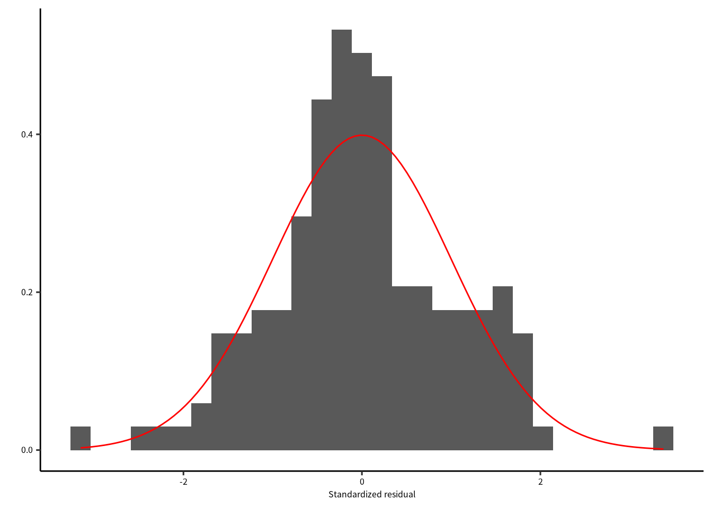
<p class="caption">(\#fig:unnamed-chunk-10)残渣のヒストグラムと正規分布。</p>
</div>


```r
ggplot(firis) + 
  geom_qq(aes(sample = .stdresid)) +
  geom_abline(color = "red") +
  labs(x = "Theoretical Quantile", y = "Standardized residual") 
```

<div class="figure" style="text-align: center">
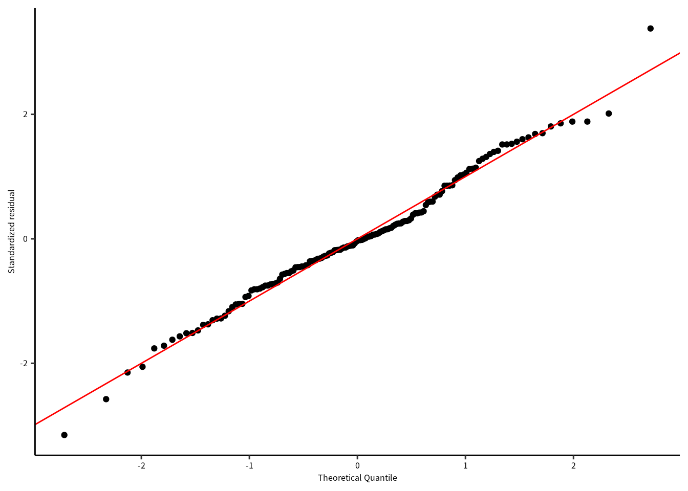
<p class="caption">(\#fig:unnamed-chunk-11)QQプロット</p>
</div>

どちらの図を確認しても、標準化残渣は正規分布に従っているように見えます。


### 残渣のばらつき

正規性に問題がなければ、次は標準化残渣のばらつきを確認したいです。
すべての変数に対して残渣の図をつくります。
また、求めた期待値に対しても残渣を確認します。
残渣になんかしらのパタンがあると、問題です。


```r
firis |> 
  select(matches("Petal|Sepal"), .stdresid) |> 
  pivot_longer(matches("Petal|Sepal")) |> 
  ggplot() + 
  geom_point(aes(x = value, y = .stdresid)) + 
  geom_hline(yintercept = 0, linetype = "dashed", color = "red") +
  facet_wrap(vars(name), scales = "free")
```

<div class="figure" style="text-align: center">

<p class="caption">(\#fig:unnamed-chunk-12)標準化残渣と応答変数、それぞれの説明変数との関係。</p>
</div>

残渣は 0 をまたいで均等にばらついていることが確認できました。
さらに、ばらつきに明確なパタンがないので、この点についてモデルには問題なさそうです。
次は残渣と期待値の関係を確認します。


```r
firis |> 
  select(.fitted, .stdresid) |> 
  ggplot() + 
  geom_point(aes(x = .fitted, y = .stdresid)) + 
  geom_hline(yintercept = 0, linetype = "dashed", color = "red") 
```

<div class="figure" style="text-align: center">
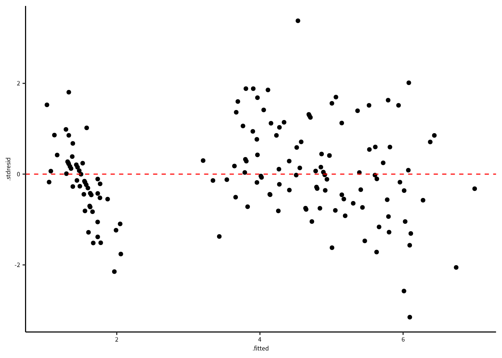
<p class="caption">(\#fig:unnamed-chunk-13)標準化残渣と期待値の関係。</p>
</div>

期待値と標準化残渣の関係を確認すると、特に問題はないですね。
場合によって、標準化残渣の絶対値の平方根で確認しやすい場合もあります。
この解析の場合は不必要ですが、コードと結果は次の通りです。


```r
firis |> 
  select(.fitted, .stdresid) |> 
  ggplot() + 
  geom_point(aes(x = .fitted, y = sqrt(abs(.stdresid)))) 
```

<div class="figure" style="text-align: center">

<p class="caption">(\#fig:unnamed-chunk-14)標準化残渣の平方根と期待値の関係。</p>
</div>

最後に、クックの距離を確認します。クックの距離 (Cook's distance) はモデルの当てはめに強く影響する値を検出してくれます。
データ点のクックの距離が $P(F_{(n, n-p)}=0.5)$ を超えた場合、ちょっと怪しいかもしれないです。

```r
dof = summary(m1) |> pluck("df")
thold = qf(0.5, dof[1], dof[2])
firis |> 
  mutate(n = 1:n()) |> 
  mutate(above = ifelse(.cooksd > thold, T, F)) |> 
  ggplot() + 
  geom_point(aes(x = n, y = .cooksd, color = above)) + 
  geom_hline(yintercept = thold, color = "red", linetype = "dashed")
```

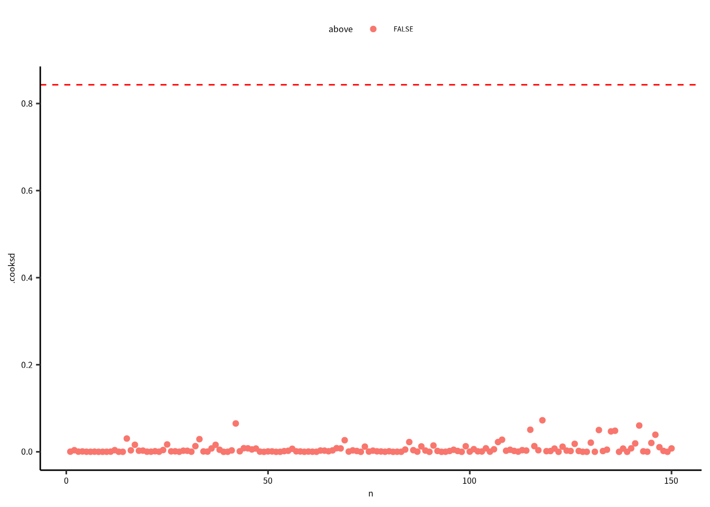

診断図から問題ないと判断できたら、説明変数の多重鏡線性を確認しましょう。
まず，説明変数がお互いに相関があるかを確認します。


```r
iris %>% select(-Species, - Petal.Length) %>% cor()
#>              Sepal.Length Sepal.Width Petal.Width
#> Sepal.Length    1.0000000  -0.1175698   0.8179411
#> Sepal.Width    -0.1175698   1.0000000  -0.3661259
#> Petal.Width     0.8179411  -0.3661259   1.0000000
```

`Petal.Width` と `Sepal.Length` の相関は高いですが，他は 0 に近いので相関関係は低いです。
多重共線性をしっかりと確認したければ，分散拡大係数 (Variance Inflation Factor; VIF) をもとめます。

VIF は決定係数 $(R_i^2)$ をつかって計算するので，方程式は次の通りです。

$$
\text{VIF} = \frac{1}{1-R_i^2}
$$

VIF を計算するには，説明変数 $x_i$ を他の説明変数 $x_{j \neq i}$ との線形モデル組み立てて，決定係数を求める必要があります。

つまり，先ほどの相関係数の結果をつかうと，


```r
x1 = lm(Petal.Width ~ Sepal.Length + Sepal.Width, 
        data = iris) %>% summary() %>% pluck("r.squared")
x2 = lm(Sepal.Length ~ Petal.Width + Sepal.Width, 
        data = iris) %>% summary() %>% pluck("r.squared")
x3 = lm(Sepal.Width ~ Sepal.Length + Petal.Width, 
        data = iris) %>% summary() %>% pluck("r.squared")
1 / (1-c(x1,x2,x3)) # VIF
#> [1] 3.889961 3.415733 1.305515
```

`car` パッケージの `vif()` 関数の方が便利です。


```r
car::vif(m1)
#>  Petal.Width Sepal.Length  Sepal.Width 
#>     3.889961     3.415733     1.305515
```

$VIF(\beta_i) > 10$ であれば，多重共線性の問題は大きいと考えられます。
このときの決定係数は $1-1/10 = 0.90$ です。

## ガラパゴス諸島における種数の解析

`iris` データの解析に大きな問題がなかったので、あまり参考にならなかったので、
ガラパゴス諸島のデータを解析してみましょう。

`faraway` パッケージの `gala` を解析します。
`gala` にはガラパゴス諸島の生態系に対しての 7 つの変数があります。`Species` は植物の種数，`Endemics` は植物の固有種，
`Area` は島の平面積 (m^2^)，`Elevation` は島の最も高い場所 (m)，`Nearest` は最も近い島からの距離 (km)，`Scruz` はサンタクルス島からの距離 (km)，`Adjacent` は最も近い島の面積 (m^2^)です。


```r
data(gala, package = "faraway")
gala = gala %>% as_tibble() # tibble に変換
gala %>% print(n = 3) # 最初の 3 行を表示
#> # A tibble: 30 × 7
#>   Species Endemics  Area Elevation Nearest Scruz Adjacent
#>     <dbl>    <dbl> <dbl>     <dbl>   <dbl> <dbl>    <dbl>
#> 1      58       23 25.1        346     0.6   0.6     1.84
#> 2      31       21  1.24       109     0.6  26.3   572.  
#> 3       3        3  0.21       114     2.8  58.7     0.78
#> # … with 27 more rows
```


解析する前に、データの可視化をします。


説明変数 (explanatory variable)、または予測子 (Predictor) に対する種数の変動は予測子によって変わることがわかります。


```r
gala_out = gala %>% select(-Endemics) %>% gather(Variable, Predictor, -Species)
ggplot(gala_out) + geom_point(aes(x=Predictor, y=Species)) + facet_wrap("Variable", scales = "free_x")
```

では、モデルと帰無仮設を決めます。

「種数の増減は予測子に依存する」を作業仮説にしたとき，モデルは次のようになります。

$$
E(\text{Species}) = b_0 + b_1\text{Area}+b_2\text{Elevation}+b_3\text{Nearest}+b_4\text{Scruz}+b_5\text{Adjacent}
$$

ネイマン＝ピアソン (Neyman-Pearson) の枠組みの中で解析するなら，帰無仮設と対立仮設を建てなければなりません。

* 帰無仮設： $b_0 = b_1 = b_2 = b_3 = b_4 = b_5$
* 対立仮説： $b_0 \neq b_1 \neq b_2 \neq b_3 \neq b_4 \neq b_5$

解析は次の通りです。
この度、帰無仮説のモデルもわさわさくみました。


```r
H0 = lm(Species ~ 1, data = gala)  # これが帰無仮設のモデルです。
HF = lm(Species ~ Area + Elevation + Nearest + Scruz + Adjacent, data = gala) # これが対立仮説のモデルです。
```

相互作用を入れていないが、Type-III SS を求めます。


```r
# anova(H0, HF) # Type-I SS
Anova(H0, HF, type = "III")   # Type=III SS
#> Anova Table (Type III tests)
#> 
#> Response: Species
#>             Sum Sq Df F value    Pr(>F)    
#> (Intercept) 217942  1  58.618 6.805e-08 ***
#> Residuals    89231 24                      
#> ---
#> Signif. codes:  
#> 0 '***' 0.001 '**' 0.01 '*' 0.05 '.' 0.1 ' ' 1
```

**P値は < 0.0001 なので，0.05 より小さいです。帰無仮設は棄却できます。**
帰無仮設を棄却したら，採択するモデル（モデルは採択できるが，仮説は採択できません）の
診断図を作図して，残差のばらつきや正規性などを確認します。

では、HF の診断図を確認しましょう。


```r
fgala = fortify(HF)
p1 = ggplot(fgala) + 
  geom_histogram(aes(x = .stdresid, y = ..density..)) +
  stat_function(fun = dnorm, color = "red") +
  labs(x = "Standardized residual", y = "") 
p2 = ggplot(fgala) + 
  geom_qq(aes(sample = .stdresid)) +
  geom_abline(color = "red") +
  labs(x = "Theoretical Quantile", y = "Standardized residual") 
p1 | p2
```

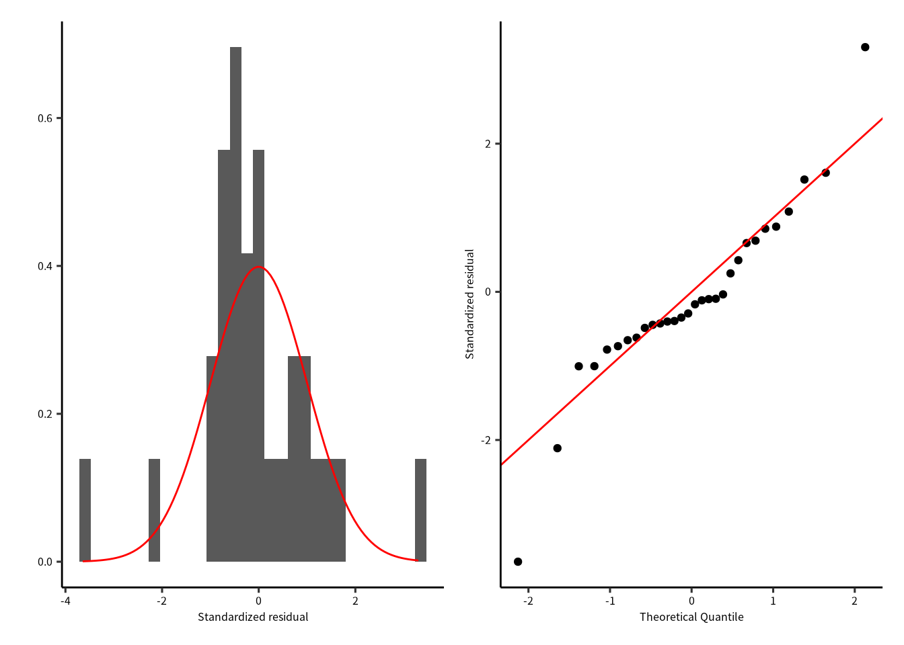

データ数は少ないが，残差は 0 を中心にしていて左右対称です。
殆どの残差はQQプロットの直線に沿っています。
よって，残差の正規性に大きな問題はなさそうです。


```r
fgala |> 
  select(Species, Area, Elevation, Nearest, Scruz, Adjacent, .stdresid) |> 
  pivot_longer(-.stdresid) |> 
  ggplot() + 
  geom_point(aes(x = value, y = .stdresid)) + 
  geom_hline(yintercept = 0, linetype = "dashed", color = "red") +
  facet_wrap(vars(name), scales = "free")
```


予測子に対する残差の分布を確認すると，均等に分布していないように見えます。
例えば **Residual vs. Nearest** の場合，波状を描いているように見えます。

## モデルの診断図：期待値に対する残差のばらつき


```r
p1 = fgala |> 
  select(.fitted, .stdresid) |> 
  ggplot() + 
  geom_point(aes(x = .fitted, y = .stdresid)) + 
  geom_hline(yintercept = 0, linetype = "dashed", color = "red") 
p2 = fgala |> 
  select(.fitted, .stdresid) |> 
  ggplot() + 
  geom_point(aes(x = .fitted, y = sqrt(abs(.stdresid)))) 
p1 | p2
```

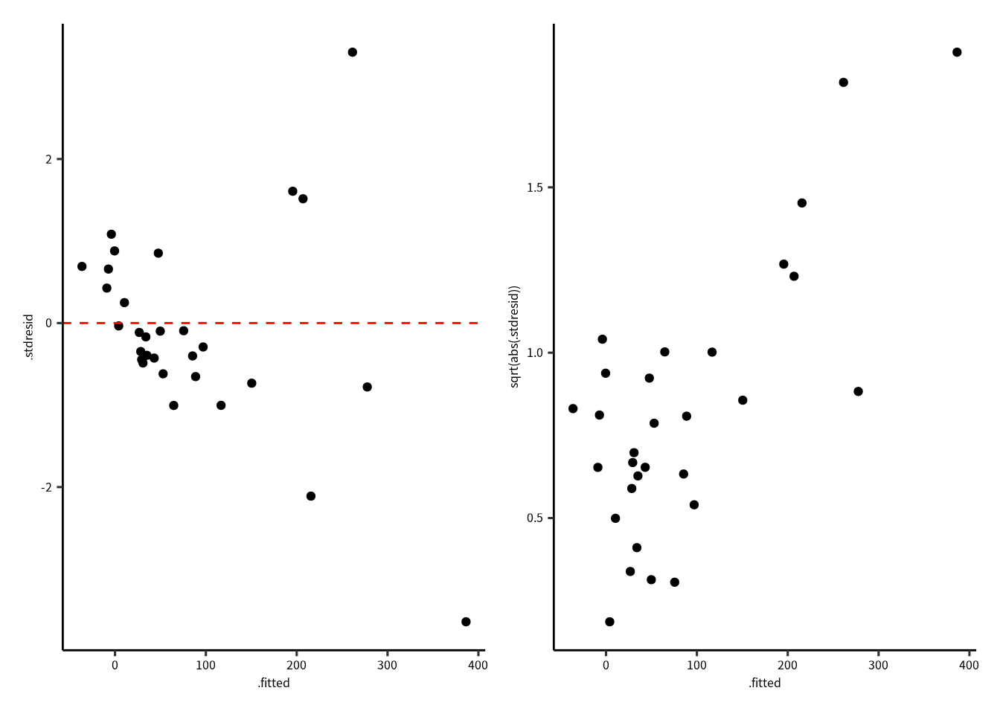

残差のばらつきは期待値と関係性が有るように見えます (Residual vs. Fitted Values Plot)。
Scale--Location Plot では，その関係が明確です。

次は異常値を探してみましょう。


```r
dof = summary(HF) |> pluck("df")
thold = qf(0.5, dof[1], dof[2])
fgala |> 
  mutate(n = 1:n()) |> 
  mutate(above = ifelse(.cooksd > thold, T, F)) |> 
  ggplot() + 
  geom_point(aes(x = n, y = .cooksd, color = above)) + 
  geom_hline(yintercept = thold, color = "red", linetype = "dashed")
```

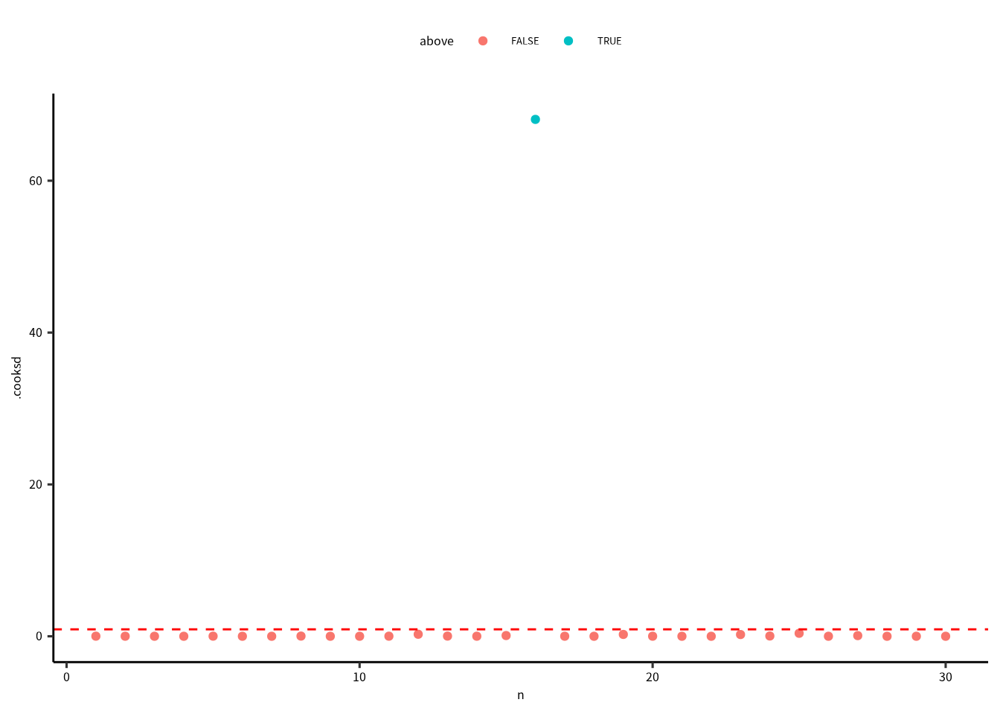

クックの距離が $P(F_{(p, n-p)}=0.5)$ を超えれば，影響力の高い点だと考えられます。
このとき，16番目のデータが明らかに超えています。

$P(F_{(p, n-p)}=0.5)$は自由度 $p$ (パラメータの数) と $n-p$ (データ数からパラメータ数の差) のときのF値の中央値です。


```r
which(cooks.distance(HF) > thold)
#> 16 
#> 16
```

いろいろと問題があったので、モデルの改良は必要ですね。
ところが、モデルを改良するときの問題点を意識してください。

**帰無仮設は棄却できたが，診断図を確認すると多数の問題点がありました。**
このようなとき，モデルを改良する必要があります。
ただし，ネイマン=ピアソンの帰無仮設検定法のとき，**検討するモデルが増えれば増えるほど第１種の誤りを起こす確率も上がります。**


5 つの予測子（変数）があるので，交互作用ありの一次式のモデルの場合，パラメータの数は32 です。
検証できるパラメータ数はデータ数に制限されるので，
パラメータ数とデータ数が等しいときのモデルは[飽和モデル](https://stats.stackexchange.com/questions/283/what-is-a-saturated-model)とよびます。
ちなみに，32 パラメータのときの第 1 種の誤りを起こす確率は 0.8063 です。
飽和モデルのとき，分散を推定することができないので，飽和モデルは理論上のモデルです。


## モデル構築の考え方


モデルを設計するときに最も大事なことは：

* 統計解析の仮定を守る
* 科学的・統計学的にありえる
* 説明しやすい
* シンプル・単純である

モデルの改良点：

* 応答変数を変換する
* 説明変数を変換する
* 誤差項の分布を変える
* モデルパラメータを増やす（二次関数・三次関数・交互作用など）


### 応答変数の変換

残差に問題があるとき，応答変数を変換することが一般的に行われています。
応答変数の変換は，残差を正規分布に従わせるためにします。

たとえば個体数はつねに $y\ge 0$ です。負の個体数は存在しません。
このとき，正規分布を仮定したら，0 近辺の値の 95% 信頼区間は負の値をとることもあります。
実データとの整合性がとれなくなります。
または，0 から 1 の値しか取れないデータのときでも正規性に問題がでます。

応答変数が個体数のような正の整数のとき，ログ変換することが多いです。`log(x)`
または，0 から 1 の比率の様なデータのとき，アークサイン変換をします。 `asin(x)`

## 応答変数変換した解析

応答変数をログ変換した解析と変換していない解析の結果はつぎの通りです。

**ログ変換後の分散分析表**


```r
gala = gala %>% mutate(logSpecies = log(Species))
logHF = lm(logSpecies~ Area + Elevation + Nearest + Scruz + Adjacent, data = gala)
logHF %>% Anova(type = "III") %>% print(signif.stars = F)
#> Anova Table (Type III tests)
#> 
#> Response: logSpecies
#>             Sum Sq Df F value    Pr(>F)
#> (Intercept) 53.956  1 48.7039 3.238e-07
#> Area         3.998  1  3.6088   0.06955
#> Elevation   26.168  1 23.6211 5.927e-05
#> Nearest      0.918  1  0.8289   0.37164
#> Scruz        1.217  1  1.0984   0.30505
#> Adjacent     7.597  1  6.8575   0.01505
#> Residuals   26.588 24
```

**変換なしの分散分析表**


```r
HF %>% Anova(type = "III") %>% print(signif.stars = F)
#> Anova Table (Type III tests)
#> 
#> Response: Species
#>             Sum Sq Df F value    Pr(>F)
#> (Intercept)    506  1  0.1362 0.7153508
#> Area          4238  1  1.1398 0.2963180
#> Elevation   131767  1 35.4404 3.823e-06
#> Nearest          0  1  0.0001 0.9931506
#> Scruz         4636  1  1.2469 0.2752082
#> Adjacent     66406  1 17.8609 0.0002971
#> Residuals    89231 24
```

変数（パラメータ）に対するP値はが変わりました。
変換なしの解析に比べて，ログ変換後の`Elevation` と `Nearest` のP値は下がりましたが，その他のP値は上がりました。


```r
fgala = fortify(logHF)
p1 = ggplot(fgala) + 
  geom_histogram(aes(x = .stdresid, y = ..density..)) +
  stat_function(fun = dnorm, color = "red") +
  labs(x = "Standardized residual", y = "") 
p2 = ggplot(fgala) + 
  geom_qq(aes(sample = .stdresid)) +
  geom_abline(color = "red") +
  labs(x = "Theoretical Quantile", y = "Standardized residual") 
p1 | p2
```

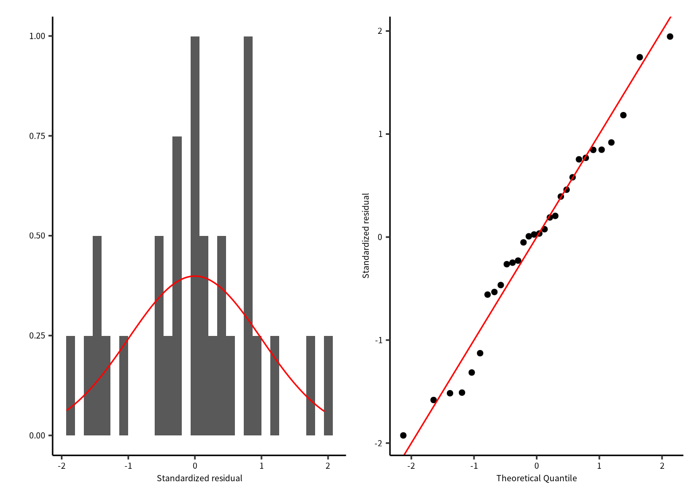

ログ変換なしの結果よりちょっと良くなったと思います。


```r
fgala |> 
  select(logSpecies, Area, Elevation, Nearest, Scruz, Adjacent, .stdresid) |> 
  pivot_longer(-.stdresid) |> 
  ggplot() + 
  geom_point(aes(x = value, y = .stdresid)) + 
  geom_hline(yintercept = 0, linetype = "dashed", color = "red") +
  facet_wrap(vars(name), scales = "free")
```

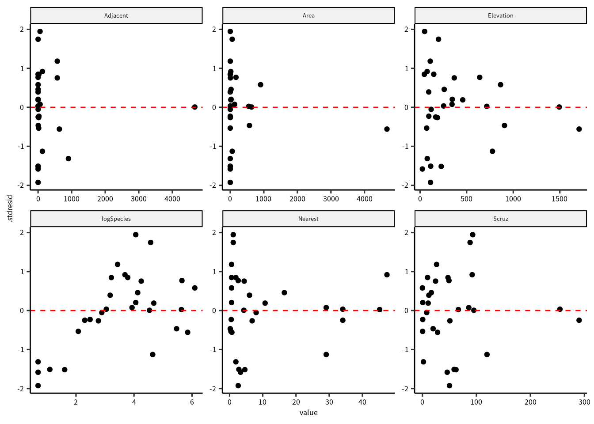

説明変数が上昇すると残差のばらつきが減少する傾向があるので，残差のばらつきに問題があります。


```r
p1 = fgala |> 
  select(.fitted, .stdresid) |> 
  ggplot() + 
  geom_point(aes(x = .fitted, y = .stdresid)) + 
  geom_hline(yintercept = 0, linetype = "dashed", color = "red") 
p2 = fgala |> 
  select(.fitted, .stdresid) |> 
  ggplot() + 
  geom_point(aes(x = .fitted, y = sqrt(abs(.stdresid)))) 
p1 | p2
```

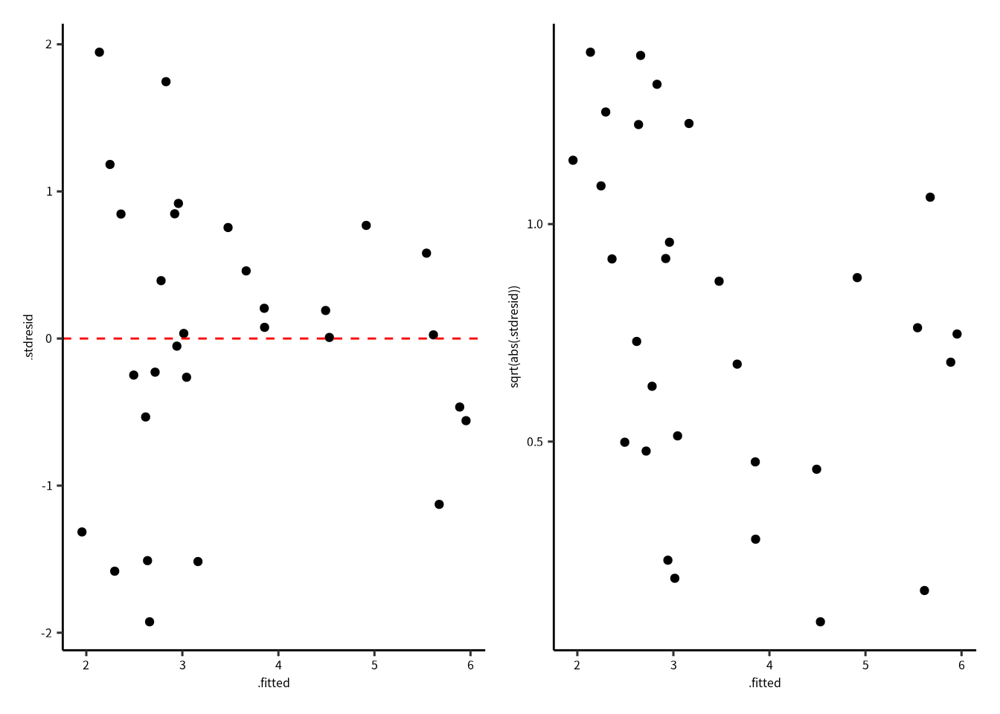

期待値に対しても，残差のばらつきの均一性が問題です。さらに Scale - Location Plot には明らか傾向があります。


```r
dof = summary(logHF) |> pluck("df")
thold = qf(0.5, dof[1], dof[2])
fgala |> 
  mutate(n = 1:n()) |> 
  mutate(above = ifelse(.cooksd > thold, T, F)) |> 
  ggplot() + 
  geom_point(aes(x = n, y = .cooksd, color = above)) + 
  geom_hline(yintercept = thold, color = "red", linetype = "dashed")
```

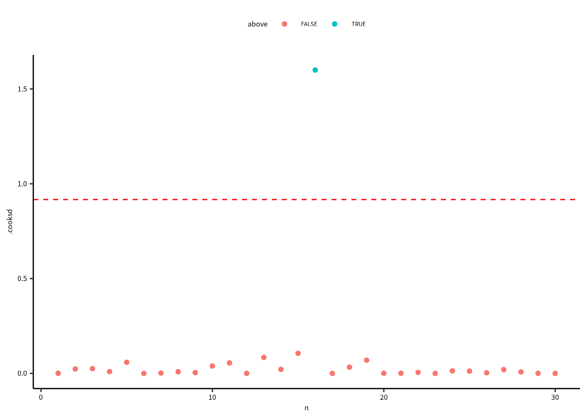


```r
which(cooks.distance(logHF) > thold)
#> 16 
#> 16
```

16番目のデータに対して，クックの距離は下がったが，$PF_{(n, n-p)}=0.5)$ 以上のままなので，課題としてのこります。


### 応答変数以外の解決手法

応答変数をログ変換しても問題は解決できませんでした。
次に検討することは説明変数の変換または、削除です。
まずは，VIF の高い変数から外してみみます。


```r
car::vif(logHF)
#>      Area Elevation   Nearest     Scruz  Adjacent 
#>  2.928145  3.992545  1.766099  1.675031  1.826403
```

`Elevation` の値が一番高かったので，`Elevation` なしのモデルを再解析します。


```r
logHF2 = lm(logSpecies~ Area + Nearest + Scruz + Adjacent, data = gala)
car::vif(logHF2)
#>     Area  Nearest    Scruz Adjacent 
#> 1.047496 1.669984 1.658583 1.073529
```

診断図を確認したら，結果は良くなかったので，`Nearest` か `Scruz` も外します。
種数は島と島の間の距離に依存するかもしれないが，一つの島（Santa Cruz島）との距離の影響は考えにくいので，`Scruz` を外します。

## 単純化したモデル

結果として，つぎのモデルを解析することになりました。

$$
E(\log(\text{Species})) = b_0 + b_1\text{Area}+b_2\text{Nearest}+b_3\text{Adjacent}
$$


```r
logSF = lm(logSpecies~ Area + Nearest + Adjacent, data = gala)
logSF %>% Anova(type = "III") %>% print(signif.stars = F)
#> Anova Table (Type III tests)
#> 
#> Response: logSpecies
#>              Sum Sq Df F value    Pr(>F)
#> (Intercept) 159.281  1 74.7879 3.983e-09
#> Area         13.201  1  6.1981   0.01951
#> Nearest       2.372  1  1.1139   0.30095
#> Adjacent      0.180  1  0.0847   0.77335
#> Residuals    55.374 26
```

`Area` 以外の変数のP値は 0.05 より高いです。

## 診断図


```r
fgala = fortify(logSF)
p1 = ggplot(fgala) + 
  geom_histogram(aes(x = .stdresid, y = ..density..)) +
  stat_function(fun = dnorm, color = "red") +
  labs(title = "Histogram", x = "Standardized residual", y = "") 
p2 = ggplot(fgala) + 
  geom_qq(aes(sample = .stdresid)) +
  geom_abline(color = "red") +
  labs(title = "QQ plot", x = "Theoretical Quantile", y = "Standardized residual") 
p3 = fgala |> 
  select(logSpecies, Area, Nearest, Adjacent, .stdresid) |> 
  pivot_longer(-.stdresid) |> 
  ggplot() + 
  geom_point(aes(x = value, y = .stdresid)) + 
  geom_hline(yintercept = 0, linetype = "dashed", color = "red") +
  labs(title = "Resid. vs. predictor", x = "Predictor value", y = "Standardized residual") +
  facet_wrap(vars(name), scales = "free")
p4 = fgala |> 
  select(.fitted, .stdresid) |> 
  ggplot() + 
  geom_point(aes(x = .fitted, y = .stdresid)) + 
  geom_hline(yintercept = 0, linetype = "dashed", color = "red")  +
  labs(title = "Resid. vs. fit", x = "Fitted value", y = "Standardized residual")
p5 = fgala |> 
  select(.fitted, .stdresid) |> 
  ggplot() + 
  geom_point(aes(x = .fitted, y = sqrt(abs(.stdresid))))  +
  labs(title = "Scale - location", x = "Fitted value", y = "Standardized residual")
dof = summary(logSF) |> pluck("df")
thold = qf(0.5, dof[1], dof[2])
p6 = fgala |> 
  mutate(n = 1:n()) |> 
  mutate(above = ifelse(.cooksd > thold, T, F)) |> 
  ggplot() + 
  geom_point(aes(x = n, y = .cooksd, color = above)) + 
  geom_hline(yintercept = thold, color = "red", linetype = "dashed") +
  labs(title = "Cook's distance", x = "Index", y = "Cook's distance")

p1 + p2 + p3 + p4 + p5 + p6
```


残差のばらつきや正規性は良くなったが，クックの距離の問題が残っています。

## 説明変数も変換する

こんどは，説明変数も変換します。

$$
E(\log(\text{Species})) = b_0 + b_1\log(\text{Area})+b_2\text{Nearest}+b_3\log(\text{Adjacent})
$$


```r
gala = gala %>% mutate(logSpecies = log(Species), logArea = log(Area), logAdjacent = log(Adjacent))
logSF2 = lm(logSpecies~ logArea + Nearest + logAdjacent, data = gala)
logSF2 %>% Anova(type = "III") %>% print(signif.stars = F)
#> Anova Table (Type III tests)
#> 
#> Response: logSpecies
#>              Sum Sq Df  F value    Pr(>F)
#> (Intercept) 151.442  1 239.3574 1.247e-14
#> logArea      52.429  1  82.8653 1.445e-09
#> Nearest       0.618  1   0.9764    0.3322
#> logAdjacent   0.159  1   0.2512    0.6204
#> Residuals    16.450 26
```


```r
fgala = fortify(logSF2)
p1 = ggplot(fgala) + 
  geom_histogram(aes(x = .stdresid, y = ..density..)) +
  stat_function(fun = dnorm, color = "red") +
  labs(title = "Histogram", x = "Standardized residual", y = "") 
p2 = ggplot(fgala) + 
  geom_qq(aes(sample = .stdresid)) +
  geom_abline(color = "red") +
  labs(title = "QQ plot", x = "Theoretical Quantile", y = "Standardized residual") 
p3 = fgala |> 
  select(logSpecies, logArea, Nearest, logAdjacent, .stdresid) |> 
  pivot_longer(-.stdresid) |> 
  ggplot() + 
  geom_point(aes(x = value, y = .stdresid)) + 
  geom_hline(yintercept = 0, linetype = "dashed", color = "red") + 
  labs(title = "Resid. vs. predictor", x = "Predictor value", y = "Standardized residual") +
  facet_wrap(vars(name), scales = "free")
p4 = fgala |> 
  select(.fitted, .stdresid) |> 
  ggplot() + 
  geom_point(aes(x = .fitted, y = .stdresid)) + 
  geom_hline(yintercept = 0, linetype = "dashed", color = "red")  +
  labs(title = "Resid. vs. fit", x = "Fitted value", y = "Standardized residual")
p5 = fgala |> 
  select(.fitted, .stdresid) |> 
  ggplot() + 
  geom_point(aes(x = .fitted, y = sqrt(abs(.stdresid))))  +
  labs(title = "Scale - location", x = "Fitted value", y = "Standardized residual")
dof = summary(logSF) |> pluck("df")
thold = qf(0.5, dof[1], dof[2])
p6 = fgala |> 
  mutate(n = 1:n()) |> 
  mutate(above = ifelse(.cooksd > thold, T, F)) |> 
  ggplot() + 
  geom_point(aes(x = n, y = .cooksd, color = above)) + 
  geom_hline(yintercept = thold, color = "red", linetype = "dashed") +
  labs(title = "Cook's distance", x = "Index", y = "Cook's distance")

p1 + p2 + p3 + p4 + p5 + p6
```


残差のばらつき，正規性，クックの距離の問題は解決できました。

**結果**


```r
logSF2 %>% Anova(type = "III") %>% print(signif.stars = F)
#> Anova Table (Type III tests)
#> 
#> Response: logSpecies
#>              Sum Sq Df  F value    Pr(>F)
#> (Intercept) 151.442  1 239.3574 1.247e-14
#> logArea      52.429  1  82.8653 1.445e-09
#> Nearest       0.618  1   0.9764    0.3322
#> logAdjacent   0.159  1   0.2512    0.6204
#> Residuals    16.450 26
```

帰無仮設の有意性検定によると，`logArea` と `Nearest` の効果は有意ですが，`logAdjacent` の効果は有意じゃない。

ところが，この結果まで導くには，5 種類のモデルを検証しました。$\alpha_\text{fwer}$ は
$1 - (1-0.05)^5 = 0.2262$ ですので，$\alpha_\text{fwer}=0.05$ にしたければ，$\alpha = 0.0102$ に設定しなければなりません。このとき，`logArea` 以外の要因の効果は有意ではありません。

################################################################################

## 一般化線形モデル

一般化線形モデル (GLM) は今までの線型モデルと同じように，線型結合した変数から成り立っています。

さらに，

* 正規分布を仮定した線型モデルのとき，予測残差は Residuals (残差) とよびましたが，GLMの予測残差は Deviance (尤離度・逸脱度・デビアンス) とよびます。
* 正規分布以外の指数型分布族にぞくする分布も使えます。
* 一般化線形モデルに 3 つの成分が存在します。
    * 誤差構造または**ランダム成分 (random component)**
    * **線型予測子 (linear predictor)**または系統成分(systematic component)
    * 連結関数または**リンク関数 (link function)**

## 指数型分布族・誤差項

$$
f(y|\theta, \phi) = \exp\left(\frac {y\theta - b(\theta)} {a(\phi)} + c(y, \phi)\right)
$$

$\theta$ は**正準パラメータ (canonical parameter)**，$\phi$ **はばらつきのパラメータ (dispersion parameter, 分散パラメータ)**，$a(\cdot)$, $b(\cdot)$, $c(\cdot)$ は存知の関数です。さらに，平均値は $\mu = E(y) = b'(\theta)$，分散は $var(y) = a(\phi) b''(\theta)$ です。つまり，平均値は $\theta$ の関数できまるが，分散は二つの関数の積です。$a(\phi) = \phi/w$ であれば，$v(y) = \phi b''(\theta)/w$ であり，分散関数とよびます。正規分布の場合，分散と平均値は独立しているのと，$\phi=1$ なので，$var(y) = 1/w$ です。$w$ は存知の重みです。


### 線形予測子または系統成分

応答変数における予測子の影響は次のように書けます。

$$
\eta = \beta_0 + \beta_1 x_1 + \cdots + \beta_n x_n 
$$

この線形予測子は一般線形モデルと同じ用に構築します。

### 連結関数 (リンク関数)

応答変数の期待値と予測子の関係はリンク関数を通して関係づけます。

$$
g(\mu) = \eta
$$

リンク関数は単調な微分可能な関数です。

### 一般化線形モデルの推定方法


一般化線形モデルのパラメータ推定には**最尤推定 (maximum likelihood estimation; maximum likelihood method; 最尤推定法)** を用います。

$y_1, \dots, y_n$ は $n$ 数の独立な確率変数とします。さらに，$y_i$ は同じパラメータの正規分布に従うとしたら，同時確立分布はつぎの通りです。

$$
P(y_1, \dots, y_n | \mu, \sigma^2) = \prod_{i=1}^{N} \exp\left(y_i\frac{\mu}{\sigma^2} -\frac{\mu^2}{2\sigma^2} - \frac{1}{2}\log(2\pi\sigma^2) -\frac{y_i^2}{2\sigma^2}\right) = \mathcal{L}(\mu, \sigma^2 | y_1, \dots, y_n)
$$

ここの $\mathcal{L}(\cdots)$ が**尤度関数 (log-likelihood function)**。両側の自然対数を求めれば，**対数尤度関数 (log-likelihood function)** に導きます。

$$
\log(\mathcal{L}(\mu,\sigma^2)) = - \frac{n}{2}\log(2\pi\sigma^2)-\frac{1}{2\sigma^2}\sum_{i=1}^{N}(y_i - \mu)^2
$$

この対数尤度関数が最大または**負の対数尤度関数 (negative log-likelihood function)** が最小になるパラメータをさがすことが目的です。

### 一般的な誤差項

**連続型確率分布**

* 正規分布
* ガンマ分布
* ベータ分布
* 指数分布

**離散型確率分布**

* ポアソン分布
* 二項分布
* 負の二項分布
* categorical 分布

他にありますが，上記の分布が一般的につかわれています。
 

## ガラパゴス諸島のデータのGLM解析例

まず，帰無仮設の気無モデル（ヌルモデル）を組み立てます。

$$
\begin{aligned}
\text{Species} &\sim Pois(\mu)\\
E(\text{Species}) &= \mu \\
E(\text{Species}) &= \exp(\eta) \\
\eta &= b_0  \\
\end{aligned}
$$

$\eta = b_0$ は切片のみのモデルです。

### ポアソンGLM解析の出力

  

```r
H0_poisson = glm(Species ~ 1, data = gala, family = poisson(link = "log"))
H0_poisson %>% summary() %>% print(signif.stars = F)
#> 
#> Call:
#> glm(formula = Species ~ 1, family = poisson(link = "log"), data = gala)
#> 
#> Deviance Residuals: 
#>     Min       1Q   Median       3Q      Max  
#> -12.307   -9.782   -5.200    1.142   27.351  
#> 
#> Coefficients:
#>             Estimate Std. Error z value Pr(>|z|)
#> (Intercept)  4.44539    0.01978   224.8   <2e-16
#> 
#> (Dispersion parameter for poisson family taken to be 1)
#> 
#>     Null deviance: 3510.7  on 29  degrees of freedom
#> Residual deviance: 3510.7  on 29  degrees of freedom
#> AIC: 3673.6
#> 
#> Number of Fisher Scoring iterations: 6
```

パラメータの推定量の表の後に，(Dispersion parameter for poisson family taken to be 1) の記述があります。
これは，ポアソン分布のばらつきのパラメータ $(\phi)$ を 1 に設定したと意味します。
ヌルモデルを当てはめたので，ヌル逸脱度 (Null Deviance) と残渣逸脱度 (Residual Deviance) は同じです。

### 対立モデル

次は対立モデルです。

$$
\begin{aligned}
\text{Species} &\sim Pois(\mu)\\
E(\text{Species}) &= \mu \\
E(\text{Species}) &= \exp(\eta) \\
\eta &= b_0 + b_1\text{Area}+b_2\text{Elevation}+b_3\text{Nearest}+b_4\text{Scruz}+b_5\text{Adjacent}\\
\end{aligned}
$$

### 対立モデルの出力


```r
HF_poisson = glm(Species ~ Area + Elevation + Nearest + Scruz + Adjacent, 
                 data = gala, family = poisson(link = "log"))
HF_poisson %>% summary() %>% print(signif.stars = F)
#> 
#> Call:
#> glm(formula = Species ~ Area + Elevation + Nearest + Scruz + 
#>     Adjacent, family = poisson(link = "log"), data = gala)
#> 
#> Deviance Residuals: 
#>     Min       1Q   Median       3Q      Max  
#> -8.2752  -4.4966  -0.9443   1.9168  10.1849  
#> 
#> Coefficients:
#>               Estimate Std. Error z value Pr(>|z|)
#> (Intercept)  3.155e+00  5.175e-02  60.963  < 2e-16
#> Area        -5.799e-04  2.627e-05 -22.074  < 2e-16
#> Elevation    3.541e-03  8.741e-05  40.507  < 2e-16
#> Nearest      8.826e-03  1.821e-03   4.846 1.26e-06
#> Scruz       -5.709e-03  6.256e-04  -9.126  < 2e-16
#> Adjacent    -6.630e-04  2.933e-05 -22.608  < 2e-16
#> 
#> (Dispersion parameter for poisson family taken to be 1)
#> 
#>     Null deviance: 3510.73  on 29  degrees of freedom
#> Residual deviance:  716.85  on 24  degrees of freedom
#> AIC: 889.68
#> 
#> Number of Fisher Scoring iterations: 5
```

最初に当てはめた線形モデルの結果と全く違います。

## 尤度比検定とAICにおけるモデル比較 

今までは，正規分布を仮定した解析手法をつかっていたので，比較はF検定で行いました。
ポアソンGLMののとき，尤度比検定で，帰無モデル（ヌルモデル）と対立モデルを比較します。


```r
anova(H0_poisson, HF_poisson, test = "LRT")
#> Analysis of Deviance Table
#> 
#> Model 1: Species ~ 1
#> Model 2: Species ~ Area + Elevation + Nearest + Scruz + Adjacent
#>   Resid. Df Resid. Dev Df Deviance  Pr(>Chi)    
#> 1        29     3510.7                          
#> 2        24      716.8  5   2793.9 < 2.2e-16 ***
#> ---
#> Signif. codes:  
#> 0 '***' 0.001 '**' 0.01 '*' 0.05 '.' 0.1 ' ' 1
```

**AICでも比較できます。**


```r
AIC(H0_poisson, HF_poisson)
#>            df       AIC
#> H0_poisson  1 3673.5596
#> HF_poisson  6  889.6767
```

尤度比検定のとき，NHSTの検証になるので，帰無仮設を棄却することになります。
AICのとき，モデル選択するので，AICの最も低いモデルを採択します。
正規分布やガンマ分布などの他の分布をつかったときでも，尤度比検定やAICを用いてもいいです。
もちろん，正規分布の場合，F検定でも問題はありません (このとき，`test = "F"`)。

### ポアソン分布のときに必ず確認する値

ポアソン分布のGLMを実施したあと，**必ず確認しなければならい値は過分散 (over-dispersion)**です。
過分散があるとき，パラメータの標準誤差，信頼区間，モデルの予測値は誤っています。
過分散をパラメータとして推定するモデル（正規分布やガンマ分布など）の場合は，過分散の推定を無視できます。


```r
## https://bbolker.github.io/mixedmodels-misc/glmmFAQ.html
overdisp_fun = function(model) {
    rdf = df.residual(model)
    rp = residuals(model,type="pearson")
    Pearson.chisq = sum(rp^2)
    prat = Pearson.chisq/rdf
    pval = pchisq(Pearson.chisq, df=rdf, lower.tail=FALSE)
    mu = mean(predict(model, type = "response"))
    c(mu=mu, chisq=Pearson.chisq,ratio=prat,rdf=rdf,p=pval)
}
overdisp_fun(HF_poisson)
#>            mu         chisq         ratio           rdf 
#>  8.523333e+01  7.619792e+02  3.174914e+01  2.400000e+01 
#>             p 
#> 2.187190e-145
```

感覚的に考えると，モデル結果の Residual Deviance の値が degrees of freedom の値と同じであれば，過分散は存在しません。
ただし，どの手法をつかっても，平均値は 5 以上じゃなければなりません。
上記のP値はとても小さいので，過分散が存在すると考えられます。
または，Residual Deviance (761.98) は自由度 (24) より大きいので，検定をしなくても過分散の問題は明らかです
過分散はデータがポアソン分布に従わないときとモデル変数が不十分なときに起こります。過小分散も存在しますが，過分散ほどの問題ではありません。

### モデルの改良


過分散の問題があったので，診断図を確認するよりも，他のモデルを当てはめてみます。
ここでは説明変数のログ変換したモデルを解析します。


```r
H2_poisson = glm(Species ~ logArea + Nearest + logAdjacent, 
                 data = gala, family = poisson(link = "log"))
H2_poisson %>% summary() %>% print(signif.stars = F)
#> 
#> Call:
#> glm(formula = Species ~ logArea + Nearest + logAdjacent, family = poisson(link = "log"), 
#>     data = gala)
#> 
#> Deviance Residuals: 
#>     Min       1Q   Median       3Q      Max  
#> -5.6281  -3.4817  -0.3344   2.7419   8.2056  
#> 
#> Coefficients:
#>              Estimate Std. Error z value Pr(>|z|)
#> (Intercept)  3.361898   0.046784  71.860  < 2e-16
#> logArea      0.371771   0.007961  46.698  < 2e-16
#> Nearest     -0.006244   0.001312  -4.759 1.94e-06
#> logAdjacent -0.097529   0.006106 -15.974  < 2e-16
#> 
#> (Dispersion parameter for poisson family taken to be 1)
#> 
#>     Null deviance: 3510.73  on 29  degrees of freedom
#> Residual deviance:  371.78  on 26  degrees of freedom
#> AIC: 540.61
#> 
#> Number of Fisher Scoring iterations: 5
```

Residual deviance と degrees of freedom を確認すると，$371.78\; /\; 26 > 1$ なので，過分散が残っています。
ガラパゴス諸島の種数のデータに対して，どのように変換を変換しても，過分散は $>1$ です。

### 過分散をパラメータとして扱う

何をしても過分散が残るとき，過分散をパラメータ化することができます。
ポアソン分布で説明できなかった分散を負の二項分布で説明できるかもしれません。

**【重要】**`MASS` パッケージの`select()` 関数は `tidyverse` の `select()` 関数と同じ名前なので、
あとに読み込んだパッケージの関すが優先されます。
つまり、`MASS` パッケージは `tidyverse` の先に読み込みましょう。
あるいは、不要になったらディタッチ (detach) しましょう。


```r
detach(name = package:MASS)
```


```r
H2_negbinom = MASS::glm.nb(Species ~ logArea + Nearest + logAdjacent, data = gala, link = "log")
H2_negbinom %>% summary() %>% print(signif.stars = F)
#> 
#> Call:
#> MASS::glm.nb(formula = Species ~ logArea + Nearest + logAdjacent, 
#>     data = gala, link = "log", init.theta = 2.83714993)
#> 
#> Deviance Residuals: 
#>     Min       1Q   Median       3Q      Max  
#> -2.2174  -0.9672  -0.3006   0.5165   2.0350  
#> 
#> Coefficients:
#>              Estimate Std. Error z value Pr(>|z|)
#> (Intercept)  3.369739   0.157235  21.431   <2e-16
#> logArea      0.364309   0.035028  10.400   <2e-16
#> Nearest     -0.012389   0.008211  -1.509    0.131
#> logAdjacent -0.034399   0.036005  -0.955    0.339
#> 
#> (Dispersion parameter for Negative Binomial(2.8371) family taken to be 1)
#> 
#>     Null deviance: 144.45  on 29  degrees of freedom
#> Residual deviance:  32.82  on 26  degrees of freedom
#> AIC: 284.88
#> 
#> Number of Fisher Scoring iterations: 1
#> 
#> 
#>               Theta:  2.837 
#>           Std. Err.:  0.830 
#> 
#>  2 x log-likelihood:  -274.884
```

誤差項の分布は負の二項分布にしたので，分散は $Variance = \mu + \frac{\mu}{\theta}$ として推定されます。
このモデルの$\theta$ は 2.8371 です。
このモデルの解析を進めたいので，次は診断図の確認です。


### 負の二項分布GLMの診断図

診断図はよくつくるので、診断図用の関数を定義します。

### 診断図関数：残差のヒストグラム


```r
# 残差のヒストグラム
gg_resid_hist = function(fitted.model) {
  require(tidyvers)
  require(statmod)
  data = fortify(fitted.model) %>% as_tibble()
  if(class(fitted.model)[1] != "lm") {
    data = data %>% mutate(qresid = statmod::qresiduals(fitted.model))
    data = data %>% mutate(residual = qresid)
    xlabel = "Randomized Quantile Residuals"
  } else {
    data = data %>% mutate(residual = .resid)
    xlabel = "Standardized Residuals"
  }
  ggplot(data) +
    geom_histogram(aes(x = residual)) +
    labs(x = xlabel) + ggtitle("Histogram of Residuals")
}
```

### 診断図関数：残差のQQプロット


```r
# 残差のQQプロット
gg_qq = function(fitted.model) {
  require(tidyvers)
  require(statmod)
  data = fortify(fitted.model) %>% as_tibble()
   if(class(fitted.model)[1] != "lm") {
    data = data %>% mutate(qresid = statmod::qresiduals(fitted.model))
    data = data %>% mutate(residual = qresid)
    ylabel = "Randomized Quantile Residuals"
  } else {
    data = data %>% mutate(residual = .stdresid)
    ylabel = "Standardized Residuals"
  }
  ggplot(data) +
    geom_qq(aes(sample =residual)) +
    geom_abline(color = "red") +
    labs(x = "Theoretical Quantile", y = ylabel) +
    ggtitle("Normal-QQ Plot")
}
```

### 診断図関数：変数に対する残差のばらつき


```r
# 変数に対する残差のプロット
gg_resX = function(fitted.model, ncol=NULL, ...) {
  require(tidyvers)
  require(statmod)
  residlab = function(string) {
    sprintf("Residuals vs. %s", string)
  }
  data = fortify(fitted.model) %>% as_tibble()
  varnames = as.character(formula(fitted.model)) %>% pluck(3)
  varnames = str_split(varnames, " \\+ ") %>% pluck(1)
  if(class(fitted.model)[1] != "lm") {
    data = data %>% mutate(qresid = statmod::qresiduals(fitted.model))
    data = data %>% mutate(residual = qresid)
    ylabel = "Randomized Quantile Residuals"
  } else {
    data = data %>% mutate(residual = .resid)
    ylabel = "Standardized Residuals"
  }
  varnames = names(data)[names(data) %in% varnames]
  data = data %>% dplyr::select(varnames, residual) %>% gather(var, value, varnames)
  ggplot(data) + 
    geom_point(aes(x = value, y = residual)) +
    geom_hline(yintercept=0, color = "red", linetype = "dashed") +
    labs(x="Value", y = ylabel) +
    facet_wrap("var", labeller=labeller(var=residlab), scales = "free_x",
               ncol = ncol)
}
```

### 診断図関数：期待値に対する残差のばらつき


```r
# 期待値に対する残差のプロット
gg_resfitted = function(fitted.model) {
  require(tidyvers)
  require(statmod)
  data = fortify(fitted.model) %>% as_tibble()
  if(class(fitted.model)[1] != "lm") {
    data = data %>% mutate(qresid = statmod::qresiduals(fitted.model))
    data = data %>% mutate(residual = qresid)
    ylabel = "Randomized Quantile Residuals"
  } else {
    data = data %>% mutate(residual = .resid)
    ylabel = "Standardized Residuals"
  }
  ggplot(data) + 
    geom_point(aes(x = .fitted, y = residual)) +
    geom_hline(yintercept=0, color = "red", linetype = "dashed") +
    labs(x="Fitted Values", y = ylabel) +
    ggtitle("Residuals vs. Fitted Values")
}
```

### 診断図関数：スケール・ロケーションプロット


```r
# スケール・ロケーションプロット
gg_scalelocation = function(fitted.model) {
  require(tidyvers)
  require(statmod)
  data = fortify(fitted.model) %>% as_tibble()
  if(class(fitted.model)[1] != "lm") {
    data = data %>% mutate(qresid = statmod::qresiduals(fitted.model))
    data = data %>% mutate(residual = qresid)
    ylabel = expression(sqrt("|RQR|"))
  } else {
    data = data %>% mutate(residual = .resid)
    ylabel = expression(sqrt("|Standardized Residuals|"))
  }
  ggplot(data) + 
    geom_point(aes(x = .fitted, y = sqrt(abs(residual)))) +
    geom_smooth(aes(x = .fitted, y = sqrt(abs(residual))), 
                se = F, color = "red", linetype = "dashed") +
    labs(x="Fitted Values", y = ylabel) +
    ggtitle("Scale - Location Plot")
}
```

### 診断図関数：クックの距離


```r
# クックの距離
gg_cooksd = function(fitted.model) {
  require(tidyvers)
  require(statmod)
  data = fortify(fitted.model) %>% as_tibble()
  data = data %>% mutate(n = seq_along(.cooksd))
  dof = summary(fitted.model) %>% pluck("df")
  thold = qf(0.5, dof[1], dof[2])
  data2 = data %>% mutate(above = ifelse(.cooksd > thold, T, F)) %>% filter(above)
  ggplot(data) + 
    geom_point(aes(x = n, y = .cooksd)) +
    geom_segment(aes(x = n, y = 0, xend = n, yend = .cooksd)) +
    geom_hline(yintercept=thold, color = "red", linetype = "dashed") +
    geom_text(aes(x = n, y = .cooksd, label = n), data = data2, nudge_x=3, color = "red") +
    labs(x="Sample", y = "Cook's Distance") +
    ggtitle("Cook's Distance Plot")
}
```


残差の確認は線形モデルと同じようにしますが，[解析に使う残差は ダン=スミス残差 (Dunn-Smyth Residuals; randomized quantile residuals) です](http://www.statsci.org/smyth/pubs/residual.html)。
とくに，ポアソンGLMと疑似ポアソンGLMのダン=スミス残差を求めます。
ダン=スミス残差は残差の累積分布関数を用いて残差のランダム化を行います。
ランダム化した残差は正規分布に近似するので，QQプロットで使用した分布のよさを評価できます。
]ランダム化残差が直線に沿っていたら，分布に問題がないと示唆します。
左側はポアソン分布GLMのランダム化残差のQQプロットです。右側は負の二項分布GLMのランダム化残差のQQプロットです。


```r
p1 = gg_qq(H2_poisson)
p2 = gg_qq(H2_negbinom)
p1 | p2
```


### η に対するランダム化残差のばらつき


ランダム化残差と $\eta$ の間に明確な関係はありません。
$\sqrt{\left(|\text{Randomized Quantile Residuals}~\right)}$ は若干山形な形をしています。
ところが，期待値の両端のデータが点線を引っ張っているように見えるので，
明確ではない。


```r
p1 = gg_resfitted(H2_negbinom)
p2 = gg_scalelocation(H2_negbinom)
p1 | p2
```

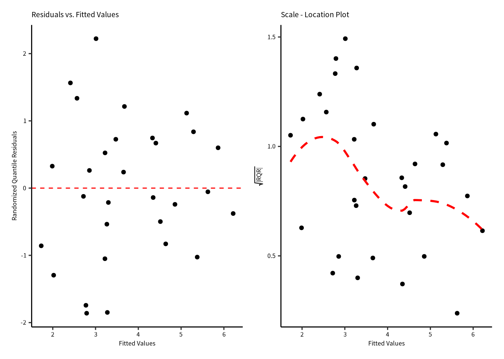

全てクックの距離は$P(F_{(n, n-p)}=0.5)$ より低いので，モデルを引っ張る点はありません。


```r
gg_cooksd(H2_negbinom)
```

## 結果

診断図と過分散の確認から，次のモデルにたどり着きました。

$$
\begin{aligned}
\text{Species} &\sim NegBin(\mu)\\
E(\text{Species}) &= \mu \\
E(\text{Species}) &= \exp(\eta) \\
Variance &= \mu + \frac{\mu}{\theta} \\
\eta &= b_0 + b_1\log(\text{Area})+b_3\text{Nearest}+b_5\log(\text{Adjacent})\\
\end{aligned}
$$


```r
AIC(H2_poisson, H2_negbinom)
#>             df      AIC
#> H2_poisson   4 540.6134
#> H2_negbinom  5 284.8838
```

ポアソン分布GLMのAICが高いので，負の二項分布GLMを採択します。


\note[item]{\href{https://stats.stackexchange.com/questions/157575/why-is-the-quasi-poisson-in-glm-not-treated-as-a-special-case-of-negative-binomi}{Quasipoisson and negative binomial model}}

### 負の二項分布の結果（係数表）


係数表だけ出力しました。


```r
H2_negbinom %>% summary() %>% coefficients() %>% print(digits = 3)
#>             Estimate Std. Error z value  Pr(>|z|)
#> (Intercept)   3.3697    0.15723  21.431 6.83e-102
#> logArea       0.3643    0.03503  10.400  2.47e-25
#> Nearest      -0.0124    0.00821  -1.509  1.31e-01
#> logAdjacent  -0.0344    0.03600  -0.955  3.39e-01
# H2_negbinom %>% summary() # 全情報の出力
```

切片と `logArea` の効果ははっきりしています (P < 0.0001)。ところが，`Nearest` と `logAdjacent` のP値は $>0.05$ でした。
さらに，変数をへらしてもAICは大きく変わりません。

### AIC


```r
H2_negbinom2 = MASS::glm.nb(Species ~ logArea + Nearest , data = gala, link = "log")
H2_negbinom3 = MASS::glm.nb(Species ~ logArea +  logAdjacent, data = gala, link = "log")
H2_negbinom4 = MASS::glm.nb(Species ~ logArea , data = gala, link = "log")
AIC(H2_negbinom, H2_negbinom2, H2_negbinom3, H2_negbinom4) |> as_tibble(rownames = "model") |> arrange(AIC)
#> # A tibble: 4 × 3
#>   model           df   AIC
#>   <chr>        <dbl> <dbl>
#> 1 H2_negbinom2     4  284.
#> 2 H2_negbinom4     3  284.
#> 3 H2_negbinom      5  285.
#> 4 H2_negbinom3     4  285.
```

最も小さいAICは `H2_negbinom2` になりましたがAICがの差が 0 ~ 7 の範囲に入るので，どのモデルでもいいです。
このとき，尤度比検定もした方がいい。


### 尤度比検定


```r
anova(H2_negbinom, H2_negbinom2, H2_negbinom3, H2_negbinom4, test = "LRT")
#> Likelihood ratio tests of Negative Binomial Models
#> 
#> Response: Species
#>                             Model    theta Resid. df
#> 1                         logArea 2.533343        28
#> 2               logArea + Nearest 2.730433        27
#> 3           logArea + logAdjacent 2.619569        27
#> 4 logArea + Nearest + logAdjacent 2.837150        26
#>      2 x log-lik.   Test    df  LR stat.   Pr(Chi)
#> 1       -277.7721                                 
#> 2       -275.7711 1 vs 2     1  2.000994 0.1571961
#> 3       -276.9859 2 vs 3     0 -1.214826 1.0000000
#> 4       -274.8838 3 vs 4     1  2.102117 0.1470954
```
自由度の高い順からペア毎の尤度比検定を行っています。$E(\text{Species})\sim b_0 + b_1\text{logArea}$ のモデルでいいかもしれないです。

### モデル診断図


```r
p1 = gg_qq(H2_negbinom4)
p2 = gg_resX(H2_negbinom4, ncol = 2)
p3 = gg_resfitted(H2_negbinom4)
p4 = gg_cooksd(H2_negbinom4)
p1 + p2 + p3 + p4
```


モデル診断図を確認したら，残差の問題はないですので，$E(\text{Species})\sim b_0 + b_1\text{logArea}$ のモデルを採択することになりました。

### 採択したモデル


```r
H2_negbinom4 %>% summary()
#> 
#> Call:
#> MASS::glm.nb(formula = Species ~ logArea, data = gala, link = "log", 
#>     init.theta = 2.533342912)
#> 
#> Deviance Residuals: 
#>     Min       1Q   Median       3Q      Max  
#> -1.9737  -0.9216  -0.2155   0.5056   1.8969  
#> 
#> Coefficients:
#>             Estimate Std. Error z value Pr(>|z|)    
#> (Intercept)  3.22480    0.13669  23.592   <2e-16 ***
#> logArea      0.34989    0.03543   9.877   <2e-16 ***
#> ---
#> Signif. codes:  
#> 0 '***' 0.001 '**' 0.01 '*' 0.05 '.' 0.1 ' ' 1
#> 
#> (Dispersion parameter for Negative Binomial(2.5333) family taken to be 1)
#> 
#>     Null deviance: 130.161  on 29  degrees of freedom
#> Residual deviance:  32.604  on 28  degrees of freedom
#> AIC: 283.77
#> 
#> Number of Fisher Scoring iterations: 1
#> 
#> 
#>               Theta:  2.533 
#>           Std. Err.:  0.719 
#> 
#>  2 x log-likelihood:  -277.772
```


```r
ndata = gala |> expand(logArea = seq(min(logArea), max(logArea), length = 21)) 
ndata = bind_cols(ndata, predict(H2_negbinom4, newdata = ndata, type = "link", se = T) |> as_tibble())
ndata = ndata |> 
  mutate(expect = exp(fit),
         lower = exp(fit - se.fit),
         upper = exp(fit + se.fit))
```


```r
gala %>% 
  ggplot(aes(x = logArea)) +
  geom_ribbon(aes(ymin = lower, ymax = upper), data = ndata, alpha = 0.5) +
  geom_point(aes(y = Species)) +
  geom_line(aes(y = expect), data = ndata)
```

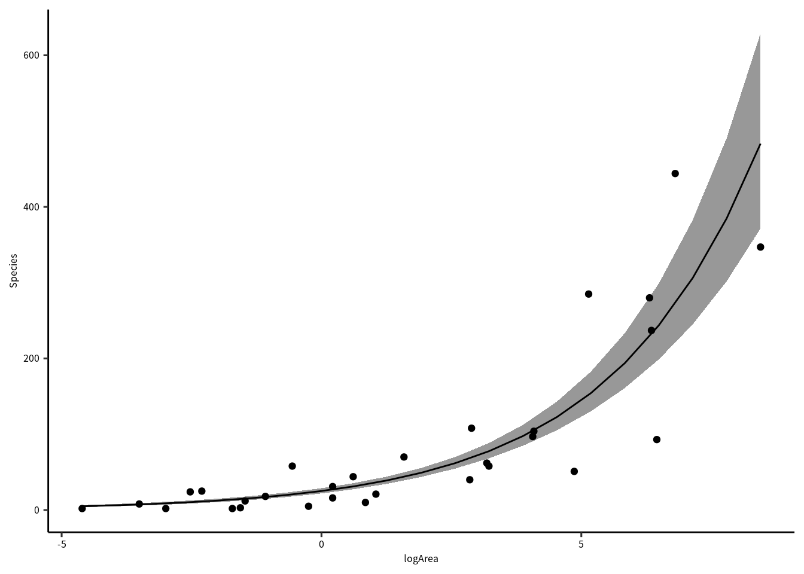

