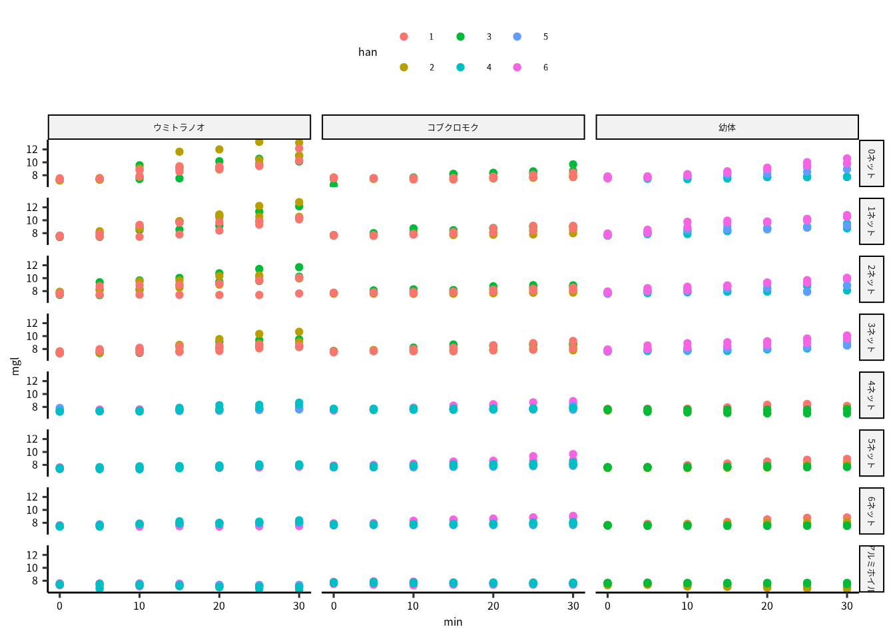
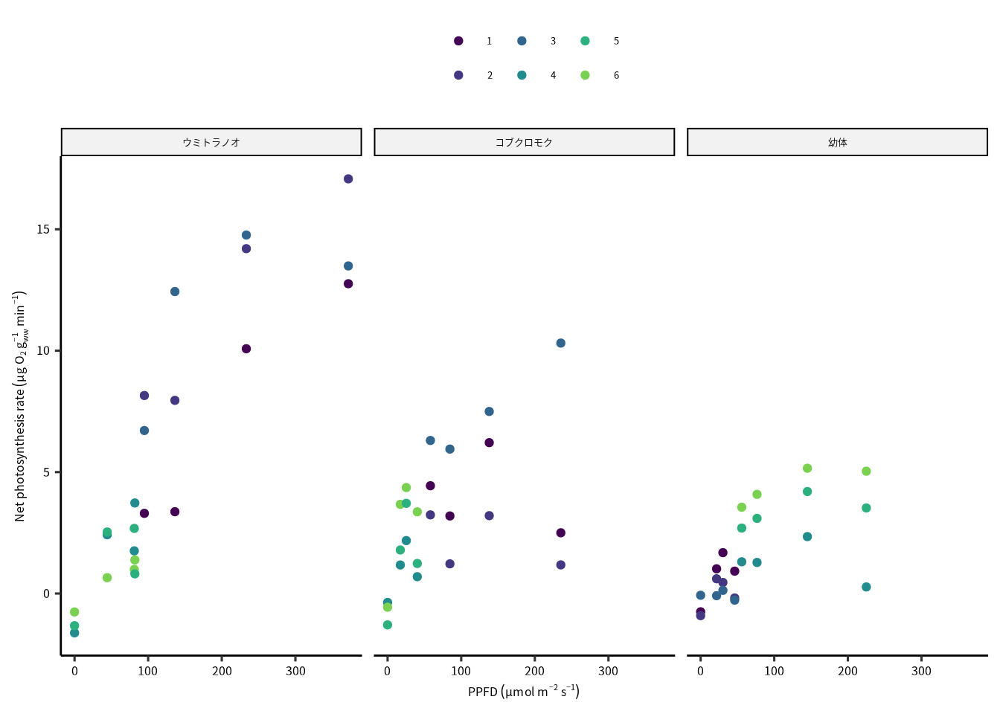
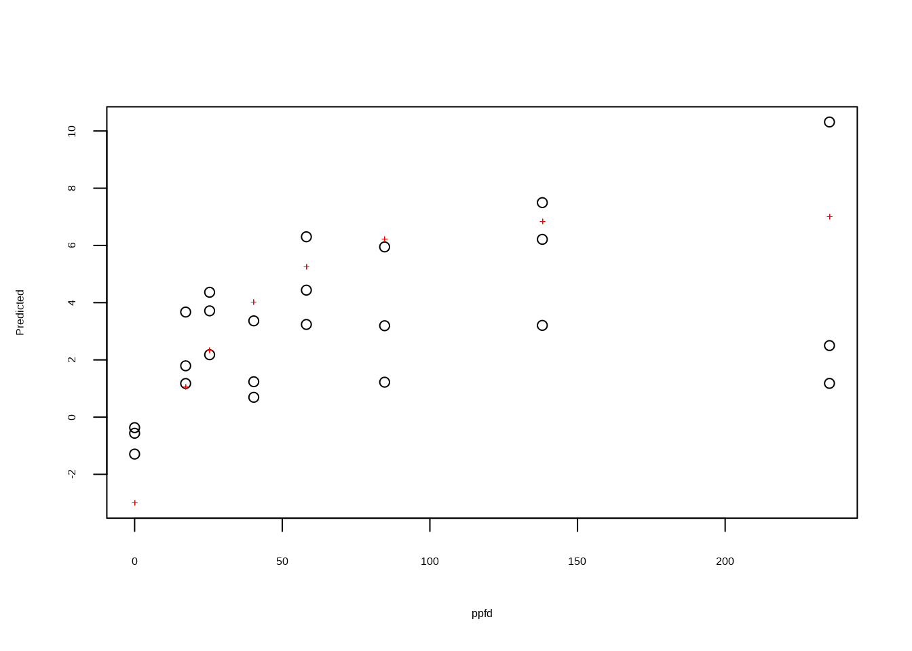
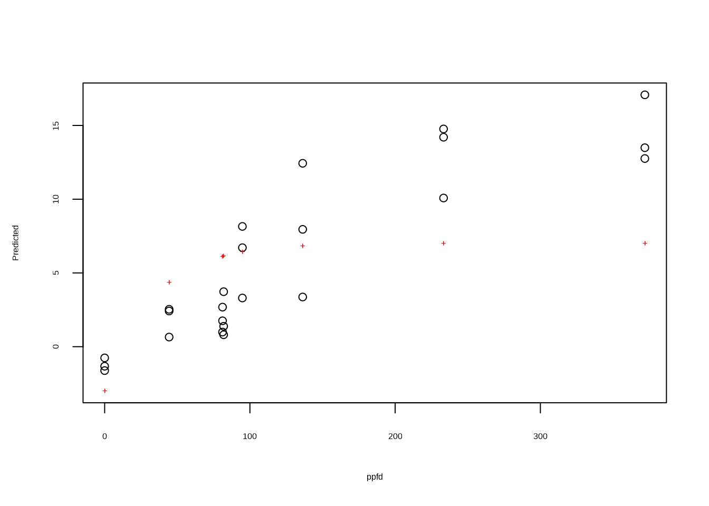
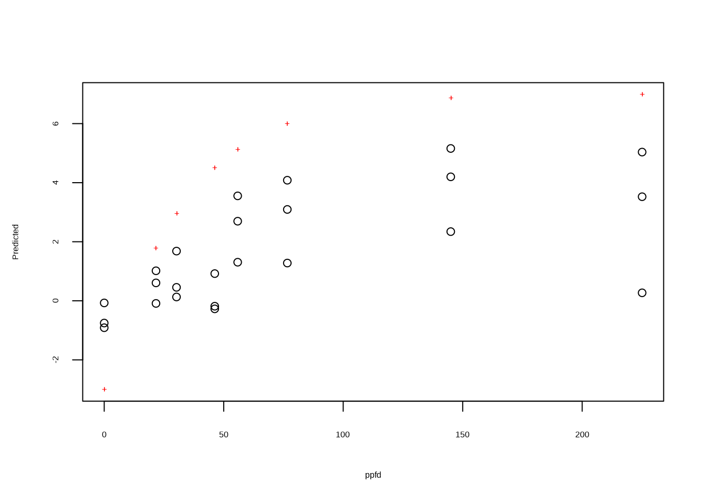
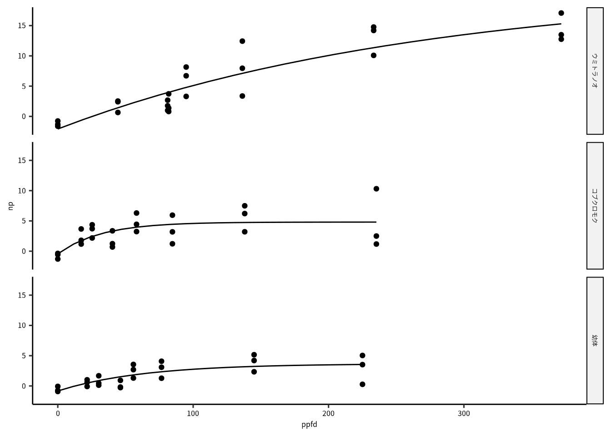
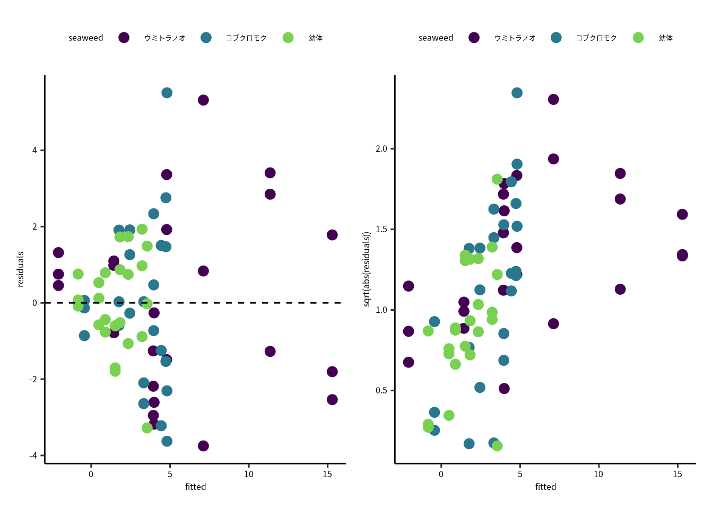
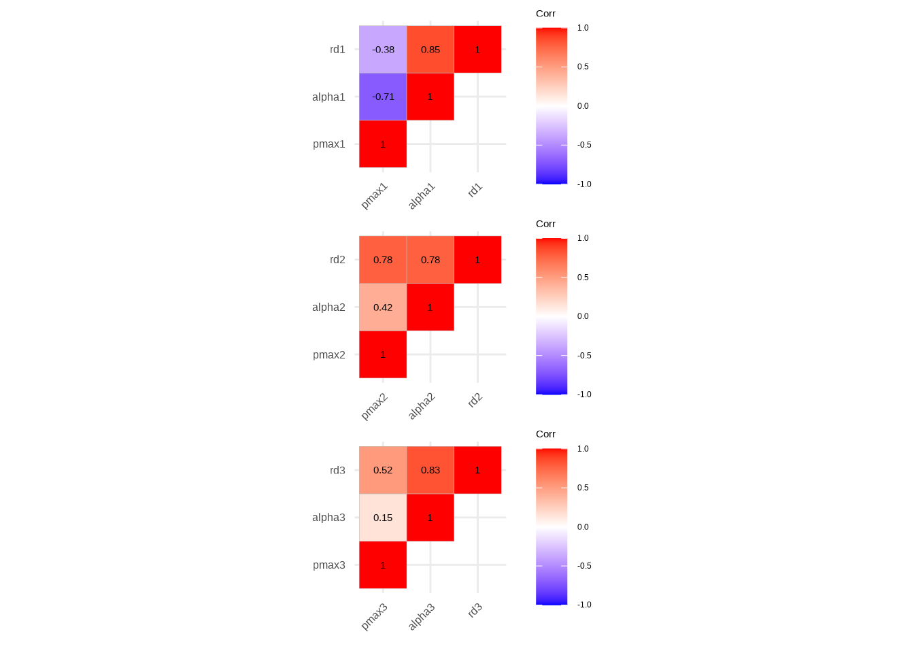
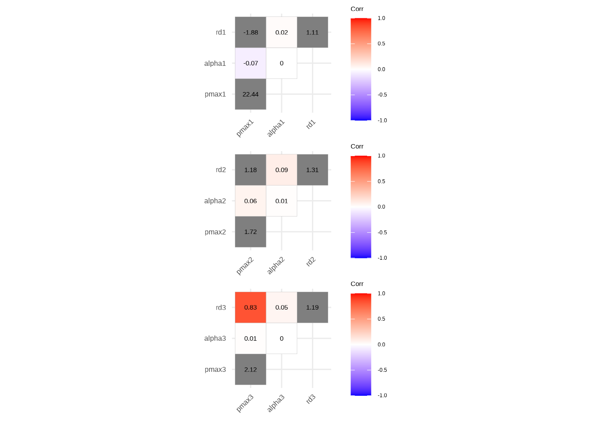
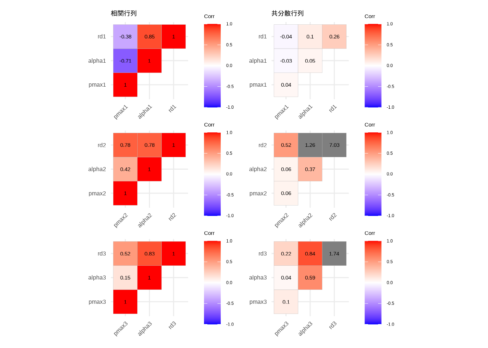

# 非線形モデルI {#non-linear-model01}

ここで紹介する非線形モデルは、海洋生物科学実験III用に準備しました。
光合成光曲線の解析を紹介します。

## 必要なパッケージ


```r
library(tidyverse)
library(googlesheets4)
library(ggcorrplot)
library(patchwork)
library(minpack.lm)
library(nlstools)
library(broom)
```


## データの読み込み

データは Google Drive に共有しています。
`googlesheets4` のパッケージをつかて、データをクラウドからダウンロードしましょう。
データは共有制限なしで公開したので、authentication なしでアクセスできます。
このときは `gs4_deauth()` を実行します。


```r
gs4_deauth()
```

Google Drive で共有したデータは次のURLの通りです。
リンクは実験日１〜３の google sheets に飛びます。
* [実験日 1](https://docs.google.com/spreadsheets/d/1CsY7ILKZRFlwQEIzSgu1veMQ964IPVegIJOo04lIGVE/edit#gid=1846404397)
* [実験日 2](https://docs.google.com/spreadsheets/d/1yeC-rJdxdiVa_icoNHZ1xrt4HWHyGCeQMnUt1r2_hnk/edit#gid=540001236)
* [実験日 3](https://docs.google.com/spreadsheets/d/1Im8Qg-ukk8uh_3z4H6IwirTc4nhxPqKrDWrjhK4gZ0o/edit#gid=2099964525)


```r
spreadsheet1 = "https://docs.google.com/spreadsheets/d/1CsY7ILKZRFlwQEIzSgu1veMQ964IPVegIJOo04lIGVE/edit#gid=1846404397"
spreadsheet2 = "https://docs.google.com/spreadsheets/d/1yeC-rJdxdiVa_icoNHZ1xrt4HWHyGCeQMnUt1r2_hnk/edit#gid=540001236" 
spreadsheet3 = "https://docs.google.com/spreadsheets/d/1Im8Qg-ukk8uh_3z4H6IwirTc4nhxPqKrDWrjhK4gZ0o/edit#gid=2099964525"
```

google sheets にはつぎのシートが入っています。

* 光合成データ
* 海藻資料データ
* 光環境データ

データの読み込みは `read_sheet()` で行います。
各シートの構造は同じにしているので、`map()` をつかって一度にデータを読み込みます。
`fnames` 変数は解析に使わないので、`select(-fnames)` で外します。


```r
mgldata = tibble(fnames = c(spreadsheet1, spreadsheet2, spreadsheet3), day = 1:3) |> 
  mutate(data = map(fnames, read_sheet, sheet = "光合成データ")) |> 
  select(-fnames)
seaweed = tibble(fnames = c(spreadsheet1, spreadsheet2, spreadsheet3), day = 1:3) |> 
  mutate(data = map(fnames, read_sheet, sheet = "海藻資料データ"))|> 
  select(-fnames)
lightdata = tibble(fnames = c(spreadsheet1, spreadsheet2, spreadsheet3), day = 1:3) |> 
  mutate(data = map(fnames, read_sheet, sheet = "光環境データ"))|> 
  select(-fnames)
```

### 光環境データの処理

班毎に光量子の平均値を計算するよりも、光条件毎の平均値を求めた方がいいとおもいます。
データそのものには、アルミホイルの情報がないので、光環境データと結合します。


```r
lightdata = lightdata |> 
  unnest(data) |> 
  select(day,
         han = "班",
         light = "光環境",
         sample = matches("サンプル"),
         ppfd = matches("光量子")) |> 
  group_by(day, light) |> 
  summarise(ppfd = mean(ppfd))
```

アルミホイルの `tmp` データ。


```r
tmp = bind_rows(tibble(light = rep("アルミホイル",3), 
                       ppfd =  rep(0, 3),
                       day = 1:3))

lightdata = bind_rows(lightdata, tmp) |> 
  mutate(light = factor(light), day = factor(day))
```

### 全データを結合

光合成データ `mgldata` と海藻資料データ `seaweed` を結合する。


```r
mgldata = mgldata |> unnest(data) |> 
  select(day,
         han = "班",
         sample = matches("サンプル"),
         min = matches("時間"),
         mgl = matches("酸素"),
         temperature = matches("水温"),
         light = matches("光環境"),
         seaweed = matches("海藻"))

seaweed = seaweed |> unnest(data) |> 
  select(day,
         seaweed = matches("海藻"),
         han = "班",
         sample = matches("サンプル"),
         vol = matches("容量"),
         gww = matches("湿重量"))

mgldata = full_join(mgldata, seaweed, by = c("han", "sample", "day"))
```

`han`, `sample`, `day` は因子に変換します。


```r
mgldata = mgldata |> mutate(across(c(han, sample, day), as.factor))
```

結合したあとの，溶存酸素濃度の時間変動を確認します。


```r
ggplot(mgldata) +
  geom_point(aes(x = min, y = mgl, color = han)) +
  facet_grid(rows = vars(light),
             cols = vars(seaweed))
```



ネットがないとき (0ネット) 溶存酸素濃度が増加するが、アルミホイルのときは減少しています。

### 光合成速度を求める

光合成速度を求めるための関数を定義します。
`fit_model()` は線形モデルを溶存酸素濃度時系列データに当てはめ用です。
`get_rate()` は 2 つのモデル係数 $(y = b_0+ b_1 x)$ から傾き $(b_1)$ を抽出するためです。


```r
fit_model = function(df) {
  lm(mgl ~ min, data = df)
}
get_rate = function(m) {
  coefficients(m)[2] 
}
```

ここでデータをグループ化して、グループ毎の傾きを求めます。


```r
mgldata = 
  mgldata |> 
  group_nest(day, han, sample, light, gww, vol, seaweed) |> 
  mutate(model = map(data, fit_model)) |> 
  mutate(rate = map_dbl(model, get_rate)) |> 
  mutate(stats = map(model, glance)) |> 
  unnest(stats) 
```

求めた係数と環境データを結合します。


```r
alldata = full_join(mgldata, lightdata, by = c("day", "light"))
```

係数は湿重量と実験容器の容積で割って、湿重量あたり純光合成速度を求めます。
ここで、係数の単位は mg O~2~ l^-1^ min^-1^ から mg O~2~ g~ww~ min^-1^ に変わります。
単位の求め方：

$$
\overbrace{\frac{mg\;\text{O}_2}{l}}^{\text{酸素濃度}} \times \underbrace{\frac{1}{g_{ww}}}_{\text{湿重量}} \times \overbrace{ml}^{\text{容積}} \times \frac{1 \;l}{1000\; ml} \times \frac{1000\;\mu g\;\text{O}_2}{1\;mg\;\text{O}_2}

$$

```r
alldata = 
  alldata %>% 
  mutate(normalized_rate = rate / gww * vol)
  
```

解析をする前に、光量子量、種、班ごとの平均値を求めます。


```r
dataset = 
  alldata |> 
  group_by(ppfd, seaweed, han) |> 
  summarise(np = mean(normalized_rate))
```

標準化した光合成速度は次の通りです。


```r
xlabel = expression(paste("PPFD"~(mu*mol~m^{-2}~s^{-1})))
ylabel = '"Net photosynthesis rate"~(mu*g~O[2]~g[ww]^{-1}~min^{-1})'
ylabel = as.expression(parse(text = ylabel))
dataset |> 
  ggplot() + 
  geom_point(aes(x = ppfd, y = np, color = han)) +
  scale_color_viridis_d("", end = 0.8) +
  scale_x_continuous(xlabel) +
  scale_y_continuous(ylabel) +
  facet_grid(col = vars(seaweed)) 
```



## モデルの当てはめ

非線形モデルの当てはめに便利な `nlstools` パッケージを読み込みます。


```r
library(nlstools)
```

当てはめたいモデルは次のとおりです。

$$
\overbrace{P_{net}}^{\text{純光合成速度}} = \underbrace{P_{max}\left(1 - \exp\left(-\frac{\alpha}{P_{max}}I\right)\right)}_{\text{総光合成速度}} - \overbrace{R_d}^{\text{暗記呼吸速度}}
$$

* $P_{net}$ は純光合成速度 (`normalized_rate`)
* $I$ 光量子量 (`ppfd`)
* $P_{max}$ は光合成飽和速度 (`pmax`)
* $\alpha$ は初期勾配 (`alpha`)
* $R_d$ は暗呼吸速度 (`rd`)

このモデルをR関数に書き換えると次のようになります。


```r
pecurve = function(ppfd, pmax, rd, alpha) {
  pmax * (1-exp(-alpha / pmax * ppfd)) - rd
}
```

`nlstools` の `preview()` 関数をつかって，モデル当てはめ用の関数 (`nls()`) に必要なの初期値を探します。
`variable` 引数に `ppfd` 変数の位置情報を渡してください。


```r
START = list(pmax = 10, rd = 3, alpha = 0.3)

crispifolium = dataset |> filter(str_detect(seaweed, "コブクロ"))
thunbergii = dataset |> filter(str_detect(seaweed, "ウミトラノオ"))
juvenile = dataset |> filter(str_detect(seaweed, "幼体"))
```


```r
preview(np ~ pecurve(ppfd, pmax, rd, alpha), 
            data = crispifolium, 
        variable = 1,
        start = START)
```



```
#> 
#> RSS:  167
```

```r
preview(np ~ pecurve(ppfd, pmax, rd, alpha), 
            data = thunbergii, 
        variable = 1,
        start = START)
```



```
#> 
#> RSS:  501
```

```r
preview(np ~ pecurve(ppfd, pmax, rd, alpha), 
            data = juvenile, 
        variable = 1,
        start = START)
```



```
#> 
#> RSS:  246
```

`+` 記号がデータの中心に通る用になったら，そのときの初期値を ~~`nls()`~~ `nlsLM()` 関数に渡してモデルの当てはめをします。
ちなみに、`nls()` 関数はGauss-Newton アルゴリズムによってパラメータ推定をしますが、`nlsLM()` は Levenberg-Marquardt アルゴリズムを用います。
Levenberg-Marquardt法のほうが優秀です。
その理由について、詳細はいつか紹介します。

ここではデータを海藻毎に当てはめるので、解析関数をつくります。


```r
fit_nls = function(df) {
  START = list(pmax = 14, rd = 3, alpha = 0.3)
  # nls(np ~ pecurve(ppfd, pmax, rd, alpha),  data = df, start = START)
  nlsLM(np ~ pecurve(ppfd, pmax, rd, alpha),  data = df, start = START)
}

dataset = dataset |> ungroup() |> 
  group_nest(seaweed) |>
  mutate(model = map(data, fit_nls))
dataset
#> # A tibble: 3 × 3
#>   seaweed                    data model 
#>   <chr>        <list<tibble[,3]>> <list>
#> 1 ウミトラノオ           [24 × 3] <nls> 
#> 2 コブクロモク           [24 × 3] <nls> 
#> 3 幼体                   [24 × 3] <nls>
```

当てはめたモデルの結果は次の通りです。


```r
dataset = dataset |> 
  mutate(summary =map(model, glance)) |> 
  unnest(summary)
dataset
#> # A tibble: 3 × 12
#>   seaweed       data model sigma isConv  finTol logLik   AIC
#>   <chr>     <list<t> <lis> <dbl> <lgl>    <dbl>  <dbl> <dbl>
#> 1 ウミトラ… [24 × 3] <nls>  2.51 TRUE   1.49e-8  -54.5 117. 
#> 2 コブクロ… [24 × 3] <nls>  2.21 TRUE   1.49e-8  -51.5 111. 
#> 3 幼体      [24 × 3] <nls>  1.31 TRUE   1.49e-8  -39.0  86.0
#> # … with 4 more variables: BIC <dbl>, deviance <dbl>,
#> #   df.residual <int>, nobs <int>
```

次はモデルの期待値を求めます。
この関数は期待値を擬似データから計算します。
擬似データは `tibble()` で作っています。


```r
calc_fitted = function(data, model) {
  N = 21 # 擬似データの長さ
  ndata = tibble(ppfd = seq(min(data$ppfd), max(data$ppfd),length = N))
  tmp = predict(model, newdata = ndata) |> as_tibble()
  bind_cols(ndata,tmp)
}

dataset = dataset |> mutate(fitted = map2(data, model, calc_fitted))
```


```r
ggplot() +
  geom_point(aes(x = ppfd, y = np), data = unnest(dataset, data))+
  geom_line(aes(x = ppfd, y = value), data = unnest(dataset, fitted)) +
  facet_grid(rows = vars(seaweed))
```

<div class="figure" style="text-align: center">

<p class="caption">(\#fig:unnamed-chunk-25)観測とモデル期待値。</p>
</div>


## 診断図

線形モデルと同様に、モデルを当てはめたら、残渣の診断図も確認しましょう。


```r
shindan = dataset |> 
  select(seaweed, data, model) |> 
  mutate(residuals = map(model, residuals)) |> 
  mutate(fitted = map(model, fitted)) |> 
  select(seaweed, data, residuals, fitted) |> 
  unnest(everything())
```


```r
p1 = ggplot(shindan) +
  geom_point(aes(x = fitted, y = residuals,
                 color = seaweed),
             size = 3) +
  geom_hline(yintercept = 0, linetype = "dashed") +
  scale_color_viridis_d(end = 0.8)

p2 = ggplot(shindan) +
  geom_point(aes(x = fitted, y = sqrt(abs(residuals)),
                 color = seaweed),
             size = 3) +
  scale_color_viridis_d(end = 0.8)
p1+p2
```

<div class="figure" style="text-align: center">

<p class="caption">(\#fig:unnamed-chunk-28)
モデル残渣と残渣の絶対値の平方根の図で、モデルの当てはめの良さが分かります。
（左）はモデル残渣対期待値です。期待値が増加するとモデル残渣の散らばりが大きくなるのがはっきりしています。
点線 (0) の周りを均一にばらつくのが理想です。
（右）は残渣の絶対値の平方根です。期待値が上がると残渣が増加しています。
これらの図を確認すると、残渣の正規性に問題あると考えられます。
</p>
</div>

## パラメータの集計

残渣プロットの結果はひどかったが、とりあえず、光飽和点 $(I_k)$ と光補償点 $(I_c)$ を求めましょう。

* 光飽和点：$I_k = P_{max} / \alpha$ 
* 光補償点：$I_c = \frac{P_{max}}{\alpha} \ln\left(\frac{P_{max}}{P_{max} - R_d}\right)$


まずは係数を抽出するための関数を定義します。

```r
get_cfs = function(m) {
  cfs = coef(m)
  tibble(pmax = cfs["pmax"],
         alpha = cfs["alpha"],
         rd = cfs["rd"])
}
```

ここで光飽和点と光補償点を求めるための関数を定義します。


```r
calc_ik = function(m) {
  cfs = coef(m)
  cfs["pmax"] / cfs["alpha"]*log(cfs["pmax"]/(cfs["pmax"] - cfs["rd"]))
}
calc_ic = function(m) {
  cfs = coef(m)
  cfs["pmax"] / cfs["alpha"]
}
```

`map()` を使って係数を求めます。


```r
modelcfs = dataset %>% 
  select(seaweed, model) |> 
  mutate(cfs = map(model, get_cfs)) |> 
  mutate(ik = map(model, calc_ik)) |> 
  mutate(ic = map(model, calc_ic)) |> 
  unnest(c(ik, ic, cfs))
modelcfs
#> # A tibble: 3 × 7
#>   seaweed      model   pmax  alpha    rd    ik    ic
#>   <chr>        <list> <dbl>  <dbl> <dbl> <dbl> <dbl>
#> 1 ウミトラノオ <nls>  23.3  0.0858 2.08  25.4  271. 
#> 2 コブクロモク <nls>   5.24 0.165  0.431  2.74  31.8
#> 3 幼体         <nls>   4.50 0.0718 0.827 12.7   62.7
```


```r
cnames = c("海藻類", "P~max~",
          "α", "R~d~", "I~k~", "I~c~")
modelcfs |> 
  select(-model) |> 
  kableExtra::kbl(digits = c(0,1,3,1,1,1),
                  col.names = cnames)
```

<table>
 <thead>
  <tr>
   <th style="text-align:left;"> 海藻類 </th>
   <th style="text-align:right;"> P~max~ </th>
   <th style="text-align:right;"> α </th>
   <th style="text-align:right;"> R~d~ </th>
   <th style="text-align:right;"> I~k~ </th>
   <th style="text-align:right;"> I~c~ </th>
  </tr>
 </thead>
<tbody>
  <tr>
   <td style="text-align:left;"> ウミトラノオ </td>
   <td style="text-align:right;"> 23.3 </td>
   <td style="text-align:right;"> 0.086 </td>
   <td style="text-align:right;"> 2.1 </td>
   <td style="text-align:right;"> 25.4 </td>
   <td style="text-align:right;"> 271.4 </td>
  </tr>
  <tr>
   <td style="text-align:left;"> コブクロモク </td>
   <td style="text-align:right;"> 5.2 </td>
   <td style="text-align:right;"> 0.165 </td>
   <td style="text-align:right;"> 0.4 </td>
   <td style="text-align:right;"> 2.7 </td>
   <td style="text-align:right;"> 31.8 </td>
  </tr>
  <tr>
   <td style="text-align:left;"> 幼体 </td>
   <td style="text-align:right;"> 4.5 </td>
   <td style="text-align:right;"> 0.072 </td>
   <td style="text-align:right;"> 0.8 </td>
   <td style="text-align:right;"> 12.7 </td>
   <td style="text-align:right;"> 62.7 </td>
  </tr>
</tbody>
</table>


## 多重比較

数種類のデータ群に、一つのモデルを当てはめたら、群ごとに推定したパラメータの違いが気になります。
複数群をお互いに比較することは多重比較といいます。
一般的には、
群ごとにパラメータを推定する full model から群ごとのデータをまとめて、一つのパラメータを推定する pooled model まで考えられます。
このとき、`nlsLM()` は使用できないので、`nls()` 関数を使います。
`nls()` の収束を助けるために、まずは pooled model の `nlsLM()` の結果を full model のパラメータ初期値にします。

では、データをすくし整理します。


```r
dataset = dataset |> select(seaweed, data) |> unnest(data)
dataset = dataset |> mutate(seaweed = factor(seaweed))
```

フルモデル (full model) の場合はそれぞれの群ごとに、$P_{max}$、$\alpha$、$R_d$ を推定します。
プールモデル (pooled model) の場合は、群の区別をせずに、1 セットのパラメータを推定します。


```r
poolmodel = nlsLM(np ~ pecurve(ppfd, pmax, rd, alpha), 
    start = list(pmax = 10, rd = 3, alpha = 0.3),
    data = dataset, 
    lower = c(pmax = 0, rd = 0, alpha = 0))

START = lapply(coef(poolmodel), rep, 3)
fullmodel = nls(np ~ pecurve(ppfd, pmax[seaweed], rd[seaweed], alpha[seaweed]), 
    start = START, 
    data = dataset)
```

AIC を確認すると、フルモデルのAICが最も低いです。


```r
AIC(poolmodel, fullmodel) |> as_tibble(rownames = "model") |> arrange(AIC)
#> # A tibble: 2 × 3
#>   model        df   AIC
#>   <chr>     <dbl> <dbl>
#> 1 fullmodel    10  320.
#> 2 poolmodel     4  353.
```

すべてのモデルを当てはめて、AICで比較することはできますが、
Wald's 検定でパラメータ比較をしたほうが便利です。


パラメータの多重比較は
[`aomisc`](devtools::install_github("onofriAndreaPG/aomisc")
の個人パッケージが有ると楽です。
インストール方法は `remotes` パッケージをつかって、github からインストールします。


```r
# remotes::install_github("onofriAndreaPG/aomisc")
```

多重比較は Holm法を使います。

Holm法はp 値を小さい順になれべてから実施します。
最も小さいP値の有意水準は $\alpha / N$ です。
$N$ は比較する回数です。
ここで$P \leq \alpha / N$ なら、
次のP値を  $\alpha / (N-1)$ で評価します。
$P > \alpha / (N-1)$ なら、ここで検定が終わります。
帰無仮説を棄却できないまで、$N-k$ の補正でP値を評価続けます。


```r
library(aomisc)
cfs = summary(fullmodel)$coef
df = summary(fullmodel)$df
```

`pmax` の多重比較は次のとおりです。
3つ目の比較まで評価しました


```r
rows = 1:3
pairComp(cfs[rows,1], cfs[rows,2],dfr = df[2], adjust = "holm")
#> $pairs
#> 
#> 	 Simultaneous Tests for General Linear Hypotheses
#> 
#> Linear Hypotheses:
#>                  Estimate Std. Error t value Pr(>|t|)   
#> pmax1-pmax2 == 0   18.045      4.915   3.671  0.00102 **
#> pmax1-pmax3 == 0   18.785      4.956   3.790  0.00102 **
#> pmax2-pmax3 == 0    0.740      1.960   0.377  0.70711   
#> ---
#> Signif. codes:  
#> 0 '***' 0.001 '**' 0.01 '*' 0.05 '.' 0.1 ' ' 1
#> (Adjusted p values reported -- holm method)
#> 
#> 
#> $Letters
#>            Mean       SE CLD
#> pmax1 23.286128 4.737174   a
#> pmax2  5.240990 1.311692   b
#> pmax3  4.501039 1.456917   b
```

`alpha`と`rd`の場合、$P > \alpha/N$ ので、3つ目比較までしません。


```r
rows = 4:6
pairComp(cfs[rows,1], cfs[rows,2],dfr = df[2], adjust = "holm")
#> $pairs
#> 
#> 	 Simultaneous Tests for General Linear Hypotheses
#> 
#> Linear Hypotheses:
#>              Estimate Std. Error t value Pr(>|t|)
#> rd1-rd2 == 0   1.6452     1.5549   1.058    0.882
#> rd1-rd3 == 0   1.2494     1.5164   0.824    0.882
#> rd2-rd3 == 0  -0.3958     1.5815  -0.250    0.882
#> (Adjusted p values reported -- holm method)
#> 
#> 
#> $Letters
#>          Mean       SE CLD
#> rd1 2.0767329 1.052591   a
#> rd2 0.4315057 1.144426   a
#> rd3 0.8273007 1.091576   a
```


```r
rows = 7:9
pairComp(cfs[rows,1], cfs[rows,2],dfr = df[2], adjust = "holm")
#> $pairs
#> 
#> 	 Simultaneous Tests for General Linear Hypotheses
#> 
#> Linear Hypotheses:
#>                    Estimate Std. Error t value Pr(>|t|)
#> alpha1-alpha2 == 0 -0.07882    0.10219  -0.771        1
#> alpha1-alpha3 == 0  0.01404    0.05846   0.240        1
#> alpha2-alpha3 == 0  0.09286    0.11428   0.813        1
#> (Adjusted p values reported -- holm method)
#> 
#> 
#> $Letters
#>              Mean         SE CLD
#> alpha1 0.08579966 0.01998607   a
#> alpha2 0.16461744 0.10021636   a
#> alpha3 0.07175792 0.05493227   a
```


```r
detach(package:aomisc)
detach(package:drc)
detach(package:MASS)
```

## モデルの改良

上で多重比較をしましたが、実は非線形モデルのパラメータはお互いとの相関関係が強いことが多いです。
つまり、多重比較に若干無理があります。
光合成光曲線の解析から推定したパラメータの相関関係は次の図の通りです。


```r
fm_cov  = vcov(fullmodel) # モデルパラメータの共分散行列
fm_corr = cov2cor(fm_cov) # モデルパラメータの相関行列
```


```r
vname1 = str_c(c("pmax", "alpha", "rd"), "1")
vname2 = str_c(c("pmax", "alpha", "rd"), "2")
vname3 = str_c(c("pmax", "alpha", "rd"), "3")
p1 = ggcorrplot(fm_corr[vname1, vname1],     type = "upper", show.diag = T, lab =T)
p2 = ggcorrplot(fm_corr[vname2, vname2], type = "upper", show.diag = T, lab = T)
p3 = ggcorrplot(fm_corr[vname3, vname3], type = "upper", show.diag = T, lab = T)
p1 + p2 + p3 + plot_layout(ncol = 1)
```

<div class="figure" style="text-align: center">

<p class="caption">(\#fig:unnamed-chunk-44)
光合成光曲線の解析からもとめたパラメータの相関関係を示しています。
種ごとにまとめて、3つの相関プロットに示した。
（右）ウミトラノオ、（中）コブクロモク、（左）幼体。
相関係数は -1 から　1 をとります。
ウミトラノオ以外の場合では、パラメータごとの関係に正の相関があります。
</p>
</div>

さらに、共分散も確認すると、負の値をとったペアもあります。
分散は 0 から　1の値しか取れませんが、共分散は負の値をとっても問題ないです。
診断図の結果によると、このモデルには色々と問題がありますね。


```r
vname1 = str_c(c("pmax", "alpha", "rd"), "1")
vname2 = str_c(c("pmax", "alpha", "rd"), "2")
vname3 = str_c(c("pmax", "alpha", "rd"), "3")
p1 = ggcorrplot(fm_cov[vname1, vname1],     type = "upper", show.diag = T, lab =T)
p2 = ggcorrplot(fm_cov[vname2, vname2], type = "upper", show.diag = T, lab = T)
p3 = ggcorrplot(fm_cov[vname3, vname3], type = "upper", show.diag = T, lab = T)
p1 + p2 + p3 + plot_layout(ncol = 1)
```




モデル係数が絶対に正の値になるように、モデルは次の通りに改良した。

$$
\begin{aligned}
P_{net} &= P_{max}\left(1 - \exp\left(-\frac{\alpha}{P_{max}}I\right)\right) - R_d \\
P_{max} &= \exp(\log P_{max}) \\
\alpha &= \exp(\log \alpha) \\
R_{d} &= \exp(\log R_{d}) \\
\end{aligned}
$$

ログスケールのパラメータは $-\infty \leq x \leq \infty$　ですが、
指数関数で変換すると、$\exp(x) > 0$ です。


```r
pecurve_exp = function(ppfd, pmax, rd, alpha) {
  pmax = exp(pmax)
  alpha = exp(alpha)
  rd = exp(rd)
  pmax * (1 - exp(-alpha / pmax * ppfd)) - rd
}

poolmodel_exp = nlsLM(np ~ pecurve_exp(ppfd, pmax, rd, alpha), 
    start = list(pmax = log(10), rd = log(3), alpha = log(0.3)),
    data = dataset)
poolmodel_start = nlsLM(np ~ pecurve_exp(ppfd, pmax, rd, alpha), 
    start = list(pmax = log(10), rd = log(3), alpha = log(0.3)),
    data = dataset |> filter(ppfd < 300))

START = lapply(coef(poolmodel_start), rep, 3)

fullmodel_exp = nls(np ~ pecurve_exp(ppfd, pmax[seaweed], rd[seaweed], alpha[seaweed]), 
    start = START, data = dataset)

AIC(poolmodel_exp, fullmodel_exp) |> as_tibble(rownames = "model") |> arrange(AIC)
#> # A tibble: 2 × 3
#>   model            df   AIC
#>   <chr>         <dbl> <dbl>
#> 1 fullmodel_exp    10  320.
#> 2 poolmodel_exp     4  353.
```


```r
fm_cov_exp  = vcov(fullmodel_exp) # モデルパラメータの共分散行列
fm_corr_exp = cov2cor(fm_cov_exp) # モデルパラメータの相関行列

vname1 = str_c(c("pmax", "alpha", "rd"), "1")
vname2 = str_c(c("pmax", "alpha", "rd"), "2")
vname3 = str_c(c("pmax", "alpha", "rd"), "3")
p1 = ggcorrplot(fm_corr_exp[vname1, vname1],     type = "upper", show.diag = T, lab =T)+
  labs(title = "相関行列")
p2 = ggcorrplot(fm_corr_exp[vname2, vname2], type = "upper", show.diag = T, lab = T)
p3 = ggcorrplot(fm_corr_exp[vname3, vname3], type = "upper", show.diag = T, lab = T) 
p4 = ggcorrplot(fm_cov_exp[vname1, vname1],     type = "upper", show.diag = T, lab =T)+
  labs(title = "共分散行列")
p5 = ggcorrplot(fm_cov_exp[vname2, vname2], type = "upper", show.diag = T, lab = T)
p6 = ggcorrplot(fm_cov_exp[vname3, vname3], type = "upper", show.diag = T, lab = T) 

p1 + p2 + p3 + p4 + p5 + p6 + plot_layout(ncol = 2, byrow = F)
```

<div class="figure" style="text-align: center">

<p class="caption">(\#fig:unnamed-chunk-49)
改良したモデルでも、共分散行列に負の値がでました。
コブクロモクの場合、光合成が飽和するほどの光ではなかったと考えられる。
</p>
</div>

問題を残しながら、$I_c$ と $I_k$ の誤差を求めます。

## ガウス誤差伝播法

誤差伝播法は直接推定したパラメータから間接パラメータの誤差を推定するための手法です。
他変数関数のテイラー展開を第2次の項まで求めた式で誤差を計算します。
ただし、直接推定したパラメータはお互いに独立していたら、第1次の項まで十分です。

$$
\sigma_f^2 = \mathbf{g}^T\mathbf{V}\mathbf{g}
$$
$$
\mathbf{g} = 
\begin{bmatrix}
\frac{\partial f}{\partial \beta_x}\\
\frac{\partial f}{\partial \beta_y}\\
\frac{\partial f}{\partial \beta_z}\\
\end{bmatrix}
$$


$$
\mathbf{V} =
\begin{bmatrix}
\sigma_{xx}^2 & \sigma_{xy}^2 & \sigma_{xz}^2 \\
\sigma_{xy}^2 & \sigma_{yy}^2 & \sigma_{yz}^2 \\
\sigma_{xz}^2 & \sigma_{yz}^2 & \sigma_{zz}^2 \\
\end{bmatrix}
$$

$$
\sigma_f^2 = 
\begin{bmatrix}
\frac{\partial f}{\partial \beta_x}& 
\frac{\partial f}{\partial \beta_y}&
\frac{\partial f}{\partial \beta_z}\\
\end{bmatrix}
\begin{bmatrix}
\sigma_{xx}^2 & \sigma_{xy}^2 & \sigma_{xz}^2 \\
\sigma_{xy}^2 & \sigma_{yy}^2 & \sigma_{yz}^2 \\
\sigma_{xz}^2 & \sigma_{yz}^2 & \sigma_{zz}^2 \\
\end{bmatrix}
\begin{bmatrix}
\frac{\partial f}{\partial \beta_x}\\ 
\frac{\partial f}{\partial \beta_y}\\
\frac{\partial f}{\partial \beta_z}\\
\end{bmatrix}
$$

$$
\sigma_f^2 = 
\begin{bmatrix}
\frac{\partial f}{\partial \beta_x}\sigma_{xx}^2 +\frac{\partial f}{\partial \beta_y}\sigma_{xy}^2 +\frac{\partial f}{\partial \beta_y}\sigma_{xz}^2&
\frac{\partial f}{\partial \beta_x}\sigma_{xy}^2 +\frac{\partial f}{\partial \beta_y}\sigma_{yy}^2 +\frac{\partial f}{\partial \beta_y}\sigma_{yz}^2&
\frac{\partial f}{\partial \beta_x}\sigma_{xz}^2 +\frac{\partial f}{\partial \beta_y}\sigma_{yz}^2 +\frac{\partial f}{\partial \beta_y}\sigma_{zz}^2 
\end{bmatrix}
\begin{bmatrix}
\frac{\partial f}{\partial \beta_x}\\ 
\frac{\partial f}{\partial \beta_y}\\
\frac{\partial f}{\partial \beta_z}\\
\end{bmatrix}
$$
$$
\sigma_f^2 = 
\frac{\partial f}{\partial \beta_x}\left(\frac{\partial f}{\partial \beta_x}\sigma_{xx}^2 +\frac{\partial f}{\partial \beta_y}\sigma_{xy}^2 +\frac{\partial f}{\partial \beta_z}\sigma_{xz}^2\right) +
\frac{\partial f}{\partial \beta_y}\left(\frac{\partial f}{\partial \beta_x}\sigma_{xy}^2 +\frac{\partial f}{\partial \beta_y}\sigma_{yy}^2 +\frac{\partial f}{\partial \beta_z}\sigma_{yz}^2\right) +
\frac{\partial f}{\partial \beta_z}\left(\frac{\partial f}{\partial \beta_x}\sigma_{xz}^2 +\frac{\partial f}{\partial \beta_y}\sigma_{yz}^2 +\frac{\partial f}{\partial \beta_z}\sigma_{zz}^2\right) 
$$

$$
\sigma_f^2 = \left(\frac{\partial f}{\partial \beta_x}\right)^2\sigma_{xx}^2 + 
                   \frac{\partial f}{\partial \beta_x}\frac{\partial f}{\partial \beta_y}\sigma_{xy}^2 +
                   \frac{\partial f}{\partial \beta_x}\frac{\partial f}{\partial \beta_z}\sigma_{xz}^2 +
             \left(\frac{\partial f}{\partial \beta_y}\right)^2\sigma_{yy}^2 + 
                   \frac{\partial f}{\partial \beta_y}\frac{\partial f}{\partial \beta_x}\sigma_{xy}^2 +
                   \frac{\partial f}{\partial \beta_y}\frac{\partial f}{\partial \beta_z}\sigma_{yz}^2 +
             \left(\frac{\partial f}{\partial \beta_z}\right)^2\sigma_{zz}^2 + 
                   \frac{\partial f}{\partial \beta_z}\frac{\partial f}{\partial \beta_x}\sigma_{xz}^2 +
                   \frac{\partial f}{\partial \beta_z}\frac{\partial f}{\partial \beta_y}\sigma_{yz}^2 
$$

$$
\sigma_f^2 = \left(\frac{\partial f}{\partial \beta_x}\right)^2\sigma_{xx}^2 + 
             \left(\frac{\partial f}{\partial \beta_y}\right)^2\sigma_{yy}^2 + 
             \left(\frac{\partial f}{\partial \beta_z}\right)^2\sigma_{zz}^2 + 
                   2\frac{\partial f}{\partial \beta_x}\frac{\partial f}{\partial \beta_y}\sigma_{xy}^2 +
                   2\frac{\partial f}{\partial \beta_x}\frac{\partial f}{\partial \beta_z}\sigma_{xz}^2 +
                   2\frac{\partial f}{\partial \beta_y}\frac{\partial f}{\partial \beta_z}\sigma_{yz}^2 
$$


参考文献：
* Tellinghuisen J. 2001. Statistical error propagation. Journal of Physical Chemistry A 105: 3917 - 3921.
* Lo E. 2005. Gaussian error propagation applied to ecological data: Post-ice-storm-downed woody biomass. Ecological Monographs 75: 451-466.

$$
\sigma_f^2=\sum_{i = 1}^n \left(\frac{\partial q}{\partial x_i}\sigma_{x_i}\right)^2 + 2\sum_{i = 1}^n\sum_{j = 1,j\neq i}^n \left(\frac{\partial q}{\partial x_i}\frac{\partial q}{\partial x_j}\rho_{x_i x_j}\sigma_{x_i}\sigma_{x_j}\right) 
$$

共分散と相関の関係は次の通りです。

$$
\overbrace{\rho_{xy}}^\text{相関}= \overbrace{\sigma_{xy}}^\text{共分散} / \underbrace{(\sigma_x\sigma_y)}_{x,y\;\text{の標準偏差}}
$$

では、Rで解析に使ったモデルの偏微分方程式を求めます。
光飽和点 $(I_k)$ と光補償点 $(I_c)$ の `formula` は次のように定義します。

$$
\begin{aligned}
I_k & = f_1 = P_{max} / \alpha \\
I_c & = f_2 = \frac{P_{max}}{\alpha} \ln\left(\frac{P_{max}}{P_{max} - R_d}\right) \\
\end{aligned}
$$


```r
fic = ic ~ pmax/alpha
fik = ik ~ pmax/alpha * log(pmax/(pmax - rd))
```

`fic` と `fik` は 3つの要素で組み立てられた formula です。


```r
class(fic)
#> [1] "formula"
length(fic)
#> [1] 3
fic[[1]]
#> `~`
fic[[2]]
#> ic
fic[[3]]
#> pmax/alpha
```


$$
\begin{aligned}
\frac{\partial f_1}{\partial \alpha} &= \frac{-P_{max}}{\alpha^2} \\
\frac{\partial f_1}{\partial P_{max}} &= \frac{1}{\alpha} \\
\end{aligned}
$$
$$
\begin{aligned}
\frac{\partial f_2}{\partial \alpha} &= -\frac{P_{max}}{\alpha^2} \log\left(\frac{P_{max}}{P_{max} - R_d}\right) \\
\frac{\partial f_2}{\partial P_{max}} &= \frac{1}{\alpha} \log\left(\frac{P_{max}}{P_{max} - R_d}\right) + \frac{P_{max}}{\alpha}\left(\frac{1}{P_{max} - R_d} - \frac{P_{max}}{(P_{max}-R_d)^2}\right)/\left(\frac{P_{max}}{P_{max} - R_d}\right) \\
\frac{\partial f_2}{\partial R_{d}} &= \frac{P_{max}}{\alpha} \frac{P_{max}} {\left(P_{max}-R_d\right)^2}/\left(\frac{P_{max}}{P_{max} - R_d}\right) \\
\end{aligned}
$$


```r
propagate_error = function(model, dmodel, parameters) {
  require(rlang)  
  cfs = coefficients(model)
  vars = all.vars(dmodel[[3]])
  V = vcov(model)
  
  V = V[parameters, parameters] 
  expectation = cfs[parameters]
  
  gradient_fn = deriv(dmodel[[3]], vars, function.arg = T)
  ff = expr(gradient_fn(!!!syms(vars)))
  tmp =  exprs(!!!expectation)
  tmp = set_names(tmp, vars)
  
  for(i in 1:length(vars)) {
    call2("=", expr(!!vars[i]), expectation[i]) |> eval()
  }
  G = eval(ff)
  G = attributes(G)$gradient |> matrix(ncol = 1)
  sqrt((t(G) %*% V) %*% G)
}
```

ウミトラノオの共分散値は負の値になっていたので、ウミトラノオの $I_c$ と $I_k$ の標準誤差の推定はできません。
残りのコブクロモクと幼体の方だけ推定してみます。


```r
cfsout = summary(fullmodel)$coef |> as_tibble(rownames = "parameter") |> 
  dplyr::select(parameter, est=Estimate, se = `Std. Error`) |> 
  mutate(id = str_extract(parameter, "[0-9]"),
         parameter = str_extract(parameter, "[A-z]+")) |> 
  pivot_wider(names_from = parameter,
              values_from = c(est, se),
              names_glue = "{.value}_{parameter}")
```


```r
cnames = c("Seaweed", "Parameter", "Estimate", "SE")
cfsout = bind_cols(modelcfs |> select(seaweed, est_ic = ic, est_ik = ik), cfsout) |> 
  mutate(pmax = str_c("pmax", id),
  alpha = str_c("alpha", id),
  rd = str_c("rd", id)) |> 
  mutate(se_ic = pmap_dbl(list(pmax, alpha, rd), \(pmax, alpha, rd) {
    fic = ic ~ exp(pmax) / exp(alpha)
    propagate_error(fullmodel, fic, c(pmax, alpha))
  })) |> 
  mutate(se_ik = pmap_dbl(list(pmax, alpha, rd), \(pmax, alpha, rd) {
    fik = ik ~ exp(pmax) / exp(alpha) * log(exp(pmax) / (exp(pmax) - exp(rd)))
    propagate_error(fullmodel, fik, c(pmax, alpha, rd))
  })) |> select(-alpha, -pmax, -rd) |> 
  pivot_longer(cols = matches("est_|se_"),
               names_to = c("stat", "par"),
               names_pattern = "(est|se)_(.*)") |> 
  pivot_wider(names_from = stat, values_from = value) |> 
  arrange(par, id) |> 
  select(-id)
```


```r
cfsout |> 
  kableExtra::kbl(digits = c(0,0,3,2),
                  col.names = cnames)
```

<table>
 <thead>
  <tr>
   <th style="text-align:left;"> Seaweed </th>
   <th style="text-align:left;"> Parameter </th>
   <th style="text-align:right;"> Estimate </th>
   <th style="text-align:right;"> SE </th>
  </tr>
 </thead>
<tbody>
  <tr>
   <td style="text-align:left;"> ウミトラノオ </td>
   <td style="text-align:left;"> alpha </td>
   <td style="text-align:right;"> 0.086 </td>
   <td style="text-align:right;"> 2.000000e-02 </td>
  </tr>
  <tr>
   <td style="text-align:left;"> コブクロモク </td>
   <td style="text-align:left;"> alpha </td>
   <td style="text-align:right;"> 0.165 </td>
   <td style="text-align:right;"> 1.000000e-01 </td>
  </tr>
  <tr>
   <td style="text-align:left;"> 幼体 </td>
   <td style="text-align:left;"> alpha </td>
   <td style="text-align:right;"> 0.072 </td>
   <td style="text-align:right;"> 5.000000e-02 </td>
  </tr>
  <tr>
   <td style="text-align:left;"> ウミトラノオ </td>
   <td style="text-align:left;"> ic </td>
   <td style="text-align:right;"> 271.412 </td>
   <td style="text-align:right;"> 5.657173e+10 </td>
  </tr>
  <tr>
   <td style="text-align:left;"> コブクロモク </td>
   <td style="text-align:left;"> ic </td>
   <td style="text-align:right;"> 31.839 </td>
   <td style="text-align:right;"> 2.039000e+02 </td>
  </tr>
  <tr>
   <td style="text-align:left;"> 幼体 </td>
   <td style="text-align:left;"> ic </td>
   <td style="text-align:right;"> 62.725 </td>
   <td style="text-align:right;"> 1.215700e+02 </td>
  </tr>
  <tr>
   <td style="text-align:left;"> ウミトラノオ </td>
   <td style="text-align:left;"> ik </td>
   <td style="text-align:right;"> 25.352 </td>
   <td style="text-align:right;"> 7.580000e+00 </td>
  </tr>
  <tr>
   <td style="text-align:left;"> コブクロモク </td>
   <td style="text-align:left;"> ik </td>
   <td style="text-align:right;"> 2.735 </td>
   <td style="text-align:right;"> 1.400000e+00 </td>
  </tr>
  <tr>
   <td style="text-align:left;"> 幼体 </td>
   <td style="text-align:left;"> ik </td>
   <td style="text-align:right;"> 12.739 </td>
   <td style="text-align:right;"> 2.270000e+00 </td>
  </tr>
  <tr>
   <td style="text-align:left;"> ウミトラノオ </td>
   <td style="text-align:left;"> pmax </td>
   <td style="text-align:right;"> 23.286 </td>
   <td style="text-align:right;"> 4.740000e+00 </td>
  </tr>
  <tr>
   <td style="text-align:left;"> コブクロモク </td>
   <td style="text-align:left;"> pmax </td>
   <td style="text-align:right;"> 5.241 </td>
   <td style="text-align:right;"> 1.310000e+00 </td>
  </tr>
  <tr>
   <td style="text-align:left;"> 幼体 </td>
   <td style="text-align:left;"> pmax </td>
   <td style="text-align:right;"> 4.501 </td>
   <td style="text-align:right;"> 1.460000e+00 </td>
  </tr>
  <tr>
   <td style="text-align:left;"> ウミトラノオ </td>
   <td style="text-align:left;"> rd </td>
   <td style="text-align:right;"> 2.077 </td>
   <td style="text-align:right;"> 1.050000e+00 </td>
  </tr>
  <tr>
   <td style="text-align:left;"> コブクロモク </td>
   <td style="text-align:left;"> rd </td>
   <td style="text-align:right;"> 0.432 </td>
   <td style="text-align:right;"> 1.140000e+00 </td>
  </tr>
  <tr>
   <td style="text-align:left;"> 幼体 </td>
   <td style="text-align:left;"> rd </td>
   <td style="text-align:right;"> 0.827 </td>
   <td style="text-align:right;"> 1.090000e+00 </td>
  </tr>
</tbody>
</table>

