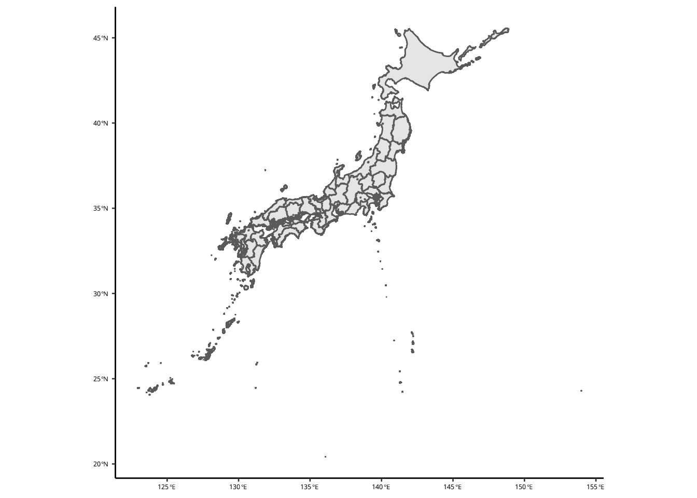
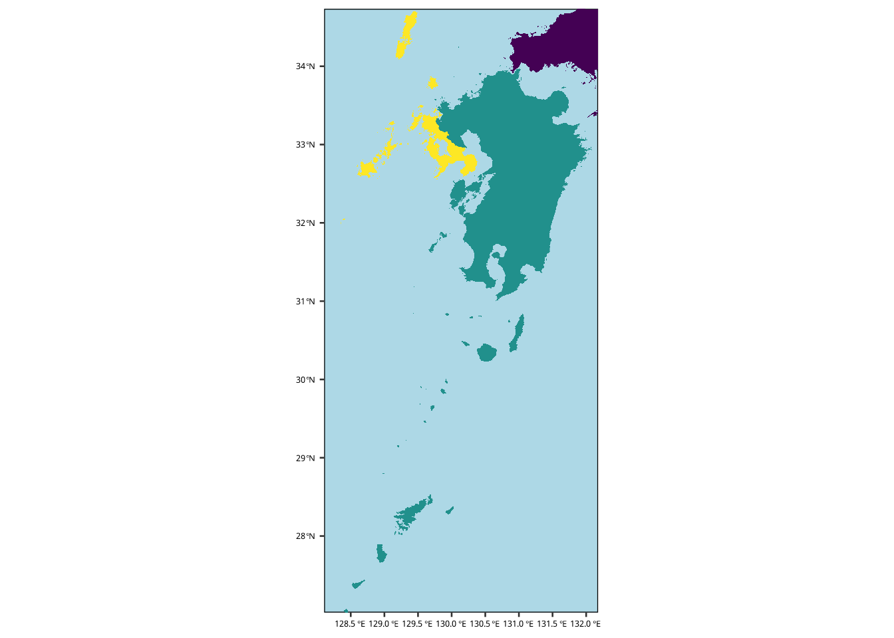

# 地図の作り方 {#maps}


## 必要なパッケージ


```r
library(tidyverse)　# Essential package
library(ggpubr)     # Publication-oriented figures
library(kableExtra) # Tables
library(magick)     # Imagemagick R API
library(patchwork)  # Simplified figure tiling
library(showtext)   # I want to use google fonts in the figures
```


次の2つは地図専用のパッケージです。


```r
library(ggspatial)  # Essential for map-making with ggplot
library(sf)         # Essential for map data manipulation
```

Noto Sans のフォントが好きなので、ここで [Google Fonts](https://fonts.google.com/) からアクセスします。


```r
font_add_google("Noto Sans","notosans")
```

`ggplot` のデフォルトテーマも設定し、フォント埋め込みも可能にします。
ここでデフォルトを設定すると、毎回 `theme_pubr()` を `ggplot`のチェインにたさなくていい。


```r
theme_pubr(base_size = 10, base_family = "notosans") |> theme_set()
showtext_auto() # Automatically embed the Noto Sans fonts into the ggplots.
```

## シェープファイルの読み込み

シェープファイル (shapefile) は地図データのことです。
基本的の拡張子は `shp`, `shx`, `dbf`　ですが、その他に `prj` と `xml` もあります。

研究室用にダウンロードした [国土交通省・国土数値情報ダウンロードサービス](https://nlftp.mlit.go.jp/ksj/index.html) のシェープファイルは `~/Lab_Data/Japan_map_data/Japan` に入っています。


```r
mlit = read_sf("~/Lab_Data/Japan_map_data/Japan/N03-20210101_GML/")
```

`mlit` に読み込んだシェープファイルは[ここへ](https://nlftp.mlit.go.jp/ksj/gml/datalist/KsjTmplt-N03-v3_0.html)。

シェープファイルの 座標参照系 (CRS: Coordinate Reference System) を確認しましょう。


```r
st_crs(mlit)
#> Coordinate Reference System:
#>   User input: JGD2011 
#>   wkt:
#> GEOGCRS["JGD2011",
#>     DATUM["Japanese Geodetic Datum 2011",
#>         ELLIPSOID["GRS 1980",6378137,298.257222101,
#>             LENGTHUNIT["metre",1]]],
#>     PRIMEM["Greenwich",0,
#>         ANGLEUNIT["degree",0.0174532925199433]],
#>     CS[ellipsoidal,2],
#>         AXIS["geodetic latitude (Lat)",north,
#>             ORDER[1],
#>             ANGLEUNIT["degree",0.0174532925199433]],
#>         AXIS["geodetic longitude (Lon)",east,
#>             ORDER[2],
#>             ANGLEUNIT["degree",0.0174532925199433]],
#>     USAGE[
#>         SCOPE["Horizontal component of 3D system."],
#>         AREA["Japan - onshore and offshore."],
#>         BBOX[17.09,122.38,46.05,157.65]],
#>     ID["EPSG",6668]]
```

CRSには **地理座標系** と **投影座標系** の2種類があります。
座標系にはEPSGコードもつけられています。


```r
# HTML 用テーブル
tibble(`EPSG Code` = c(4326,6668,6677),
       `CRS` = c("WGS84", "JGD2011", "JGD2011 / Japan Plane Rectangular CS IX"),
       `Units` = c("degrees", "degrees", "meters")) |> 
  kbl() |> 
  kable_styling(bootstrap_options = c("hover"))
```

<table class="table table-hover" style="margin-left: auto; margin-right: auto;">
 <thead>
  <tr>
   <th style="text-align:right;"> EPSG Code </th>
   <th style="text-align:left;"> CRS </th>
   <th style="text-align:left;"> Units </th>
  </tr>
 </thead>
<tbody>
  <tr>
   <td style="text-align:right;"> 4326 </td>
   <td style="text-align:left;"> WGS84 </td>
   <td style="text-align:left;"> degrees </td>
  </tr>
  <tr>
   <td style="text-align:right;"> 6668 </td>
   <td style="text-align:left;"> JGD2011 </td>
   <td style="text-align:left;"> degrees </td>
  </tr>
  <tr>
   <td style="text-align:right;"> 6677 </td>
   <td style="text-align:left;"> JGD2011 / Japan Plane Rectangular CS IX </td>
   <td style="text-align:left;"> meters </td>
  </tr>
</tbody>
</table>

このデータは政策区域のデータなので、とても重いです。
まずは、都道府県ごとにまとめた `RDS` ファイルを作って保存します。
都道府県ごとに `st_union()` を使って `polgyon` データを結合します。
結合したデータを unnest して、simple feature に戻してかた保存します。
121158 features もあるので、数時間もかります。

沿岸のデータだけなら軽いですので、`C23` シリーズのファイルを読み込みます。


```r
mlit = tibble(folder = dir("~/Lab_Data/Japan_map_data/Coastline/", full = TRUE)) |> 
  mutate(data = map(folder, read_sf)) |> select(data) |> 
  unnest(data) |> 
  st_as_sf(crs = st_crs(6668))
```

では、ここで地図の確認をします。


```r
mlit |> ggplot() + geom_sf()
```


`mlit` のデータは細かい政策区域まで分けられているので、全国スケールの図には向いていません。
`st_union()` をつかって、都道府県ごとに polygon を結合したファイルは、`~/Lab_Data/Japan_map_data/Japan/todofuken.rds` に保存しています。
次のコードで、都道府県ごとにまとめましたが、並列処理でも５時間以上もかかったので、`RDS` ファイルを使いましょう。


```r
# Takes 5.5 hours to complete with 30 cores!
# library(furrr)
# plan(multisession, workers = 30)
# Group by prefecture
# mlit1 = mlit |> group_nest(N03_001) |> 
#   # mutate(data = future_map(data, st_union)) |> 
#   unnest(data) |> st_as_sf() 
# mlit1 |> write_rds("~/Lab_Data/Japan_map_data/Japan/todofuken.rds")
```


```r
mlit1 = read_rds("~/Lab_Data/Japan_map_data/Japan/todofuken.rds")
```


```r
mlit1 |> ggplot() + geom_sf()
```



## 調査地点のデータを準備する

形上湾アマモ場調査のステーションの GPS `tibble` を準備する。


```r
zostera = read_csv("~/Lab_Data/matsumuro/Katagami_Bay/longlat_info.csv")
zostera |> print(n = 3)
#> # A tibble: 105 × 6
#>    Name   lat  long datetime            eelgrass
#>   <dbl> <dbl> <dbl> <dttm>              <chr>   
#> 1     1  33.0  130. 2021-05-25 09:14:48 absent  
#> 2     2  33.0  130. 2021-05-25 09:30:32 absent  
#> 3     3  33.0  130. 2021-05-25 09:37:16 present 
#> # … with 102 more rows, and 1 more variable:
#> #   `coverage(%)` <dbl>
```

`zostera` に緯度経度を設定する。
CRS は `mlit` と同じにします。


```r
zostera = zostera |> st_as_sf(coords = c("long", "lat"), crs = st_crs(mlit))
zostera |> print(n = 3)
#> Simple feature collection with 105 features and 4 fields
#> Geometry type: POINT
#> Dimension:     XY
#> Bounding box:  xmin: 129.7845 ymin: 32.90032 xmax: 129.806 ymax: 32.95375
#> Geodetic CRS:  JGD2011
#> # A tibble: 105 × 5
#>    Name datetime            eelgrass `coverage(%)`
#> * <dbl> <dttm>              <chr>            <dbl>
#> 1     1 2021-05-25 09:14:48 absent               0
#> 2     2 2021-05-25 09:30:32 absent               0
#> 3     3 2021-05-25 09:37:16 present              5
#> # … with 102 more rows, and 1 more variable:
#> #   geometry <POINT [°]>
```

## 九州データの抽出

九州のデータと長崎のデータを抽出します。
**重要：長崎の名前が誤っています。`Nagasaki` のはずが、`Naoasaki` として記録されています。**


```r
toget = "長崎|福岡|大分|佐賀|熊本|鹿児島|宮崎"
kyushu = mlit1 |> filter(str_detect(N03_001, toget))
```

海岸線のデータ (`mlit`) から長崎の情報を抽出したいが、このデータの位置情報はコードで記述されています。


```r
admincode = readxl::read_xlsx("~/Lab_Data/Japan_map_data/AdminiBoundary_CD.xlsx", skip = 2)
admincode = admincode |> select(code = matches("行政"), N03_001 = matches("都道府県*.*漢字"))
codes = admincode |> filter(str_detect(N03_001, "長崎")) |> pull(code)
```


```r
nagasaki = mlit |> filter(str_detect(C23_001, str_c(codes, collapse = "|"))) 
```

長崎の海岸線は次のようになります。


```r
ggplot() + geom_sf(data = nagasaki)
```


九州は `mlit1` から抽出したので、都道府県政策区域として作図されます。


```r
ggplot() + geom_sf(data = kyushu)
```


長崎をハイライトしましょう。


```r
kyushu |> 
  mutate(fillme = str_detect(N03_001, "長崎")) |> 
  ggplot() + geom_sf(aes(fill = fillme), color = NA) +
  guides(fill = "none") +
  scale_fill_viridis_d() +
  theme(panel.background = element_rect(fill = "lightblue", color = "black"),
        axis.line = element_blank())
```


この図には、違和感を感じるので、山口、島根、愛媛、広島と高知も追加します。
そしれ、最初に作った `kyushu` の範囲を抽出しておきます。


```r
kbbox = kyushu |> st_bbox()
```


```r
toget = "長崎|福岡|大分|佐賀|熊本|鹿児島|宮崎|山口|島根|愛媛|高知|広島"
kyushu = mlit1 |> filter(str_detect(N03_001, toget))
```


長崎、九州、その他の色分けをして、 `kyushu` をクロップします。
クロップ範囲は `kbbox` です。


```r
kyushu = kyushu |>
  mutate(fillme = case_when(str_detect(N03_001, "長崎") ~ "Nagasaki",
                            str_detect(N03_001, "福岡|大分|佐賀|熊本|鹿児島|宮崎") ~ "Kyushu",
                            TRUE ~ "Honshu")) |> 
  st_crop(kbbox)
```

この地図は次のようになりました。


```r
ggplot(kyushu) + 
  geom_sf(aes(fill = fillme), color = NA) +
  guides(fill = "none") +
  coord_sf(expand = FALSE) +
  scale_fill_viridis_d() +
  theme(panel.background = element_rect(fill = "lightblue", color = "black"),
        axis.line = element_blank())
```




## 調査地点の図

形上湾と大村湾の図を作ります。
形上湾の方には、調査地点と結果ものせます。
まずは形上湾と大村湾の範囲を決めます。
範囲は Google Map で選びました。


```r
katagami = rbind(rev(c(32.95809069048365, 129.7669185309373)),
                 rev(c(32.89802000729197, 129.82832411747583))) |>
  as_tibble(.name_repair = \(x) c("long", "lat")) |>
  st_as_sf(coords = c("long", "lat"), crs = st_crs(kyushu))

omurabay = rbind(rev(c(33.103196388120104, 129.67183787501082)),
                 rev(c(32.817013859622804, 130.03298144413574))) |> 
  as_tibble(.name_repair = \(x) c("long", "lat")) |>
  st_as_sf(coords = c("long", "lat"), crs = st_crs(kyushu))
```

ここで、それぞれの湾のデータを `kyushu` からぬきます。

```r
omurabay_area = kyushu |> filter(str_detect(N03_001, "長崎")) |> st_crop(st_bbox(omurabay)) 
katagami_area = kyushu |> filter(str_detect(N03_001, "長崎")) |> st_crop(st_bbox(katagami)) 
```

アマモの被度データの simple features データを準備します。

```r
zostera = zostera |>
  st_as_sf(coords = c("long", "lat"), crs = st_crs(kyushu)) |> 
  rename(coverage = matches("cover")) |> 
  mutate(rank = cut(coverage, 
                    c(-Inf, 1, 10, 40, 70, Inf),
                    labels = c("E", "D", "C", "B", "A"))) |> 
  mutate(rank = factor(rank, 
                       levels = LETTERS[1:5],
                       labels = LETTERS[1:5]))
```

九州の図を先につくります。

```r
# The main plot of kyushu
pmain = ggplot(kyushu) + 
  geom_sf(aes(fill = fillme), color = NA) +
  guides(fill = "none") +
  coord_sf(expand = FALSE) +
  scale_fill_viridis_d() +
  theme(panel.grid = element_blank(),
        panel.background = element_rect(fill = "lightblue", color ="black"),
        panel.border  = element_rect(fill = NA, color ="black"),
        plot.background =  element_rect(fill = NA, color =NA),
        axis.title = element_blank(),
        axis.line = element_blank())
```

大村湾と形上湾の図を次に作りますが、先にラベルの tibble を準備します。
`tibble` の `long` と `lat` のデータは試行錯誤で来ました。
もっといい方法はあるはずです。


```r
# Build plots for Omura Bay and Katagami Bay.
tmp1 = omurabay_area |> st_transform(crs = st_crs(6677)) |> st_bbox()
tmp2 = katagami_area |> st_transform(crs = st_crs(6677)) |> st_bbox()
# tibble for labeling figures. The long and lat are by trial-and-error.
# Need to find a better method.
label1 = tibble(long = tmp1[3] -2500,
                lat = tmp1[2] +1700,
                label = "Omura Bay, Nagasaki, Japan") |> 
  st_as_sf(coords = c("long", "lat"), crs = st_crs(6677), agr = "constant") |> 
  st_transform(crs = st_crs(omurabay_area))

label2 = tibble(long = tmp2[1] +800,
                lat = tmp2[4] -150,
                label = "Katagami Bay, Nagasaki, Japan") |> 
  st_as_sf(coords = c("long", "lat"), crs = st_crs(6677), agr = "constant") |> 
  st_transform(crs = st_crs(omurabay_area))
```

では、大村湾と形上湾の地図をつくります。

```r
pomura = ggplot() +
  geom_sf(fill = "grey50", data = omurabay_area, size = 0) +
  geom_sf_text(aes(label = label), 
               data = label1,
               color = "white",
               family = "notosans", 
               fontface = "bold",
               vjust = 1, hjust = 1,
               size = 5)  + 
  coord_sf(expand = FALSE) +
  annotation_north_arrow(style = north_arrow_minimal(text_family = "notosans", 
                                                     text_face = "bold",
                                                     line_width = 2,
                                                     text_size = 20),
                         pad_y = unit(0.3, "npc")) + 
  theme(panel.background = element_rect(fill = "lightblue", color ="black"),
        panel.border  = element_rect(fill = NA, color ="black"),
        plot.background =  element_rect(fill = "white", color =NA),
        axis.title = element_blank(),
        axis.line = element_blank(),
        axis.text = element_blank(),
        axis.ticks = element_blank())

pkatagami = ggplot() +
  geom_sf(fill = "grey50", data = katagami_area, size = 0) +
  geom_sf(aes(fill = rank), data = zostera,
          pch = 21, size = 3,
          color = "white", stroke = 1) +
  geom_sf_text(aes(label = label), 
               data = label2,
               color = "white",
               family = "notosans", 
               fontface = "bold",
               vjust = 1.0, hjust = 0.0,
               size = 5)  + 
  annotation_north_arrow(style = north_arrow_minimal(text_family = "notosans", 
                                                     text_face = "bold",
                                                     line_width = 2,
                                                     text_size = 20)) + 
  coord_sf(expand = FALSE, crs = st_crs(katagami_area)) +
  scale_fill_viridis_d(end = 0.8) +
  theme(panel.grid = element_blank(),
        panel.background = element_rect(fill = "lightblue", color ="black"),
        panel.border  = element_rect(fill = NA, color ="black"),
        plot.background =  element_rect(fill = "white", color =NA),
        axis.title = element_blank(),
        axis.line = element_blank(),
        axis.text = element_blank(),
        axis.ticks = element_blank())
```

`patchwork` のパッケージをつかって、図を組み立てます。
図は PDF に保存したら、`magick` を使って、PNGにも変換します。


```r
pout = pmain + (pomura / pkatagami)
pdfname = "Images/katagami-map-v1.pdf"
pngname = str_replace(pdfname, "pdf", "png")
ggsave(pdfname, plot= pout, width = 300, height = 300, units = "mm")
image_read_pdf(pdfname, density = 600) |> image_trim() |> image_border(color = "white") |> image_write(pngname)
```


