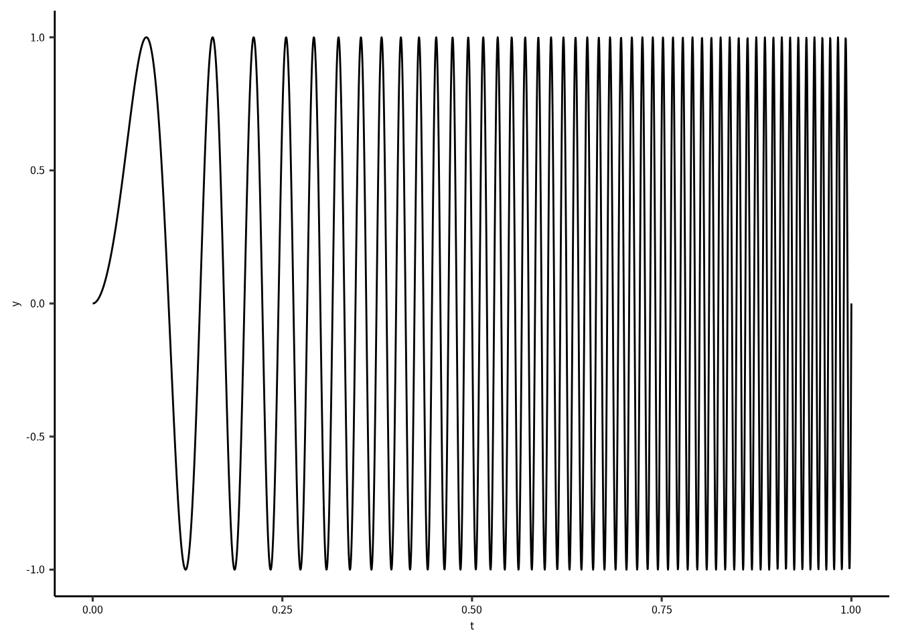
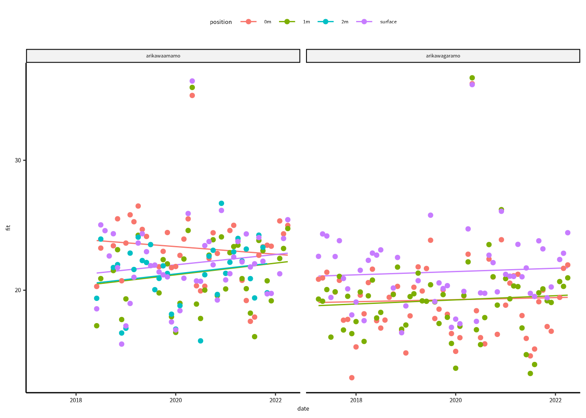

# Wavelet 解析 {#wavelet}

## 必要なパッケージ


```r
library(tidyverse)
library(lubridate)
library(gnnlab)
library(furrr)
library(biwavelet)
```


ウェーブレット変換は時系列データから時間的変化の特徴と周波数成分を調べるために使います。
**細かい説明はいつか追加します。**
本章を完成するまでは、次の論文を参考にしてください。


Cazelles B., Chavez M., Berteaux D., Menard F., Vik J.O., Jenouvrier S., and Stenseth N.C. 2008. Wavelet analysis of ecological time series. Oecologia 156: 287-304.

Grinsted A., Moore J.C., and Jevrejeva S. 2004. Application of the cross wavelet transform and wavelet coherence to geophysical time series. Nonlinear Processes in Geophysics 11: 561-566.

Torrence C. and Compo G.P. 1998. A practical guide to wavelet analysis. Bulletin of the American Meteorological Society 79: 61-78.

Torrence C and Webster P.J. 1998. The annual cycle of persistence in the El Nino/Southern Oscillation. Quarterly Journal of the Royal Meteorological Society 124: 1985-2004.


$$
\psi(\eta) = \frac{1}{\sqrt[\leftroot{-2}\uproot{3}4]{\pi}}\;e^{\eta^2/2}\;e^{ik\eta}
$$
パラメータ $\eta$ は時間 $(t)$ と ウェーブレットスケール $(s)$ の比率です。
ウェーブレットスケールを下げると時間軸方向の分解能が上がります。
ウェーブレットパラメータ $k$ はモレー・ウェーブレットの振動数（山の数）を制御しています。
よって、$k$ を上げると、周波数分解能が上がります。

では、`biwavelet` パッケージで次の波形を解析してみましょう。

$$
\begin{aligned}
y &= \sin(2 \pi \omega) \\
\omega &= 50 t^2 + 10
\end{aligned}
$$
この波形の角周波数 $(\omega)$ は徐々に高くなります。


```r
ft = function(t) {
  f = 50 * t^2 + 10
  sin(2 * pi * f )
}
z = tibble(t = seq(0, 1, length = 3000)) |> mutate(y = ft(t))
```


```r
ggplot(z) + geom_line(aes(x = t, y = y)) +
  scale_x_continuous("t") +
  scale_y_continuous("y")
```



`biwavelet` の `wt()` 関数でウェーブレット解析をします。
`wt()` に渡すデータは行列としてわたしましょう。
行列の1列目には時間情報、2列名には解析したい値です。


```r
wtout = wt(as.matrix(z), mother = "morlet")
```


```r
plot(wtout)
```

<div class="figure" style="text-align: center">

<p class="caption">(\#fig:unnamed-chunk-8)
これはウェーブレット解析のパワーを示す図です。
パワーの低いところは青色、パワーの高いところは赤色です。
黒線は統計学的に優位な領域を示しています。
赤色の部分が時間につれ、周期が上昇しています。
ウェーブレット解析で角周波数の傾向を十分抽出できたとおもいます。
白くなっているところは cone of influence (COI) です。
COIは解析アルゴリズムの精度が落ちているところを示しているので、
示されたパワーは両端から $e^{-2}$ に従って下がります。
</p>
</div>

## 解析に使う関数

Wavelet を求めるための関数です。
コアは `biwavelet` パッケージの `wt()` 関数です。
マザー・ウェーブレット (mother wavelet) はモレーウェーブレット (Morlet wavelet) に固定しています。
`wt()` には DoG (derivative of gaussian) と Paul ウェーブレットも使えます。


```r
calculate_wavelet = function(df, obs, tau = NULL, fs = 6, dB = TRUE) {
  pad_cname = function(x, w) {
    x = str_pad(x, width = w, pad = "0")
    str_c("V",x)
  }
  
  # 
  N = nrow(df)
  datetime  = df %>% pull({{tau}})
  if(!near(day(datetime[N]), day(datetime[N-1]))) {
    df = df |> slice(1:(N-1))
    datetime  = df %>% pull({{tau}})
  }
  
  hours = as.double(datetime - datetime[1], units = "hours")
  observation = df %>% pull({{obs}})
  wtout = wt(cbind(hours, observation), mother = "morlet")
  
  xval = wtout$t        # Vector of times
  yval = wtout$period   # Vector of periods
  sigma2 = wtout$sigma2 # Vector of variance of time series
  coi = wtout$coi       # Vector of cone of influence
  signif = wtout$signif # Matrix of significance levels
  # Matrix of bias-corrected power
  if(dB) {
    Z = 10 * log10(abs(wtout$power.corr / sigma2))
  } else {
    Z = log2(abs(wtout$power.corr / sigma2))
  }
  
  zlim = range(c(-1, 1) * max(Z))
  Z[Z < zlim[1]] = zlim[1]
  n = dim(Z)
  tmp1 = signif |> as_tibble(.name_repair = ~pad_cname(1:n[2], nchar(n[2]) + 1)) |> 
    mutate(period = yval) |> pivot_longer(starts_with("V"), values_to = "signif") |> 
    group_nest(name, .key = "signif") |> 
    arrange(name) |> 
    mutate(datetime)
  tmp2 = Z |> as_tibble(.name_repair =  ~pad_cname(1:n[2], nchar(n[2]) + 1)) |> 
    mutate(period = yval) |> pivot_longer(starts_with("V"), values_to = "power") |> 
    group_nest(name, .key = "power") |> 
    arrange(name) |> 
    mutate(datetime)
  
  full_join(tmp1, tmp2, by = c("name", "datetime")) |> mutate(coi, hours = xval) |> 
    select(name, datetime, hours, coi, power, signif)
}
```

関数を適応した場合、エラーがでたらスクリプトはエラーが発生したところで止まります。
関数を `possibly()`のラッパーにとおせば、エラーがでたとき、`NULL` を返すようにする。
これで、スクリプトは止まりません。


```r
calc_wt = possibly(calculate_wavelet, NULL)
```

## 補足関数


```r
se = function(x, na.rm=FALSE) {
  # 標準誤差
  N = sum(!is.na(x))
  sd(x, na.rm) / sqrt(N - 1)
} 

date_gnn = function(x) {
  # ggplot の時間軸のlabel 関数
  tmp0 = year(x)
  tmp1 = month.abb[month(x)]
  tmp2 = day(x)
  tmp0[duplicated(tmp0)] = ""
  
  str_c(tmp2, "\n" ,tmp1, "\n",tmp0) 
}

date_gnn2 = function(x) {
  # ggplot の時間軸のlabel 関数
  tmp0 = year(x)
  tmp1 = month.abb[month(x)]
  tmp2 = day(x)
  tmp0[duplicated(tmp0)] = ""
  
  str_c(tmp1, "\n",tmp0) 
}
# ggplot 用の関数
log2reverse = function(x) {-log2(x)}
log2reverseinv = function(x) {2^(-x)}

contiguous = function(df, tau, deltaT = 10) {
  # 隣接データを確認するための関数
  x = df |> pull({{tau}})
  xout = as.double(x - lag(x), units = "mins")
  df |> mutate(contig = xout) |> 
    mutate(group = as.numeric(!near(contig, deltaT))) |> 
    mutate(group = replace_na(group, 0)) |> 
    mutate(group = cumsum(group)) |> 
    mutate(group = factor(group))
}
```


## データの前処理

データの読み込みは並列で行うので、`map()` じゃなくて `future_map()` を使います。
`read_onset()` は 研究室の `gnnlab` パッケージの関数です。

```r
labdatafolder = "~/Lab_Data/kawatea/Oxygen"
dset = tibble(fnames = dir(labdatafolder, pattern = "DO.*arikawa.*csv", full = TRUE)) |> 
  filter(str_detect(fnames, "calib", negate = TRUE))
dset = dset |>
  mutate(data = future_map(fnames, read_onset)) 
dset
#> # A tibble: 327 × 2
#>    fnames                                           data    
#>    <chr>                                            <list>  
#>  1 /home/gnishihara/Lab_Data/kawatea/Oxygen/DO_02_… <tibble>
#>  2 /home/gnishihara/Lab_Data/kawatea/Oxygen/DO_02_… <tibble>
#>  3 /home/gnishihara/Lab_Data/kawatea/Oxygen/DO_03_… <tibble>
#>  4 /home/gnishihara/Lab_Data/kawatea/Oxygen/DO_03_… <tibble>
#>  5 /home/gnishihara/Lab_Data/kawatea/Oxygen/DO_03_… <tibble>
#>  6 /home/gnishihara/Lab_Data/kawatea/Oxygen/DO_03_… <tibble>
#>  7 /home/gnishihara/Lab_Data/kawatea/Oxygen/DO_03_… <tibble>
#>  8 /home/gnishihara/Lab_Data/kawatea/Oxygen/DO_03_… <tibble>
#>  9 /home/gnishihara/Lab_Data/kawatea/Oxygen/DO_03_… <tibble>
#> 10 /home/gnishihara/Lab_Data/kawatea/Oxygen/DO_03_… <tibble>
#> # … with 317 more rows
```

次はファイル名の処理をします。


```r
dset = dset |> filter(str_detect(fnames, "edge|sand", negate = T)) |> 
  mutate(fnames = basename(fnames)) |> 
  mutate(fnames = str_remove(fnames, ".csv")) |> 
  separate(fnames, into = c("type", "id", "location", "position", "surveydate"))
dset = dset |> unnest(data)
```

観測期間のデータを読み込んで、観測インターバルを設定します。


```r
surveyperiod = read_csv("~/Lab_Data/kawatea/period_info_220422.csv")
surveyperiod
#> # A tibble: 185 × 5
#>    location  start_date          end_date            comment
#>    <chr>     <dttm>              <dttm>              <chr>  
#>  1 arikawaa… 2017-04-09 00:00:00 2017-05-21 00:00:00 <NA>   
#>  2 arikawag… 2017-04-09 00:00:00 2017-05-21 00:00:00 <NA>   
#>  3 tainoura  2017-04-09 00:00:00 2017-05-21 00:00:00 <NA>   
#>  4 arikawaa… 2017-05-25 00:00:00 2017-06-13 00:00:00 <NA>   
#>  5 arikawag… 2017-05-25 00:00:00 2017-06-13 00:00:00 <NA>   
#>  6 tainoura  2017-05-25 00:00:00 2017-06-13 00:00:00 <NA>   
#>  7 arikawaa… 2017-07-20 00:00:00 2017-08-04 00:00:00 台風の…
#>  8 arikawag… 2017-07-20 00:00:00 2017-08-04 00:00:00 台風の…
#>  9 tainoura  2017-07-20 00:00:00 2017-08-18 00:00:00 <NA>   
#> 10 arikawaa… 2017-08-09 00:00:00 2017-08-18 00:00:00 <NA>   
#> # … with 175 more rows, and 1 more variable: remarks <chr>
```


```r
surveyperiod = surveyperiod |> mutate(interval = interval(start = start_date, end = end_date))
surveyperiod
#> # A tibble: 185 × 6
#>    location  start_date          end_date            comment
#>    <chr>     <dttm>              <dttm>              <chr>  
#>  1 arikawaa… 2017-04-09 00:00:00 2017-05-21 00:00:00 <NA>   
#>  2 arikawag… 2017-04-09 00:00:00 2017-05-21 00:00:00 <NA>   
#>  3 tainoura  2017-04-09 00:00:00 2017-05-21 00:00:00 <NA>   
#>  4 arikawaa… 2017-05-25 00:00:00 2017-06-13 00:00:00 <NA>   
#>  5 arikawag… 2017-05-25 00:00:00 2017-06-13 00:00:00 <NA>   
#>  6 tainoura  2017-05-25 00:00:00 2017-06-13 00:00:00 <NA>   
#>  7 arikawaa… 2017-07-20 00:00:00 2017-08-04 00:00:00 台風の…
#>  8 arikawag… 2017-07-20 00:00:00 2017-08-04 00:00:00 台風の…
#>  9 tainoura  2017-07-20 00:00:00 2017-08-18 00:00:00 <NA>   
#> 10 arikawaa… 2017-08-09 00:00:00 2017-08-18 00:00:00 <NA>   
#> # … with 175 more rows, and 2 more variables:
#> #   remarks <chr>, interval <Interval>
```

観測インストールをつかて、データをフィルタにかけます。
インストール以外のデータはここで外します。


```r
ints = surveyperiod |> pull(interval)
dset = dset |> filter(datetime %within% as.list(ints))
```

さらに、データの数を求めてフィルタにかけます。
10分間隔で測定しているので、一日あたりに 144 のデータがあります。
条件に合わないデータは外します。


```r
dset = dset |> 
  mutate(date = as_date(datetime)) |> 
  group_by(date, location, position) |> 
  filter(near(n(), 144))
dset
#> # A tibble: 1,239,696 × 9
#> # Groups:   date, location, position [8,609]
#>    type  id    location      position surveydate
#>    <chr> <chr> <chr>         <chr>    <chr>     
#>  1 DO    02    arikawagaramo 0m       170523    
#>  2 DO    02    arikawagaramo 0m       170523    
#>  3 DO    02    arikawagaramo 0m       170523    
#>  4 DO    02    arikawagaramo 0m       170523    
#>  5 DO    02    arikawagaramo 0m       170523    
#>  6 DO    02    arikawagaramo 0m       170523    
#>  7 DO    02    arikawagaramo 0m       170523    
#>  8 DO    02    arikawagaramo 0m       170523    
#>  9 DO    02    arikawagaramo 0m       170523    
#> 10 DO    02    arikawagaramo 0m       170523    
#> # … with 1,239,686 more rows, and 4 more variables:
#> #   datetime <dttm>, mgl <dbl>, temperature <dbl>,
#> #   date <date>
```

Wavelet 解析を実施するときは、データが隣接しているかを確認しましょう。
隣接しているデータをグループ化してから解析をします。
ここでは、`contiguous()` 関数に `datetime` をわたして、必要な情報を加えます。


```r
dset = dset |> ungroup() |> 
  mutate(datetime = floor_date(datetime, "10 mins")) |> 
  group_nest(location, position, id) |> 
  mutate(data = map(data, contiguous, tau = datetime)) |> 
  unnest(data)
```

グループ化が完了したら、wavelet 解析をします。

ウェーブレット解析はとても重いので、研究室のサーバなら並列処理で解析します。


```r
number_of_cpu_cores = parallel::detectCores()
plan(multisession, workers = 8)
```

では、`future_map()` を使って並列処理で解散をします。


```r
wtout = dset |> 
  arrange(datetime) |> 
  group_nest(group, location, id, position) |> 
  mutate(wtout = future_map(data, \(df) {
    df |> calc_wt(temperature, datetime)
  }))
```

普通に逐次処理のときは、`map()` で実行しましょう。


```r
wtout = dset |> 
  arrange(datetime) |> 
  group_nest(group, location, id, position) |> 
  mutate(wtout = map(data, \(df) {
    df |> calc_wt(temperature, datetime)
  }))
```

## Wavelet の図

ウェーブレットの図も関数を設計して、作ります。
`wavelet_plot()` は作図用の関数です。
これは、`map()` を通して作図します。


```r
wavelet_plot = function(wtout) {
  ylabel = "Period (hrs)"
  xlabel = "Date"
  x = select(wtout, datetime, power) |> unnest(power)
  s = select(wtout, datetime, signif) |> unnest(signif)
  rng = x |> pull(period) |> range()
  ggplot() +
    geom_tile(aes(x = datetime,
                  y = period, 
                  fill = power),
              data = x) +
    geom_contour(aes(x = datetime,
                     y = period,
                     z = signif),
                 data = s,
                 color = "black",
                 size = 1, 
                 breaks = 1) +
    geom_line(aes(x = datetime,
                  y = coi),
              data = wtout,
              color = "white") +
    geom_hline(yintercept = c(1, 6, 12, 24),
               linetype = "dashed", color = "grey50") +
    scale_y_continuous(ylabel,
                       trans = scales::trans_new("log2reverse",
                                                 log2reverse,
                                                 log2reverseinv,
                                                 domain = c(0, Inf)),
                       limits = rev(rng),
                       breaks = 2^log2(c(1, 4, 6, 12, 16, 24, 64)),
                       expand = expansion())  +
    scale_x_datetime(xlabel, 
                     date_breaks = "2 days",
                     labels = date_gnn)  +
    guides(fill = "none") + 
    scale_fill_viridis_c()
}
```

ここで作図をします。


```r
wtplots = wtout |> 
  select(group, wtout, location, position, id) |> 
  mutate(ggplot = map(wtout, wavelet_plot))
```

そのままコードを実行すると RStudio には図のアウトプットはないです。
図を見るためには、ファイルに保存したほうがいい。


```r
plots = wtplots$ggplot
length(plots)
#> [1] 324
```

合計 324 のファイルを書き出すことになりそうなので、
フォルダを作って保存します。


```r
dname = "_wavelet_plots"
if(!dir.exists(dname)) {
  dir.create(dname)
}
```

ここでファイル名と保存するための関数をつくります。
ファイルはPDFとして保存するが、同時にPDFをPNGに変換します。
PDFを変換すると、確実に選んだフォントが埋め込まれるので、
PNGファイルのフォントも綺麗です。
ファイルの変換は `magick` パッケージをつかいます。


```r
save_wavelets = function(l,p,d,g,i,plot) {
  pdfname = str_c(dname, "/", l, "_", p, "_", d, "_", g,"_", i, ".pdf")
  pngname = str_replace(pdfname, "pdf", "png")
  ggsave(pdfname, plot = plot, width = 300, height = 200, units = "mm")
  magick::image_read_pdf(pdfname, density = 300) |> 
    magick::image_trim() |> magick::image_write(pngname)
}

wtplots |> 
  mutate(period = map_chr(wtout, \(x) {
    z = x |> pull(datetime) |> as_date() |> range()
    z = str_remove_all(z, "-")
    str_c(z[1], "_", z[2])
  })) |> 
  mutate(out = pmap(list(location, position, period, group, id, ggplot), save_wavelets))
```


<div class="figure" style="text-align: center">

<p class="caption">(\#fig:unnamed-chunk-29)
有川湾鯨見山地先におけるガラモ場の水温に対するウェーブレット解析。
観測期間は2018年5月17日から6月17日でしました。
水温は海底で記録しました。
パワーの強い所は明るい色（黄色）で示していて、パワーの弱い所は暗い色（青色）で示しています。
白線はCOIを示しています。
5月17日から25日、5月31日から6月2日、6月9日,　6月12日から17日の期間には強い24時間の周期があります。
ところどころ強い12時間の周期もあります。12時間の周期は潮汐と関係していると考えますね。
12時間より短い周期でも比較的に強いパワーが示されています。
</p>
</div>

## SNR の求め方

日周期 (diurnal) と高周期 (high) の比率を求めて、一日内の水温の安定性を調べてみましょう。
ウェーブレットで検出した周期情報を High (0 ~ 7 hr), Tidal (7 = 13 hrs), Diurnal (13 ~ 25 hrs), Low (> 25 hrs) に分類します。
分離したら、一日あたりの平均パワー (power) と平均値の 95% 信頼区間を求めます。
**この解析はまだ未熟ですが、もっといい方法に気づいたら紹介します。**


```r
calculate_mean_power = function(wt) {
    wt |> 
      select(datetime, power) |> 
      unnest(power) |> 
      mutate(datetime = floor_date(datetime, "day")) |> 
      ungroup() |> 
      mutate(ftype = cut(period, breaks = c(-Inf, 7, 13, 25, Inf),
                         labels = c("High", "Tidal", "Diurnal", "Low"))) |> 
      group_by(datetime, ftype) |> 
      summarise(across(power, list(mean =mean, se = se)), .groups = "drop") |> 
      mutate(lower = power_mean - 1.96*power_se,
             upper = power_mean + 1.96*power_se)
}

wtout = wtout |> mutate(wtout2 = map(wtout, calculate_mean_power))
```

次に、`wtout2` に隠れている `tibble` を縦長から横長に変換します。
つづいて、SNRを求めますが、power はログスケールで求めたので、
SNR比は `snr = Diurnal - High` です。


```r
calculate_snr = function(wt)  {
  wt |> ungroup() |> 
    select(datetime, ftype, power_mean) |> 
    arrange(datetime) |> 
    pivot_wider(names_from =ftype, values_from = power_mean) |> 
    mutate(snr = Diurnal - High)
}
wtout = wtout |> 
  mutate(wtout3 = map(wtout2, calculate_snr))
```

SNR比を `date`, `location`, `position` ごとにまとめます。


```r
snrdata = 
  wtout |> select(wtout3, location, position) |> unnest(wtout3) |> 
  mutate(date = floor_date(datetime, "month")) |> 
  group_by(date, location, position) |> 
  summarise(snr = mean(snr), .groups = "drop")
```

SNR比に2020年あたりに怪しい値はあるが、`position` ごとに傾向有るのかな？


```r
ylabel = "Period (h)"
xlabel = "Date"
ggplot(snrdata) + 
  geom_point(aes(x = date, y = snr, color = position)) +
  facet_wrap(vars(location))
```

<div class="figure" style="text-align: center">

<p class="caption">(\#fig:unnamed-chunk-33)SNRは日周期と高周期の比率です。</p>
</div>

SNRの傾向を解析して、図に追加します。
`location`と`position` 間の比較に興味がないので、次のようなモデルを当てはめます。


```r
fit_model = function(df) {
  lm(snr ~ date, data = df)
}
```

**解析の結果**

一般線形モデルのF検定の結果、すべてのモデルのP値は 0.05 より大きいですね。


```r
snrdata |> 
  mutate(date = as_date(date)) |> 
  group_nest(location, position) |> 
  mutate(model = map(data, fit_model)) |> 
  mutate(summary = map(model, broom::glance)) |> 
  unnest(summary)
#> # A tibble: 7 × 16
#>   location   position     data model r.squared adj.r.squared
#>   <chr>      <chr>    <list<t> <lis>     <dbl>         <dbl>
#> 1 arikawaam… 0m       [46 × 2] <lm>    0.0131       -0.0128 
#> 2 arikawaam… 1m       [46 × 2] <lm>    0.0210       -0.00623
#> 3 arikawaam… 2m       [41 × 2] <lm>    0.0357        0.00731
#> 4 arikawaam… surface  [46 × 2] <lm>    0.0196       -0.00271
#> 5 arikawaga… 0m       [59 × 2] <lm>    0.00124      -0.0163 
#> 6 arikawaga… 1m       [60 × 2] <lm>    0.00538      -0.0124 
#> 7 arikawaga… surface  [60 × 2] <lm>    0.00406      -0.0151 
#> # … with 10 more variables: sigma <dbl>, statistic <dbl>,
#> #   p.value <dbl>, df <dbl>, logLik <dbl>, AIC <dbl>,
#> #   BIC <dbl>, deviance <dbl>, df.residual <int>,
#> #   nobs <int>
```

モデル係数の結果は `broom` パッケージの `tidy()` 関数で確認できます。


```r
snrdata |> 
  mutate(date = as_date(date)) |> 
  group_nest(location, position) |> 
  mutate(model = map(data, fit_model)) |> 
  mutate(summary = map(model, broom::tidy)) |> 
  unnest(summary) 
#> # A tibble: 14 × 9
#>    location position     data model term  estimate std.error
#>    <chr>    <chr>    <list<t> <lis> <chr>    <dbl>     <dbl>
#>  1 arikawa… 0m       [46 × 2] <lm>  (Int…  3.80e+1 20.8     
#>  2 arikawa… 0m       [46 × 2] <lm>  date  -8.03e-4  0.00113 
#>  3 arikawa… 1m       [46 × 2] <lm>  (Int… -1.19e+0 25.8     
#>  4 arikawa… 1m       [46 × 2] <lm>  date   1.23e-3  0.00140 
#>  5 arikawa… 2m       [41 × 2] <lm>  (Int… -4.24e-1 19.4     
#>  6 arikawa… 2m       [41 × 2] <lm>  date   1.19e-3  0.00106 
#>  7 arikawa… surface  [46 × 2] <lm>  (Int…  2.07e+0 21.4     
#>  8 arikawa… surface  [46 × 2] <lm>  date   1.09e-3  0.00116 
#>  9 arikawa… 0m       [59 × 2] <lm>  (Int…  1.53e+1 14.7     
#> 10 arikawa… 0m       [59 × 2] <lm>  date   2.16e-4  0.000811
#> 11 arikawa… 1m       [60 × 2] <lm>  (Int…  1.12e+1 14.5     
#> 12 arikawa… 1m       [60 × 2] <lm>  date   4.40e-4  0.000799
#> 13 arikawa… surface  [60 × 2] <lm>  (Int…  1.51e+1 13.6     
#> 14 arikawa… surface  [60 × 2] <lm>  date   3.45e-4  0.000750
#> # … with 2 more variables: statistic <dbl>, p.value <dbl>
```

`date` はモデル傾きのパラメータです。
`arikawaamamo` `0m` 以外の `date` 係数は正の値をとっていますが、
Wald's 検定の結果、すべての P値は 0.05 より大きいです。

帰無仮説検定論によると、0 との統計学的な有意差がなかったので、
係数が 0 ではないという仮説は棄却できない。

それにしても、とりあえずデータを図に追加してみよう。


```r
return_fit = function(data, model) {
  nd = data |> expand(date)
  bind_cols(nd, predict(model, newdata = nd, se.fit = TRUE) |> as_tibble()) |> 
    mutate(lower = fit - 1.96*se.fit,
           upper = fit + 1.96*se.fit)
}

snrdata = snrdata |> 
  mutate(date = as_date(date)) |> 
  group_nest(location, position) |> 
  mutate(model = map(data, fit_model)) |>
  mutate(ndata = map2(data,model, return_fit))
```


```r
ggplot() + 
  geom_line(aes(x = date, y = fit, color = position), data = snrdata |> unnest(ndata)) + 
  geom_point(aes(x = date, y = snr, color = position), data = snrdata |> unnest(data)) + 
  facet_wrap(vars(location))
```

<div class="figure" style="text-align: center">

<p class="caption">(\#fig:unnamed-chunk-38)SNRの傾向に線形モデルを当てはめたが、線形モデルのF検定に統計学的に有意な結果はありませんでした。</p>
</div>


